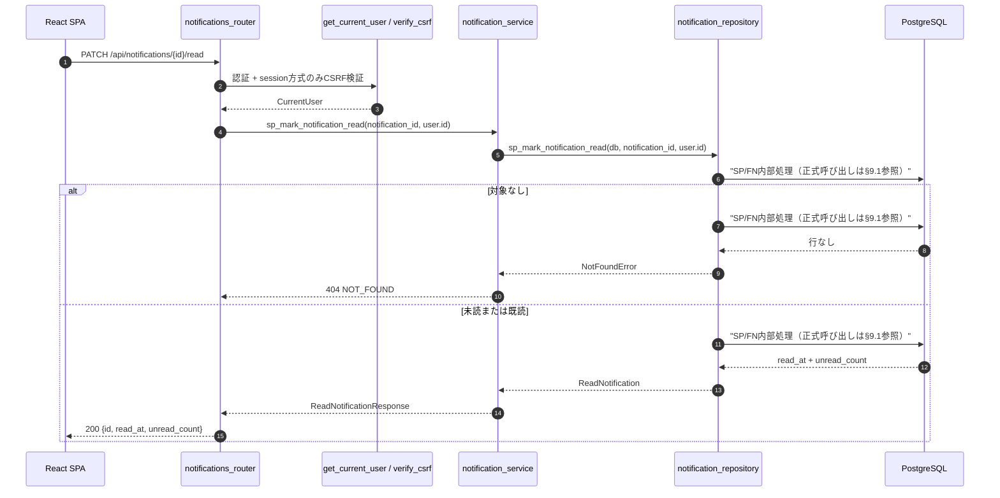
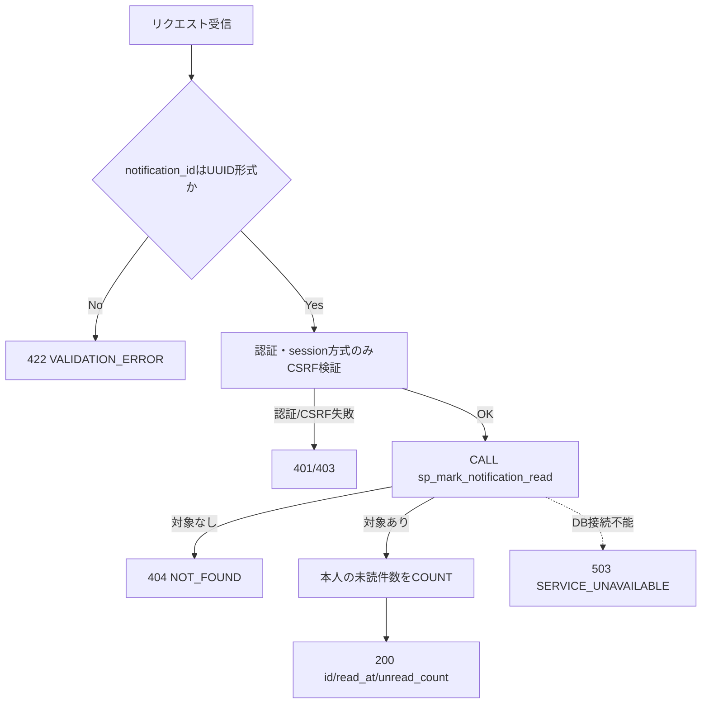
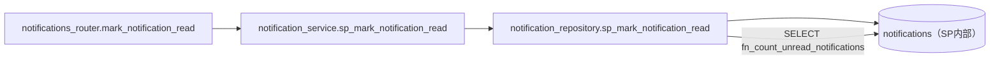
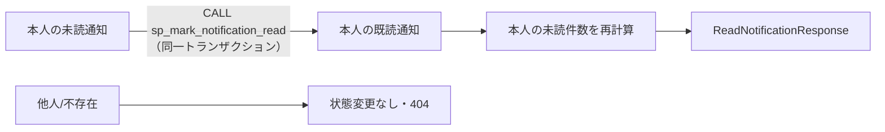

# PATCH /api/notifications/{notification_id}/read（通知を既読にする）

## 0. 関連ドキュメント

| ドキュメント | 内容 |
|--------------|------|
| [../../../basic_design/04_api.md](../../../basic_design/04_api.md) | §3.3 通知スキーマ、§4.2 エラーコード、§5 認可マトリクス |
| [../../../basic_design/01_database.md](../../../basic_design/01_database.md) | §3.8 notifications、§4.1.1 通知状態遷移 |
| [../../auth/03_csrf.md](../../auth/03_csrf.md) | session方式の更新系CSRF検証 |
| [../../database/10_table_notifications.md](../../database/10_table_notifications.md) | `sp_mark_notification_read` の更新条件と排他 |
| [./01_get_notifications.md](./01_get_notifications.md) | 通知一覧・レスポンススキーマ |

## 1. 概要

| 項目 | 内容 |
|------|------|
| エンドポイント | `PATCH /api/notifications/{notification_id}/read` |
| 目的 | ログインユーザー自身の通知を既読にする |
| 認証 | 必要（session Cookie または `Authorization: Bearer`） |
| 認可 | `notification.user_id = current_user.id` の本人一致のみ。adminも他人の通知は操作不可 |
| CSRF検証 | 必要（session方式）。jwt方式はBearer認証のため不要 |
| Origin検証 | 必要（Cookieを利用する更新系。jwtモードはAuthorizationヘッダのみのためOriginは必須検証としない） |
| 冪等性 | あり。既読済みでも `read_at` を上書きせず200を返す |
| レート制限 | user_id + 解決済みIP単位で60回/60秒。超過時は429 `TOO_MANY_ATTEMPTS`（`Retry-After`付き）、Redis障害時は503 |
| トランザクション境界 | 対象行の更新と未読件数取得を1トランザクションで行う |

## 2. 入出力仕様

### 2.1 リクエスト

| 名前 | 型 | 必須 | 制約 |
|------|----|------|------|
| notification_id | string(uuid) | ○ | UUID v4形式 |

ボディは持たない。session方式では `cerberus_sid` / `cerberus_csrf` Cookie と `X-CSRF-Token` ヘッダを受け取る。

### 2.2 レスポンス

**`200 OK`**

```json
{
  "id": "8f2a...",
  "read_at": "2026-09-04T02:00:00Z",
  "unread_count": 2
}
```

既読済みの場合は既存の `read_at` を返す。成功時に `Set-Cookie` は発行せず、`X-Request-ID` を付与する。

## 3. エラー仕様

| HTTP | code | 発生条件 |
|------|------|----------|
| 401 | `UNAUTHENTICATED` / `SESSION_EXPIRED` / `TOKEN_EXPIRED` / `TOKEN_INVALID` | 認証情報がない、または無効 |
| 403 | `USER_INACTIVE` | current userが無効化済み |
| 403 | `CSRF_INVALID` | session方式でCSRFが欠落・不一致 |
| 404 | `NOT_FOUND` | 通知が存在しない、または他ユーザーの通知を指定 |
| 422 | `VALIDATION_ERROR` | notification_idがUUID形式でない |
| 503 | `SERVICE_UNAVAILABLE` | PostgreSQL / Redis接続不能 |

他人の通知も404に統一し、通知IDの存在を列挙できないようにする。

## 4. 処理シーケンス



## 5. 関数詳細

### 5.1 `api/routers/notifications_router.py :: mark_notification_read`

| 項目 | 内容 |
|------|------|
| シグネチャ | `async def mark_notification_read(notification_id: UUID, user: CurrentUser = Depends(get_current_user), db: AsyncSession = Depends(get_db)) -> NotificationReadResponse` |
| 処理 | session方式では依存性でCSRF検証後、`notification_service.sp_mark_notification_read`を呼び出す |
| 送出例外 | `NotFoundError`（404）、認証・CSRF・DB接続系の共通例外 |
| 副作用 | 本人の通知1行の`read_at`更新 |

### 5.2 `service/notification_service.py :: sp_mark_notification_read`

| 項目 | 内容 |
|------|------|
| シグネチャ | `async def sp_mark_notification_read(db: AsyncSession, notification_id: UUID, user_id: UUID) -> NotificationReadResult` |
| 処理 | repositoryへ`user_id`を必ず渡し、対象行がなければ404。既読済みは値を保持したまま未読件数だけ再計算する |
| 副作用 | 既読化と未読件数取得 |

### 5.3 `repository/notification_repository.py :: sp_mark_notification_read`

```sql
CALL sp_mark_notification_read(:notification_id, :user_id);
```

`p_user_id` をSPへ必ず渡すため、サービス層の検証漏れがあっても他人の通知を更新できない。`id AND user_id` の一致判定、未読・既読双方の対象確認、`COALESCE(read_at, now())` による冪等な既読化はいずれもSP内部の責務であり、repositoryは `CALL` のみを発行する。

## 6. 処理フロー・分岐



既読済みの行も `COALESCE(read_at, now())` により既存時刻を保持して対象ありとして扱う。他ユーザーの通知は `id AND user_id` 条件に一致しないため、存在確認で区別せず404とする。

## 7. 関数相関図



## 8. データ遷移図



## 9. SP/FNデータアクセス一覧

### 9.1 正式なDBアクセス契約

本APIのrepositoryは、次のSP/FN呼び出しとDTO写像だけを行う。

| 種別 | 契約 | 説明 |
|------|------|------|
| sp_mark_notification_read | `sp_mark_notification_read(p_notification_id, p_user_id)` | sp_mark_notification_readを呼び出し、結果をレスポンスへ写像する |

repositoryはDBテーブルへ直結せず、SP/FN契約だけを呼び出す。 直下の従来のテーブルI/O表はSP/FN内部SQLの補足であり、repositoryの発行契約ではない。既読更新の条件と冪等性はSP層の責務であり、他人の通知・不存在の判定結果はAPI層で404へ変換する。


| 分岐 | 発行クエリ | トランザクション |
|------|------------|------------------|
| 本人の通知（未読・既読） | `CALL sp_mark_notification_read` 1回 + `SELECT fn_count_unread_notifications` 1回 | 2呼び出しを1トランザクションでcommit |
| 他人・不存在 | `sp_mark_notification_read` の対象事実をAPIで確認 | SP結果を404へ変換 |
| UUID不正・認証/CSRF失敗 | 0回 | DB処理なし |

## 10. テスト設計

| No | 区分 | ケース | 期待結果 | テスト名案 |
|----|------|--------|----------|------------|
| 1 | 結合 | 未読の本人通知を既読化 | 200、`read_at`設定、未読件数が1減る | `test_sp_mark_notification_read_own_unread_notification` |
| 2 | 結合 | 既読済み通知を再度指定 | 200、元の`read_at`を保持 | `test_sp_mark_notification_read_is_idempotent` |
| 3 | 結合 | 他人の通知IDを指定 | 404、通知は変更されない | `test_sp_mark_notification_read_other_users_notification_returns_404` |
| 4 | 結合 | session方式でCSRF不正 | 403 `CSRF_INVALID`、DB更新なし | `test_sp_mark_notification_read_rejects_invalid_csrf` |
| 5 | 単体 | notification_idが不正 | 422 `VALIDATION_ERROR` | `test_sp_mark_notification_read_rejects_invalid_id` |

## 11. 不明点・要検討事項

- 未読件数をレスポンスへ同梱する現行仕様を維持する。通知更新後のリアルタイム反映方式をWebSocket等へ変更する場合は別設計とする。
