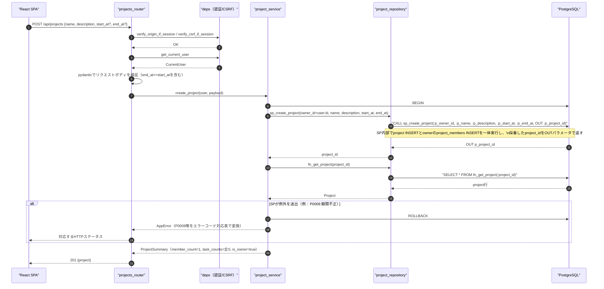
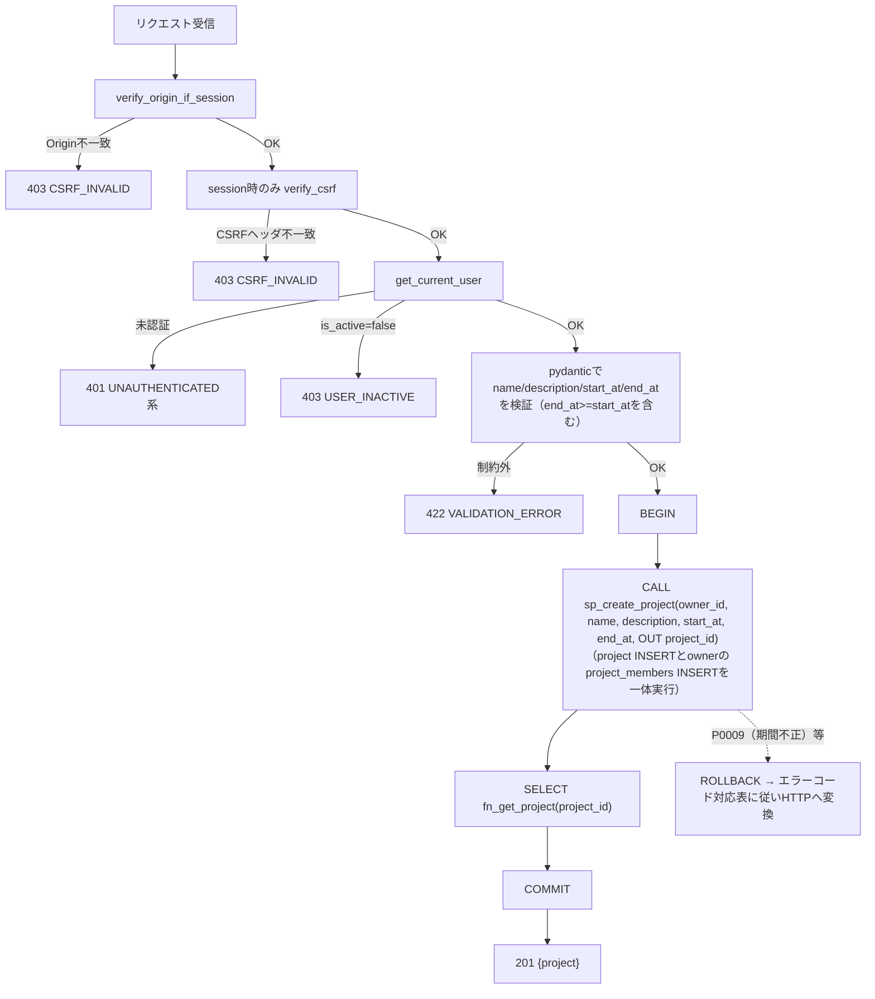
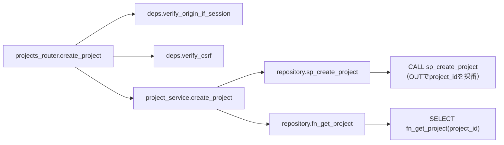
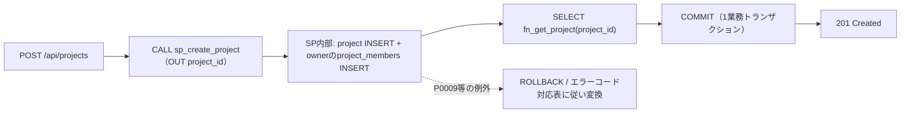

# POST /api/projects（プロジェクト作成）

## 0. 関連ドキュメント

| ドキュメント | 内容 |
|--------------|------|
| [../../../basic_design/04_api.md](../../../basic_design/04_api.md) | §2.3 プロジェクトAPI一覧、§3.2 スキーマ（`POST /projects`）、§7.2 サービス層関数一覧 |
| [../../../basic_design/01_database.md](../../../basic_design/01_database.md) | §3.3 projects、§3.4 project_members、§4.3 プロジェクト作成時のデータ生成 |
| [../../../basic_design/03_auth.md](../../../basic_design/03_auth.md) | §9.2 `core/deps.py`（`get_current_user`）、§8 CSRF対策 |
| [./01_get_projects.md](./01_get_projects.md) | 作成後に一覧へ反映されるAPI |
| [../screen/06_dashboard.md](../../screen/06_dashboard.md) | 本APIを呼び出す画面（新規作成モーダル） |

## 1. 概要

| 項目 | 内容 |
|------|------|
| エンドポイント | `POST /api/projects` |
| 目的 | 新規プロジェクトを作成し、作成者をオーナー兼メンバーとして登録する |
| 認証 | 必要（session Cookie または `Authorization: Bearer`） |
| 認可 | member（ログイン済みの全ユーザーが作成可能。admin可） |
| CSRF検証 | 必要（session モードの更新系）。jwtモードは `Authorization` ヘッダのため通常不要 |
| Origin検証 | 必要（sessionモードのみ。jwtモードはAuthorizationヘッダのみのため不要） |
| AUTH_MODE差異 | session: `X-CSRF-Token` 検証あり／jwt: ヘッダ方式のためCSRF検証なし。作成処理自体に差異なし |
| 冪等性 | なし（同名でも複数作成可能。冪等キーは提供しない） |
| レート制限 | 対象外 |
| トランザクション境界 | `CALL sp_create_project(...)` 1回を1業務トランザクションとして実行し、projectとowner membershipを一体でcommit/rollback |

## 2. 入出力仕様

### 2.1 リクエスト

**ボディ（`application/json`）**

| 名前 | 型 | 必須 | 制約 | 説明 |
|------|----|------|------|------|
| name | string | ○ | 1〜100文字 | プロジェクト名 |
| description | string \| null | 任意 | 上限なし（`TEXT`）。省略時 `null` | 説明 |
| start_at | string(datetime) \| null | 任意 | ISO 8601（`TIMESTAMPTZ`として保存、UTC）。省略時 `null` | プロジェクト開始日時 |
| end_at | string(datetime) \| null | 任意 | ISO 8601（`TIMESTAMPTZ`として保存、UTC）。省略時 `null` | プロジェクト終了日時 |

`start_at` と `end_at` が両方とも指定された場合、`end_at >= start_at` を満たさなければ `422 VALIDATION_ERROR` とする（片方のみ指定、または両方 `null`/省略の場合は検証対象外）。

パスパラメータ／クエリパラメータ：なし。ヘッダ：`X-CSRF-Token`（sessionモードの更新系で必須）。

### 2.2 レスポンス

**`201 Created`**

```json
{
  "id": "3f1c2a10-...",
  "name": "Cerberus開発",
  "description": "学習用タスク管理システムの開発",
  "owner": { "id": "1a2b...", "username": "taro", "display_name": "山田 太郎" },
  "member_count": 1,
  "task_counts": { "todo": 0, "in_progress": 0, "done": 0 },
  "is_owner": true,
  "is_active": true,
  "start_at": null,
  "end_at": null,
  "created_at": "2026-09-03T04:05:06Z"
}
```

| フィールド | 型 | NULL | 説明 |
|-----------|----|----|------|
| id | string(uuid) | 不可 | 作成されたプロジェクトID |
| name | string | 不可 | プロジェクト名 |
| description | string | 可 | 説明 |
| owner | object | 不可 | 作成者自身（`current_user`） |
| member_count | integer | 不可 | 常に `1`（作成直後はオーナーのみ） |
| task_counts | object | 不可 | 常に全status `0` |
| is_owner | boolean | 不可 | 常に `true` |
| is_active | boolean | 不可 | 常に `true`（作成直後は有効） |
| start_at | string(datetime) | 可 | リクエストで指定した値、未指定時 `null` |
| end_at | string(datetime) | 可 | リクエストで指定した値、未指定時 `null` |
| created_at | string(datetime) | 不可 | ISO 8601 UTC |

`Set-Cookie` なし。共通ヘッダ `X-Request-ID` を全レスポンスに付与する。`Location` ヘッダは付与しない（本設計ではボディのみで完結させる）。

## 3. エラー仕様

| HTTP | code | 発生条件 | メッセージ | 備考 |
|------|------|----------|------------|------|
| 401 | `UNAUTHENTICATED` / `SESSION_EXPIRED` / `TOKEN_EXPIRED` / `TOKEN_INVALID` | 認証情報なし・無効 | 認証が必要です | `deps.get_current_user` |
| 403 | `USER_INACTIVE` | `is_active=false` | アカウントが無効化されています | |
| 403 | `CSRF_INVALID` | sessionモードでCSRFヘッダ／Origin不一致 | CSRFトークンが不正です | `deps.verify_origin_if_session` / `verify_csrf_if_session` |
| 422 | `VALIDATION_ERROR` | `name` 未指定・101文字以上、または `start_at`/`end_at` 両方指定時に `end_at < start_at` | 入力内容に誤りがあります | `details` にフィールド情報 |
| 503 | `SERVICE_UNAVAILABLE` | PostgreSQL 接続不能 | しばらくしてから再度お試しください | fail-close |

`basic_design/04_api.md` §4.2 のエラーコード体系から逸脱しない。

## 4. 処理シーケンス



## 5. 処理フロー・分岐



## 6. 関数詳細

### 6.1 `api/routers/projects_router.py :: create_project`

| 項目 | 内容 |
|------|------|
| シグネチャ | `async def create_project(payload: ProjectCreateRequest, user: CurrentUser = Depends(get_current_user), db: AsyncSession = Depends(get_db), _: None = Depends(verify_csrf)) -> ProjectSummaryResponse`（`payload` は `name`, `description`, `start_at`, `end_at` を保持） |
| 引数 | `payload`: リクエストボディ（pydantic検証済み） / `user`: 認証済みユーザー / `db`: DBセッション |
| 戻り値 | `ProjectSummaryResponse`（201） |
| 送出例外 | `CsrfInvalidError`（403）を `verify_csrf` 依存関係が送出 |
| 処理内容 | 1. `verify_origin_if_session` / `verify_csrf_if_session`を依存関係として実行 2. `project_service.create_project` を呼び出す 3. 戻り値をそのまま201で返す |
| 副作用 | なし（副作用はservice層に委譲） |

### 6.2 `service/project_service.py :: create_project`

| 項目 | 内容 |
|------|------|
| シグネチャ | `async def create_project(user: CurrentUser, payload: ProjectCreateRequest, db: AsyncSession) -> ProjectSummary` |
| 引数 | `user`: 作成者 / `payload`: `name`, `description`, `start_at`, `end_at` / `db`: DBセッション |
| 戻り値 | `ProjectSummary`（`member_count=1`, `task_counts`全0, `is_owner=True`, `is_active=True` を固定値として組み立てる） |
| 送出例外 | `ValidationError`（`end_at < start_at`）→422、`InternalError`（INSERT失敗）→500、`ServiceUnavailableError`（DB接続不能）→503 |
| 処理内容 | 1. 入力形式をpydanticで検証する（`project_id`はAPI側で生成しない） 2. repositoryが `CALL sp_create_project(:p_owner_id, :p_name, :p_description, :p_start_at, :p_end_at, OUT :p_project_id)` を1回呼び、SP内部で採番された`project_id`をOUTパラメータで受け取る 3. `SELECT fn_get_project(project_id)` で応答表示用の行を取得 4. SQLSTATE P0009等はAPIのAppErrorへ変換し、SP失敗時は全体をrollback |
| 副作用 | SP内部で `projects` とownerの `project_members` を更新 |

### 6.3 `repository/project_repository.py :: sp_create_project`

| 項目 | 内容 |
|------|------|
| シグネチャ | `async def sp_create_project(db: AsyncSession, owner_id: UUID, name: str, description: str \| None, start_at: datetime \| None, end_at: datetime \| None) -> UUID` |
| 引数 | `owner_id`: 作成者 / `name`, `description`, `start_at`, `end_at`: リクエスト値 |
| 戻り値 | SP内部で`gen_random_uuid()`により採番され、OUTパラメータとして返された`project_id`（`UUID`） |
| 送出例外 | SQLSTATE `P0009`（期間不正）等。APIの対応表でAppErrorへ変換 |
| 処理内容 | `CALL sp_create_project(:p_owner_id, :p_name, :p_description, :p_start_at, :p_end_at, OUT :p_project_id)` のみを発行し、OUTパラメータを戻り値として返す。DB更新本体とowner登録はSP内部で一体実行される |
| 副作用 | SP内のDB更新。repositoryは直接CRUDを持たない |

### 6.4 `repository/project_repository.py :: fn_get_project`

| 項目 | 内容 |
|------|------|
| シグネチャ | `async def fn_get_project(db: AsyncSession, project_id: UUID) -> ProjectRow \| None` |
| 引数 | `project_id`: `sp_create_project`が返した採番済みID |
| 戻り値 | `fn_get_project`の結果を写像した行。存在しない場合は`None`（作成直後のため通常は発生しない） |
| 送出例外 | `OperationalError`（DB不通） |
| 処理内容 | `SELECT fn_get_project(:project_id)` のみを発行する |
| 副作用 | なし |

## 7. 関数相関図



## 8. データ遷移図



## 9. SP/FNデータアクセス一覧

### 9.1 正式なDBアクセス契約

本APIのrepositoryは、次のSP/FN呼び出しとDTO写像だけを行う。

| 種別 | 契約 | 説明 |
|------|------|------|
| sp_create_project | `sp_create_project(p_owner_id, p_name, p_description, p_start_at, p_end_at, OUT p_project_id)` | project作成とownerのproject_members登録を一体実行し、SP内部で採番した`project_id`をOUTで返す |
| fn_get_project | `fn_get_project(p_project_id)` | sp_create_projectが返した`project_id`でレスポンス表示用の行を取得する |

repositoryはDBテーブルへ直結せず、SP/FN契約だけを呼び出す。 直下の従来のテーブルI/O表はSP/FN内部SQLの補足であり、repositoryの発行契約ではない。更新系の整合性制御、version検証、advisory lock、通知、SQLSTATE P0xxxはSP/FN層の責務である。存在・所属の事実判定はFNの空集合/falseを受け、404/403への変換はAPI層が行う。

**PostgreSQL（SP内部の補足。repositoryが直接発行するSQLではない）**

| テーブル | 操作 | 条件・TTL | 備考 |
|----------|------|-----------|------|
| projects | INSERT（`sp_create_project`内部） | `owner_id = current_user.id`、`id`はSP内部で`gen_random_uuid()`により採番、`is_active`はDEFAULT `true`、`start_at`/`end_at`は指定値または`null` | 1トランザクション。`ck_projects_period` CHECK制約あり |
| project_members | INSERT（`sp_create_project`内部） | `project_id`（SPが採番したID）, `user_id = owner_id`, `invited_by = NULL` | 同一トランザクション。所属判定を一箇所に集約するため作成時に自分自身も登録する |
| projects | SELECT（`fn_get_project`内部） | `id = :project_id` | レスポンス表示用の取得 |

**Redis**

| キー | 操作 | TTL | 備考 |
|------|------|-----|------|
| `session:{sid}`（sessionモードのみ） | GET | `SESSION_TTL_SECONDS` | `deps.get_current_user` の認証確認 |
| `csrf:{sid}`（sessionモードのみ） | GET | `SESSION_TTL_SECONDS` | `deps.verify_csrf` によるCSRFトークン照合 |

## 10. バリデーション規則

| pydanticスキーマ | フィールド | 制約 | フロント（zod）との整合 |
|-------------------|-----------|------|--------------------------|
| `ProjectCreateRequest` | name | `str, min_length=1, max_length=100` | `zod.string().min(1).max(100)` |
| `ProjectCreateRequest` | description | `str \| None`, 省略時 `None` | `zod.string().nullable().optional()` |
| `ProjectCreateRequest` | start_at | `datetime \| None`, 省略時 `None` | `zod.string().datetime().nullable().optional()` |
| `ProjectCreateRequest` | end_at | `datetime \| None`, 省略時 `None` | `zod.string().datetime().nullable().optional()` |
| `ProjectCreateRequest` | （モデルバリデータ） | `start_at`と`end_at`が両方とも値を持つ場合、`end_at >= start_at`でなければ422 | `zod.object({...}).refine(end_at >= start_at when both present)` |

## 11. 非機能・セキュリティ考慮

| 観点 | 内容 |
|------|------|
| ログ出力 | 監査ログ対象（プロジェクト作成イベント）。`user_id`, `project_id`, `X-Request-ID` をINFOで構造化出力 |
| ユーザー列挙対策 | 該当なし |
| タイミング攻撃対策 | 該当なし |
| レート制限 | なし |
| CSRF/Origin | sessionモード：`verify_origin_if_session` + `verify_csrf_if_session`で検証する。jwtモードはAuthorizationヘッダ認証のため両方の検証対象外とする |
| fail-close方針 | INSERT失敗時は必ずロールバックし、部分的な作成（projectsのみ存在しproject_membersが無い状態）を発生させない |

## 12. テスト設計

| No | 区分 | ケース | 前提 | 期待結果 | pytest関数名案 |
|----|------|--------|------|----------|-----------------|
| 1 | 結合（実DB・実SP） | 正常作成でsp_create_project→fn_get_projectの順に呼ばれる | 実DB・実SPで検証 | sp_create_projectがOUTでproject_idを返し、fn_get_projectがその行を返すことを検証 | `test_create_project_calls_repository_in_order` |
| 2 | 単体 | sp_create_project失敗時にロールバックされる | `sp_create_project`がP0009等の例外を送出するようモック | `rollback`が呼ばれ例外が再送出される | `test_create_project_rollback_on_sp_failure` |
| 3 | 結合 | 正常系でprojectsとproject_membersが同一トランザクションで作成される | 実PostgreSQL | 201、`project_members`に自分自身が1行存在 | `test_create_project_success` |
| 4 | 結合 | nameが101文字で422 | リクエストボディ不正 | `422 VALIDATION_ERROR` | `test_create_project_name_too_long` |
| 5 | 結合 | sessionモードでCSRFヘッダ欠落時403 | `X-CSRF-Token`を送らない | `403 CSRF_INVALID` | `test_create_project_missing_csrf_session_mode` |
| 6 | 結合 | 未認証は401 | Cookie/Bearerなし | `401 UNAUTHENTICATED` | `test_create_project_unauthenticated` |
| 7 | 結合 | is_active=falseは403 | 無効化ユーザーでログイン試行済みトークンを使用 | `403 USER_INACTIVE` | `test_create_project_inactive_user` |
| 8 | 結合 | start_at/end_at省略時はnullで作成される | `start_at`/`end_at`を送らない | `201`、レスポンスの`start_at`/`end_at`が`null`、`is_active`が`true` | `test_create_project_without_period` |
| 9 | 結合 | start_at/end_atを両方指定して作成できる | `end_at >= start_at`を満たす値を送信 | `201`、レスポンスに指定値が反映される | `test_create_project_with_valid_period` |
| 10 | 結合 | end_at < start_atは422 | `end_at`が`start_at`より前の値 | `422 VALIDATION_ERROR` | `test_create_project_invalid_period_returns_422` |

`AUTH_MODE=session` / `jwt` の両方で No.3・No.6を実施する。No.5はsessionモード固有のためjwtモードでは対象外（jwtは`Authorization`ヘッダのみでCSRF検証を行わないため）とし、その理由を明記する。

## 13. 不明点・要検討事項

| 区分 | 内容 | 影響 |
|------|------|------|
| なし | | |
