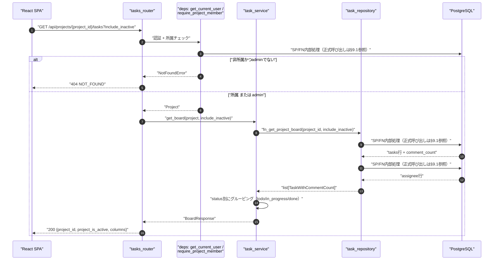
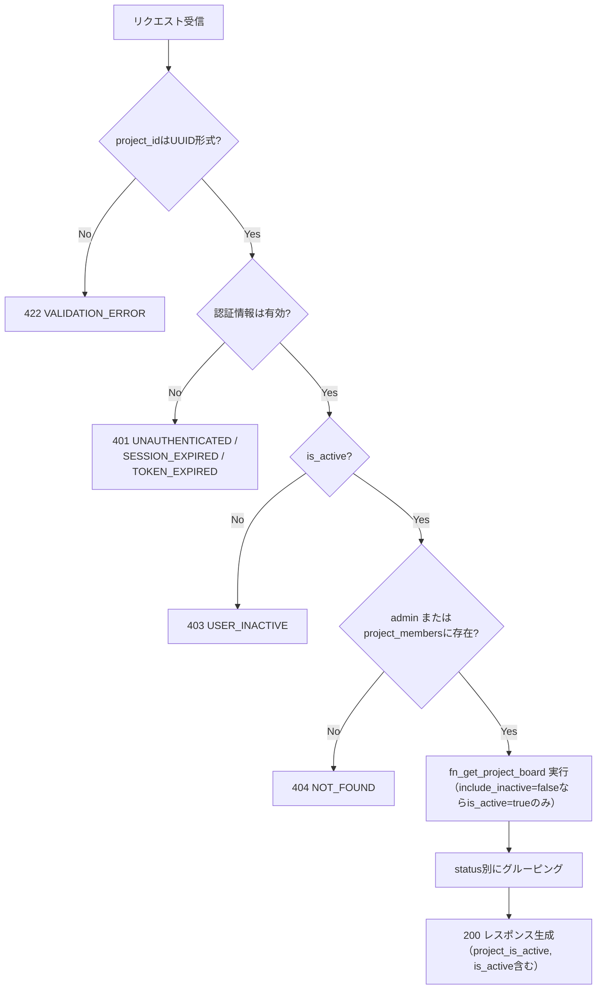
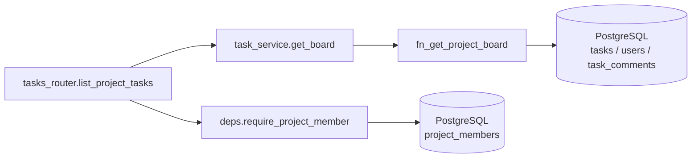
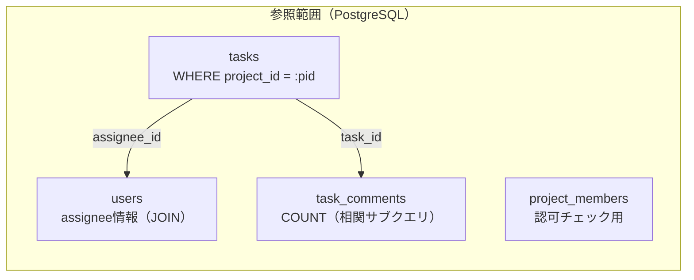

# GET /api/projects/{project_id}/tasks（プロジェクトのタスク一覧・カンバン取得）

## 0. 関連ドキュメント

| ドキュメント | 内容 |
|--------------|------|
| [../../../basic_design/04_api.md](../../../basic_design/04_api.md) | §2.4 エンドポイント一覧、§3.2 レスポンス例、§5 認可マトリクス |
| [../../../basic_design/01_database.md](../../../basic_design/01_database.md) | §3.5 tasks、§3.6 task_comments、§7 Q-3・Q-4 |
| [../../../basic_design/00_overview.md](../../../basic_design/00_overview.md) | §5.1 ログイン〜カンバン表示シーケンス |
| [../../auth/05_rbac.md](../../auth/05_rbac.md) | `require_project_member` の判定 |
| [../../database/06_table_tasks.md](../../database/06_table_tasks.md) | tasks テーブル詳細 |
| [../../database/07_table_task_comments.md](../../database/07_table_task_comments.md) | task_comments テーブル詳細 |
| [./02_post_project_tasks.md](./02_post_project_tasks.md) | 同一リソースの作成API |
| [../../screen/07_project_board.md](../../screen/07_project_board.md) | 本APIを使用するカンバン画面 |
| [../../database/06_table_tasks.md](../../database/06_table_tasks.md) | `tasks.is_active`（論理削除フラグ） |
| [../../database/04_table_projects.md](../../database/04_table_projects.md) | `projects.is_active`（プロジェクトの論理削除フラグ） |
| [./10_get_tasks.md](./10_get_tasks.md) | 横断的なフラットタスク一覧API（本APIとの使い分け） |
| [./05_delete_task.md](./05_delete_task.md) | タスク論理削除（`is_active=false`）の詳細 |

## 1. 概要

| 項目 | 内容 |
|------|------|
| エンドポイント | `GET /api/projects/{project_id}/tasks` |
| 目的 | カンバンボード描画用に、プロジェクト配下の全タスクを `status` 別にグルーピングして返す |
| 認証 | session モード：`cerberus_sid` Cookie ／ jwt モード：`Authorization: Bearer {access_token}` |
| 認可 | プロジェクトメンバー（`require_project_member`。admin は無条件許可） |
| CSRF検証 | 不要（参照系 GET のため） |
| Origin検証 | 不要（Cookie発行・利用系の更新系ではないため） |
| AUTH_MODE差異 | 認証情報の解決方法のみ異なり、レスポンス内容・認可判定に差異なし |
| 冪等性 | あり（GET、副作用なし） |
| レート制限 | 対象外（ログイン試行のみレート制限対象。関連設定なし） |
| トランザクション境界 | 単一の読み取り専用SELECT（`AsyncSession` の暗黙トランザクション内で完結。明示的な `BEGIN` は行わない） |

## 2. 入出力仕様（全体の出入力）

### 2.1 リクエスト

**パスパラメータ**

| 名前 | 型 | 必須 | 制約 | 説明 |
|------|----|----|------|------|
| project_id | string(uuid) | ○ | UUID v4 形式 | 対象プロジェクトID |

**クエリパラメータ**

| 名前 | 型 | 必須 | 制約 | 説明 |
|------|----|----|------|------|
| include_inactive | boolean | - | 省略時 `false` | `true` の場合、`tasks.is_active=false`（論理削除済み）のタスクも列に含めて返す。プロジェクトメンバーであれば admin/オーナーに限らず指定可能（[../projects/04_patch_project.md](../projects/04_patch_project.md) のプロジェクト側 `include_inactive` が admin/オーナー限定なのとは異なり、本APIはボード閲覧権限＝メンバー権限と同一に揃える方針。§13参照） |

**ヘッダ**

| 名前 | 必須 | 説明 |
|------|------|------|
| `Authorization` | jwt モードのみ必須 | `Bearer {access_token}` |
| `Cookie` | session モードのみ必須 | `cerberus_sid` |

**Cookie**：session モード時 `cerberus_sid` が必須。

**ボディ**：なし

### 2.2 レスポンス

**`200 OK`**

```json
{
  "project_id": "3f1c2a10-...",
  "project_is_active": true,
  "columns": {
    "todo": [
      {
        "id": "b2e4...",
        "title": "設計書をレビューする",
        "description": null,
        "assignee": { "id": "9a1b...", "username": "taro", "display_name": "山田 太郎" },
        "due_at": null,
        "position": 0,
        "version": 1,
        "is_active": true,
        "comment_count": 2,
        "created_at": "2026-09-01T00:00:00Z",
        "updated_at": "2026-09-01T00:00:00Z"
      }
    ],
    "in_progress": [],
    "done": []
  }
}
```

| フィールド | 型 | NULL可否 | 説明 |
|-----------|----|----------|------|
| project_id | string(uuid) | 不可 | 対象プロジェクトID |
| project_is_active | boolean | 不可 | `projects.is_active`。本APIは `project_id` がパスで確定しているため常に対象プロジェクトの値（`null` にはならない） |
| columns.todo / in_progress / done | array\<TaskSummary\> | 不可（空配列可） | 各 status 列。`position` 昇順でソート済み。既定では `is_active=true` の行のみ。`include_inactive=true` の場合は `is_active=false` の行も同じ列内に `position` 順で混在させる |
| TaskSummary.id | string(uuid) | 不可 | タスクID |
| TaskSummary.title | string | 不可 | タイトル |
| TaskSummary.description | string | 可 | 説明（カンバンカードでは省略表示） |
| TaskSummary.assignee | object | 可（未アサイン時 `null`） | `{id, username, display_name}` |
| TaskSummary.due_at | string(date-time) | 可 | 期限日時。ISO 8601 UTC |
| TaskSummary.position | integer | 不可 | 列内の並び順（0始まり）。論理削除されたタスクを除外してもposition詰めは行わないため、`is_active=true` のみで見るとギャップが生じ得る（[./05_delete_task.md](./05_delete_task.md) §11参照） |
| TaskSummary.version | integer | 不可 | 楽観ロック用バージョン。以後の `PATCH` で必須 |
| TaskSummary.is_active | boolean | 不可 | `tasks.is_active`。論理削除済みかどうか。`include_inactive=true` 時のみ `false` の行が出現し得る |
| TaskSummary.comment_count | integer | 不可 | `task_comments` の件数集計 |
| TaskSummary.created_at / updated_at | string(datetime) | 不可 | ISO 8601 UTC |

`Set-Cookie` の発行なし。共通ヘッダとして `X-Request-ID` を全レスポンスに付与する。

### 2.3 フロントエンド型との対応

フロントエンドの `BoardTask` は、`columns` 内の要素である `TaskSummary` と同じフィールドだけを持つ。`is_active` は必須として扱い、`created_by` と `project_id` はこのAPIの `TaskSummary` 契約にないため `BoardTask` に追加しない。プロジェクトIDはレスポンス最上位の `BoardResponse.project_id` から参照する。作成者情報が必要な詳細APIとは契約を混同せず、board画面のカード・詳細モーダルは `created_by` に依存しない。

## 3. エラー仕様

| HTTP | code | 発生条件 | メッセージ | 備考 |
|------|------|----------|------------|------|
| 401 | `UNAUTHENTICATED` | Cookie/Bearerなし | 認証情報がありません | |
| 401 | `SESSION_EXPIRED` | session不存在（session モード） | セッションの有効期限が切れました | |
| 401 | `TOKEN_EXPIRED` / `TOKEN_INVALID` | アクセストークン期限切れ・不正（jwt モード） | 認証トークンが無効です | |
| 403 | `USER_INACTIVE` | `is_active=false` | アカウントが無効化されています | |
| 404 | `NOT_FOUND` | `project_id` が存在しない、または非所属member | プロジェクトが見つかりません | 存在の有無を隠すため、非所属も404で統一（[../../auth/05_rbac.md](../../auth/05_rbac.md)） |
| 503 | `SERVICE_UNAVAILABLE` | PostgreSQL接続不能 | 一時的にサービスを利用できません | fail-close |

## 4. 処理シーケンス



## 5. 処理フロー・分岐



## 6. 関数詳細

### 6.1 `api/routers/tasks.py :: list_project_tasks`

| 項目 | 内容 |
|------|------|
| シグネチャ | `async def list_project_tasks(project_id: UUID, include_inactive: bool = False, project: Project = Depends(require_project_member), db: AsyncSession = Depends(get_db)) -> BoardResponse` |
| 引数 | project_id: string(uuid)、対象プロジェクトID／include_inactive: クエリパラメータ、省略時 `False`／project: `require_project_member` が解決した `Project`／db: DBセッション |
| 戻り値 | `BoardResponse`（`project_id`, `project_is_active`, `columns`） |
| 送出例外 | `NotFoundError`（404）、`AppError` 系は `core/exceptions.py` のハンドラで変換 |
| 処理内容 | 1. `require_project_member` の結果から `project` を受け取る（認可はDI側で完了済み）<br/>2. `task_service.get_board(project, include_inactive)` を呼び出す<br/>3. 結果をそのままレスポンスとして返す |
| 副作用 | なし（参照のみ） |

### 6.2 `service/task_service.py :: get_board`

| 項目 | 内容 |
|------|------|
| シグネチャ | `async def get_board(project: Project, include_inactive: bool) -> BoardResponse` |
| 引数 | project: 認可済みの `Project` エンティティ／include_inactive: 論理削除済みタスクを含めるか |
| 戻り値 | `BoardResponse`（`project_id`, `project_is_active=project.is_active`, `todo` / `in_progress` / `done` の3キーを持つ `columns`） |
| 送出例外 | なし（リポジトリ例外はそのまま上位へ伝播） |
| 処理内容 | 1. `fn_get_project_board(project.id, include_inactive)` を呼び出す<br/>2. 取得した `TaskWithCommentCount` のリストを `status` ごとに分配し、各列内は `position` 昇順のまま整形する<br/>3. 該当行がない `status` は空配列とする<br/>4. `project.is_active` をレスポンスの `project_is_active` にそのまま設定する |
| 副作用 | なし |

### 6.3 `repository/task_repository.py :: fn_get_project_board`

| 項目 | 内容 |
|------|------|
| シグネチャ | `async def fn_get_project_board(db: AsyncSession, project_id: UUID, include_inactive: bool) -> list[TaskWithCommentCount]` |
| 引数 | db: DBセッション／project_id: 対象プロジェクトID／include_inactive: `False` の場合 `is_active=true` のみ返す |
| 戻り値 | `TaskWithCommentCount`（`Task` に `comment_count: int` を付加したDTO）のリスト |
| 送出例外 | `OperationalError`（DB接続不能。`infra_error_handler` が503へ変換） |
| 処理内容 | `SELECT fn_get_project_board(:project_id, :include_inactive)` を1回実行する。担当者・コメント件数の集約、inactive条件、status/position順はFN内部で処理し、repositoryで追加SELECTを発行しない |
| 副作用 | なし |

## 7. 関数相関図



## 8. データ遷移図

読み取りのみで状態遷移なし。参照範囲は以下の通り。



## 9. SP/FNデータアクセス一覧

### 9.1 正式なDBアクセス契約

本APIのrepositoryは、次のSP/FN呼び出しとDTO写像だけを行う。

| 種別 | 契約 | 説明 |
|------|------|------|
| fn_get_project_board | `fn_get_project_board(p_project_id, p_include_inactive)` | fn_get_project_boardを呼び出し、結果をレスポンスへ写像する |

repositoryはDBテーブルへ直結せず、SP/FN契約だけを呼び出す。 直下の従来のテーブルI/O表はSP/FN内部SQLの補足であり、repositoryの発行契約ではない。更新系の整合性制御、version検証、advisory lock、通知、SQLSTATE P0xxxはSP/FN層の責務である。存在・所属の事実判定はFNの空集合/falseを受け、404/403への変換はAPI層が行う。

**PostgreSQL**

| テーブル | 操作 | 条件・TTL | 備考 |
|----------|------|-----------|------|
| project_members | SELECT | `project_id`, `user_id` | `require_project_member` による認可（admin時は省略） |
| tasks | SELECT | `project_id` 一致（+ `include_inactive=false`時は`is_active=true`）、`ORDER BY status, position` | 主クエリ。`uq_tasks_project_status_position` を使用 |
| users | SELECT（`FN結果の一括マッピング`の追加SELECT） | `tasks.assignee_id = users.id` | assignee 情報のEager Load。tasks主クエリとは別ラウンドトリップ |
| task_comments | SELECT（相関サブクエリ COUNT） | `task_id = tasks.id` | `comment_count` 算出。`ix_task_comments_task_created` を使用 |

**Redis**：使用なし。

## 10. バリデーション規則

| 対象 | pydanticスキーマ | ルール | フロント側（zod）との一致 |
|------|-------------------|--------|---------------------------|
| project_id（パス） | FastAPI の型ヒント `UUID` | UUID v4形式。不一致は自動的に422 | ルーティング側で `:projectId` をUUID形式チェック |
| include_inactive（クエリ） | FastAPI の型ヒント `bool`、既定 `False` | `true`/`false`（大文字小文字・`1`/`0`等はFastAPIの標準bool変換に従う）。不一致は422 | フロントのチェックボックス状態と対応 |

レスポンス側は `BoardResponse`（`schemas/task.py`）でシリアライズし、追加の入力バリデーションはない。

## 11. 非機能・セキュリティ考慮

| 項目 | 内容 |
|------|------|
| ログ出力 | アクセスログのみ（INFO）。認可失敗（404化される非所属アクセス）は監査対象外だが、`X-Request-ID` で相関可能なリクエストログは残す |
| ユーザー列挙対策 | 非所属プロジェクトへのアクセスは403ではなく404を返し、プロジェクトの存在有無を秘匿する |
| タイミング攻撃対策 | 本APIは認証情報の真偽比較を含まないため対象外 |
| レート制限 | なし |
| fail-close方針 | DB接続不能時は503を返し、部分的なデータでの200応答は行わない |
| N+1対策・クエリ回数 | 認可の所属確認1回（adminは省略）に加え、tasks主クエリ1回とassigneeの`FN結果の一括マッピング`追加SELECT 1回を実行する。`comment_count`は主クエリ内の相関サブクエリであり、タスクごとの追加クエリは発行しない。関連取得は同一ラウンドトリップではないが、タスク件数に比例してクエリ数は増えない |

## 12. テスト設計

| No | 区分 | ケース | 前提 | 期待結果 | pytest関数名案 |
|----|------|--------|------|----------|-----------------|
| 1 | 結合（実DB・実SP） | 正常系グルーピング | `fn_get_project_board` が3status混在のリストを返す | `columns.todo/in_progress/done` に正しく振り分けられる | `test_get_board_groups_by_status` |
| 2 | 結合（実DB・実SP） | タスク0件 | リポジトリが空リストを返す | 3列すべて空配列 | `test_get_board_empty_project` |
| 3 | 結合 | 正常系取得（member） | 実DB、所属プロジェクト・タスク3件・コメント2件 | 200、`comment_count` が一致 | `test_list_project_tasks_success` |
| 4 | 結合 | 非所属member | 実DB、他プロジェクトの`project_id`を指定 | 404 `NOT_FOUND` | `test_list_project_tasks_forbidden_as_404` |
| 5 | 結合 | admin | 実DB、非所属プロジェクトIDでもadminは200 | 200 | `test_list_project_tasks_admin_bypass` |
| 6 | 結合 | 未認証 | Cookie/Bearerなし | 401 `UNAUTHENTICATED` | `test_list_project_tasks_unauthenticated` |
| 7 | パラメータ化 | AUTH_MODE両対応 | `AUTH_MODE=session` / `jwt` それぞれで1〜6を実行 | 認可判定に差異なし | フィクスチャ `auth_mode` でパラメータ化 |
| 8 | 網羅対象外 | 大量タスクでのパフォーマンス測定 | - | - | 学習用途のためロードテストは対象外とする |
| 9 | 結合 | 既定は無効タスク除外 | 実DB、`is_active=false` のタスクを含むプロジェクト | 200、`columns`に含まれない | `test_list_project_tasks_excludes_inactive_by_default` |
| 10 | 結合 | include_inactive指定 | 実DB、`?include_inactive=true` | 200、`is_active=false` の行も `is_active:false` 付きで含まれる | `test_list_project_tasks_include_inactive` |
| 11 | 結合 | project_is_active反映 | 実DB、対象プロジェクトが `is_active=false` | 200、`project_is_active:false`（タスク自体は通常どおり返る） | `test_list_project_tasks_reflects_inactive_project` |

## 13. 不明点・要検討事項

| 区分 | 内容 | 影響 |
|------|------|------|
| 要検討 | `TaskSummary.description` をカンバン一覧レスポンスに含めるかは基本設計 §3.2 のレスポンス例に明記がない（例では省略）。本設計では詳細画面との差分を減らすため含める判断としたが、カード表示上不要ならレスポンスを軽量化する余地がある | フロント側の実装量・レスポンスサイズ |
| 要検討 | `include_inactive` の許可範囲をプロジェクトメンバー全員とした（プロジェクト側の `include_inactive` がadmin/オーナー限定なのと非対称）。カンバンは元々メンバー全員が閲覧できるため妥当と判断したが、issue #10のユーザー合意には粒度の明記がなく最終確認が必要 | 認可方針の一貫性 |
