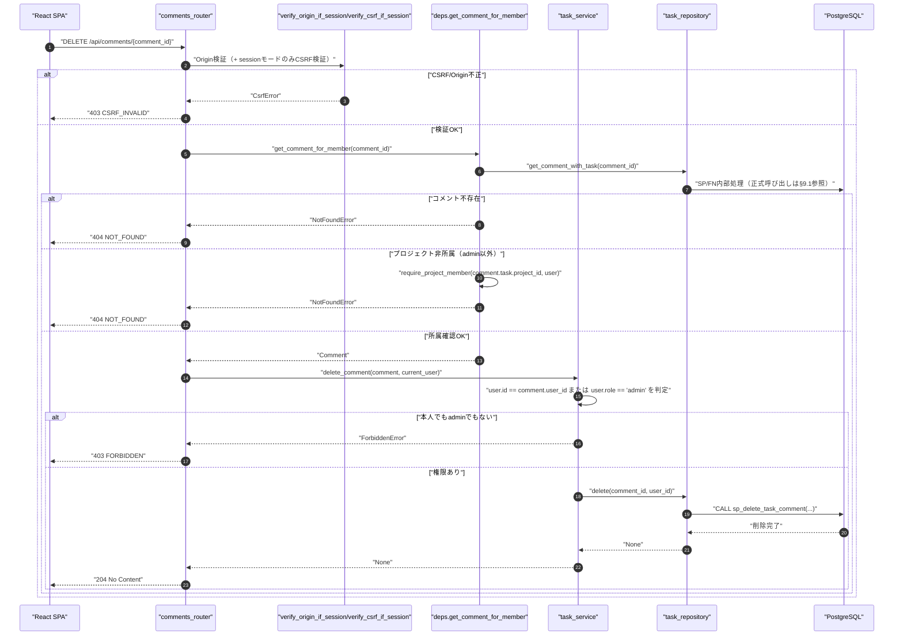
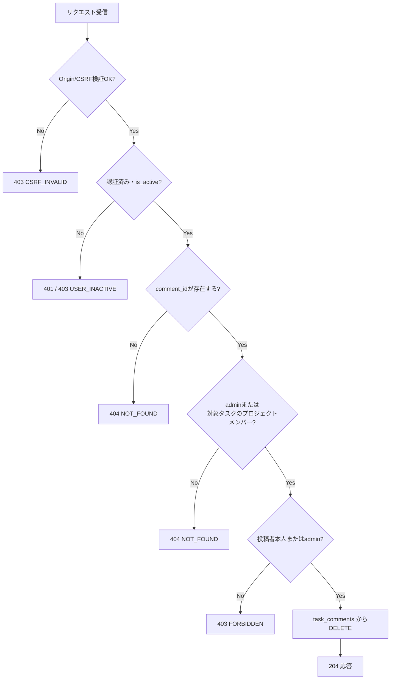
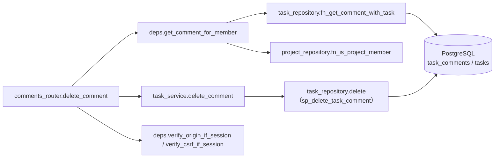
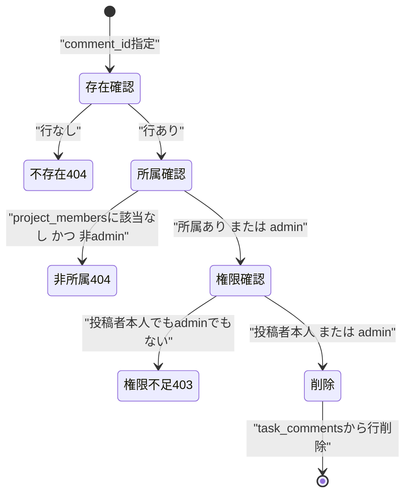

# DELETE /api/comments/{comment_id}（コメント削除）

## 0. 関連ドキュメント

| ドキュメント | 内容 |
|--------------|------|
| [../../../basic_design/04_api.md](../../../basic_design/04_api.md) | §2.4 タスク・コメントAPI一覧、§5 認可マトリクス（`DELETE /comments/{id}`：投稿者本人のみ○） |
| [../../../basic_design/01_database.md](../../../basic_design/01_database.md) | §3.6 task_comments テーブル定義 |
| [../../../basic_design/03_auth.md](../../../basic_design/03_auth.md) | §8 CSRF対策、§9.2 情報漏洩防止のための404方針 |
| [08_patch_comment.md](./08_patch_comment.md) | コメント編集API（認可判定・403/404の切り分けを共用） |
| [06_get_task_comments.md](./06_get_task_comments.md) | コメント一覧取得API |

## 1. 概要

| 項目 | 内容 |
|------|------|
| エンドポイント | `DELETE /api/comments/{comment_id}` |
| 目的 | 自分が投稿したコメントを削除する（管理者は他人のコメントも削除可能） |
| 認証 | 必要 |
| 認可 | 投稿者本人 または admin（判定順序は[08_patch_comment.md](./08_patch_comment.md) §3.1と同一） |
| CSRF検証 | 必要（sessionモードの更新系） |
| Origin検証 | 必要（sessionモードのみ。jwtモードはAuthorizationヘッダのみのため不要） |
| AUTH_MODE差異 | CSRF検証の要否のみ差異あり |
| 冪等性 | なし（削除済みIDへの再リクエストは404となり、初回の204とは異なる応答になる。§13参照） |
| レート制限 | 対象外 |
| トランザクション境界 | `task_comments` の1行DELETEのみ。関連する `position` 再採番等は発生しない（コメントに順序・カウンタ列は存在しないため） |

## 2. 入出力仕様

### 2.1 リクエスト

**パスパラメータ**

| 名前 | 型 | 必須 | 制約 | 説明 |
|------|----|----|------|------|
| comment_id | string(uuid) | ○ | UUID v4形式 | 削除対象コメントID |

**ヘッダ**

| 名前 | 型 | 必須 | 説明 |
|------|----|----|------|
| Cookie: `cerberus_sid` | string | session時必須 | セッション認証 |
| Authorization | string | jwt時必須 | `Bearer {access_token}` |
| X-CSRF-Token | string | sessionモードのみ必須 | |

**ボディ**：なし

### 2.2 レスポンス

**`204 No Content`**：ボディなし。`Set-Cookie` 発行なし。全レスポンスに `X-Request-ID` を付与する。

## 3. エラー仕様

| HTTP | code | 発生条件 | メッセージ | 備考 |
|------|------|----------|------------|------|
| 401 | `UNAUTHENTICATED` | 認証情報なし・無効 | 認証が必要です | |
| 403 | `USER_INACTIVE` | `users.is_active = false` | アカウントが無効化されています | |
| 403 | `CSRF_INVALID` | sessionモードでCSRF不一致・Origin不一致 | CSRFトークンが不正です | |
| 403 | `FORBIDDEN` | コメントが存在しプロジェクトメンバーではあるが、投稿者本人でもadminでもない | このコメントを削除する権限がありません | |
| 404 | `NOT_FOUND` | `comment_id` が存在しない、またはコメントは存在するが対象プロジェクトに非所属 | 対象のコメントが見つかりません | |

判定順序・403/404の切り分け方針は [08_patch_comment.md](./08_patch_comment.md) §3.1 と同一（存在確認 → プロジェクト所属確認 → 投稿者/admin確認）。

## 4. 処理シーケンス

## 5. 処理フロー・分岐

## 6. 関数詳細

### 6.1 `api/routers/comments.py :: delete_comment`

| 項目 | 内容 |
|------|------|
| シグネチャ | `async def delete_comment(comment: Comment = Depends(get_comment_for_member), user: CurrentUser = Depends(get_current_user), db: AsyncSession = Depends(get_db)) -> Response` |
| 引数 | `comment`：プロジェクト所属確認済みのコメント／`user`：現在ユーザー／`db`：DBセッション |
| 戻り値 | `Response(status_code=204)` |
| 送出例外 | なし（下位の `ForbiddenError` はハンドラで403に変換） |
| 処理内容 | 1. `task_service.delete_comment(comment, user, db)` を呼ぶ 2. `204` を返す |
| 副作用 | `task_comments` の1行DELETE（サービス層経由） |

### 6.2 `core/deps.py :: get_comment_for_member`

[08_patch_comment.md](./08_patch_comment.md) §6.2 と同一関数を共用する（PATCH/DELETEで重複定義しない）。

### 6.3 `service/task_service.py :: delete_comment`

| 項目 | 内容 |
|------|------|
| シグネチャ | `async def delete_comment(comment: Comment, user: CurrentUser, db: AsyncSession) -> None` |
| 引数 | `comment`：所属確認済みコメント／`user`：操作者／`db`：DBセッション |
| 戻り値 | なし |
| 送出例外 | `ForbiddenError`（投稿者本人でもadminでもない場合、403） |
| 処理内容 | 1. `user.id == comment.user_id or user.role == 'admin'` を判定し、Falseなら `ForbiddenError` 2. `task_repository.delete(comment.id, user.id, db)`（`CALL sp_delete_task_comment(...)`）を呼ぶ |
| 副作用 | `task_comments` の1行DELETE |

### 6.4 `repository/task_repository.py :: delete`

| 項目 | 内容 |
|------|------|
| シグネチャ | `async def delete(comment_id: UUID, user_id: UUID, db: AsyncSession) -> None` |
| 引数 | `comment_id`：対象コメントID／`user_id`：削除実行者ID／`db`：DBセッション |
| 戻り値 | なし |
| 送出例外 | なし（呼び出し時点で存在確認済み） |
| 処理内容 | `CALL sp_delete_task_comment(:comment_id, :user_id)` を実行する。削除本体とトランザクション境界はSP内部 |
| 副作用 | `task_comments` の1行削除 |

## 7. 関数相関図

## 8. データ遷移図

## 9. SP/FNデータアクセス一覧

### 9.1 正式なDBアクセス契約

本APIのrepositoryは、次のSP/FN呼び出しとDTO写像だけを行う。

| 種別 | 契約 | 説明 |
|------|------|------|
| delete_task_comment | `sp_delete_task_comment(p_comment_id, p_user_id)` | sp_delete_task_commentを呼び出し、結果をレスポンスへ写像する |

repositoryはDBテーブルへ直結せず、SP/FN契約だけを呼び出す。 直下の従来のテーブルI/O表はSP/FN内部SQLの補足であり、repositoryの発行契約ではない。更新系の整合性制御、version検証、advisory lock、通知、SQLSTATE P0xxxはSP/FN層の責務である。存在・所属の事実判定はFNの空集合/falseを受け、404/403への変換はAPI層が行う。

**PostgreSQL**

| テーブル | 操作 | 条件・TTL | 備考 |
|----------|------|-----------|------|
| task_comments | SELECT | `id = :comment_id` | 存在確認・project_id特定。`tasks`取得は`FN結果の一括マッピング`の追加SELECT |
| project_members | SELECT | `project_id = :pid AND user_id = :uid` | admin以外の所属確認 |
| task_comments | DELETE | `id = :comment_id` | 物理削除。他行への波及なし |

**Redis**：なし

## 10. バリデーション規則

リクエストボディを持たないため、pydanticスキーマは存在しない。`comment_id` パスパラメータのUUID形式検証のみ（不正時 `422 VALIDATION_ERROR`）。

## 11. 非機能・セキュリティ考慮

| 観点 | 内容 |
|------|------|
| 403/404の切り分け | [08_patch_comment.md](./08_patch_comment.md) §3.1・§11 と同一方針 |
| 冪等性 | DELETEの一般的な冪等性（2回目は404）は許容する。フロントは204受信後にローカルstateから即時除去し、二重削除リクエストを送らないUIとする |
| CSRF対策 | 07番・08番と同一方針 |
| ログ出力 | INFO：`comment_id`, `task_id`, `actor_user_id`, `is_admin_override`, `request_id`。監査目的で削除操作は必ず記録する |
| fail-close | PostgreSQL接続不能時は `503 SERVICE_UNAVAILABLE` |
| データ整合性 | `task_comments.task_id` は `tasks.id` に `ON DELETE CASCADE`（タスク削除時にコメントも自動削除）だが、本APIは単一コメントの削除でありCASCADEの影響範囲外 |

## 12. テスト設計

| No | 区分 | ケース | 前提 | 期待結果 | pytest関数名案 |
|----|------|--------|------|----------|-----------------|
| 1 | 単体 | 投稿者本人が削除 | `user.id == comment.user_id` | サービスが例外を投げず削除処理へ進む | `test_sp_delete_task_comment_allows_author` |
| 2 | 単体 | admin以外の非投稿者 | `user.id != comment.user_id`, `role='member'` | `ForbiddenError` | `test_sp_delete_task_comment_rejects_non_author_non_admin` |
| 3 | 単体 | admin | `role='admin'`, 非投稿者 | サービスが例外を投げず削除処理へ進む | `test_sp_delete_task_comment_allows_admin_override` |
| 4 | 結合 | 存在しないcomment_id | 実DB | `404 NOT_FOUND` | `test_sp_delete_task_comment_missing_returns_404` |
| 5 | 結合 | プロジェクト非所属メンバーが削除 | 実DB、他プロジェクトのメンバー | `404 NOT_FOUND` | `test_sp_delete_task_comment_non_member_returns_404` |
| 6 | 結合 | プロジェクトメンバーだが投稿者ではない | 実DB、同一プロジェクトの別メンバー | `403 FORBIDDEN` | `test_sp_delete_task_comment_member_non_author_returns_403` |
| 7 | 結合 | 投稿者本人が削除 | 実DB | `204`、`task_comments` から該当行が消える | `test_sp_delete_task_comment_author_deletes_successfully` |
| 8 | 結合 | adminが他人のコメントを削除 | 実DB、adminユーザー | `204` | `test_sp_delete_task_comment_admin_can_delete_others` |
| 9 | 結合 | 削除済みcomment_idへの再削除 | 実DB、直前に削除済み | `404 NOT_FOUND` | `test_sp_delete_task_comment_twice_returns_404_on_second_call` |
| 10 | パラメータ化 | `AUTH_MODE=session` / `jwt` の両方で正常系を確認 | 両モードのfixture | いずれも `204` | `test_sp_delete_task_comment_both_auth_modes` |

## 13. 不明点・要検討事項

| 区分 | 内容 | 影響 |
|------|------|------|
| 要検討 | コメント削除に確認ダイアログを挟むか等のUI仕様は画面設計側（screen/08_task_detail_modal.md）の管轄であり、本ファイルでは扱わない | 誤削除防止のUX |
| 不明 | 削除済みコメントを監査目的で論理保持する要否（`basic_design/01_database.md` は`task_comments`に論理削除列を持たない物理削除方針）。本設計は基本設計どおり物理削除とした | 削除履歴の監査可能性 |
