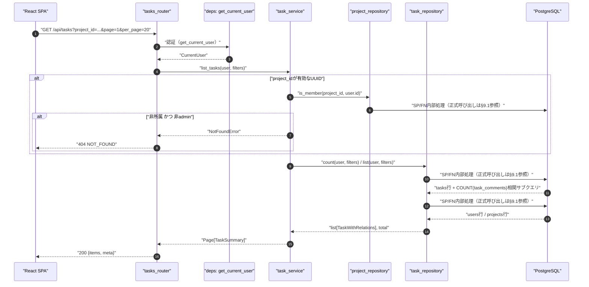
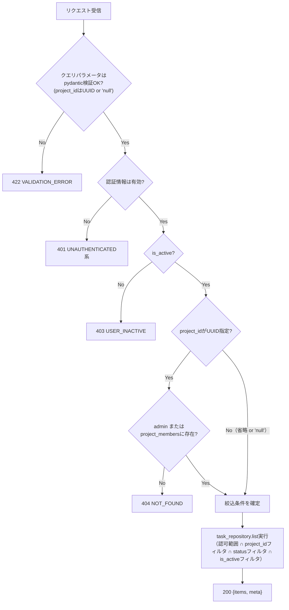
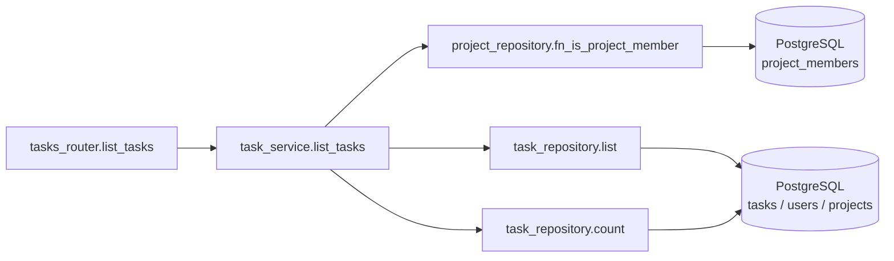
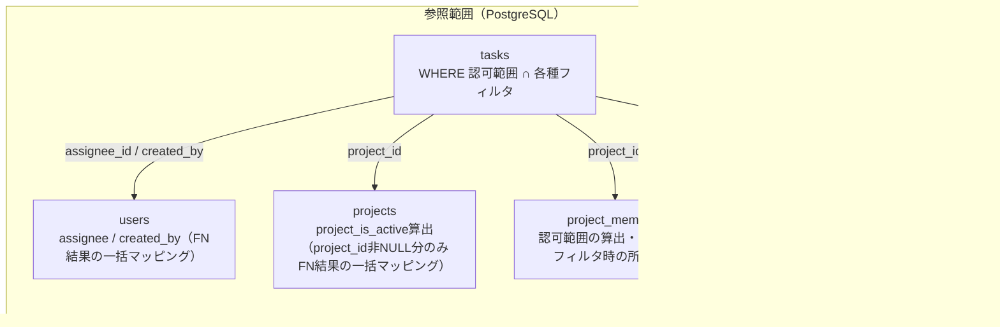

# GET /api/tasks（横断的タスク一覧取得）

## 0. 関連ドキュメント

| ドキュメント | 内容 |
|--------------|------|
| [../../../basic_design/04_api.md](../../../basic_design/04_api.md) | §1 共通仕様、§2.4 エンドポイント一覧、§5 認可マトリクス |
| [../../../basic_design/01_database.md](../../../basic_design/01_database.md) | §3.5 tasks（`project_id` NULL許容、`is_active`） |
| [../../auth/05_rbac.md](../../auth/05_rbac.md) | `require_project_member` の判定、非所属404統一方針 |
| [../../database/06_table_tasks.md](../../database/06_table_tasks.md) | tasks テーブル詳細（`project_id` NULL許容化・`is_active`追加） |
| [./01_get_project_tasks.md](./01_get_project_tasks.md) | プロジェクト配下限定の一覧・カンバン取得API（本APIとの使い分け） |
| [./03_get_task.md](./03_get_task.md) | タスク1件詳細取得（同一の認可方針を流用） |
| [./11_post_tasks.md](./11_post_tasks.md) | 同一リソース群のフラット作成API |
| [../projects/01_get_projects.md](../projects/01_get_projects.md) | ページング・`include_inactive`の既存パターン（本APIも同様の方式を踏襲） |

| 実装ファイル | `api/app/api/routers/tasks_router.py`、`api/app/schemas/task.py`、`api/app/service/task_service.py`、`api/app/repository/task_repository.py`、`db/functions/fn_list_tasks.sql` |

## 1. 概要

| 項目 | 内容 |
|------|------|
| エンドポイント | `GET /api/tasks` |
| 目的 | ログインユーザーが参照可能な全タスクを、所属プロジェクトを横断して一覧する。プロジェクト未所属タスク（`project_id=NULL`）も対象に含む。`GET /api/projects/{project_id}/tasks`（[01](./01_get_project_tasks.md)）がカンバン描画用に単一プロジェクトの`status`別グルーピングを返すのに対し、本APIは複数プロジェクトを横断した単一のページング一覧を返す |
| 認証 | session モード：`cerberus_sid` Cookie ／ jwt モード：`Authorization: Bearer {access_token}` |
| 認可 | admin：全タスク（未所属タスクも含め無条件）。member：自分が所属する各プロジェクトの全タスク（`require_project_member`と同じ「メンバーなら誰でも閲覧可」の考え方を横断適用）＋自分が作成した未所属タスク（`project_id=NULL AND created_by=自分`）の合算 |
| CSRF検証 | 不要（参照系 GET） |
| Origin検証 | 不要 |
| AUTH_MODE差異 | 認証情報の解決方法のみ異なり、業務ロジックに差異なし |
| 冪等性 | あり（GET、副作用なし） |
| レート制限 | 対象外 |
| トランザクション境界 | 単一の読み取り専用SELECT（`AsyncSession` の暗黙トランザクション内で完結） |

## 2. 入出力仕様（全体の出入力）

### 2.1 リクエスト

**クエリパラメータ**

| 名前 | 型 | 必須 | 制約 | 説明 |
|------|----|----|------|------|
| page | integer | - | 1以上。既定 `1` | ページ番号 |
| per_page | integer | - | 1〜100。既定 `20`（`PAGINATION_DEFAULT_PER_PAGE` / `PAGINATION_MAX_PER_PAGE`） | 1ページあたり件数 |
| project_id | string | - | 省略可。UUID形式、または未所属タスクのみを指定する特別値 `"null"`（文字列リテラル） | 3種の状態を区別する：①省略＝認可範囲全体（所属プロジェクト全部＋自分の未所属タスク）②UUID指定＝そのプロジェクトのタスクのみに絞込（非所属なら404）③`"null"`指定＝未所属タスクのみに絞込。詳細は下記表 |
| status | string | - | `todo` / `in_progress` / `done` | 指定時はそのstatusのみに絞込 |
| include_inactive | boolean | - | 既定 `false` | `true` で `is_active=false`（論理削除済み）タスクも含める |
| sort | string | - | `created_at` / `due_at`。既定 `created_at` | ソートキー |
| order | string | - | `asc` / `desc`。既定 `desc` | ソート順 |

**`project_id` の絞込パターン（確定方針）**

| 指定 | 対象範囲 | 非所属・不正時の挙動 |
|------|----------|----------------------|
| 省略 | 認可範囲の全件（所属プロジェクトの全タスク ＋ 自分が作成した未所属タスク） | - |
| 有効なUUID | そのプロジェクトのタスクのみ | 非所属（かつ非admin）は404 `NOT_FOUND`（[01](./01_get_project_tasks.md)と同一方針。プロジェクトの存在有無を秘匿） |
| 文字列 `"null"` | 未所属タスクのみ。member/adminとも、未所属タスクの可視範囲規則（下記）がそのまま適用される | - |
| UUID・`"null"`のいずれでもない文字列 | - | 422 `VALIDATION_ERROR` |

**未所属タスク（`project_id=NULL`）の可視範囲**：admin は全件、member は `created_by=自分` の行のみ（[03_get_task.md](./03_get_task.md) §1と同一方針）。

パスパラメータ／ヘッダ（認証ヘッダ・Cookieを除く）／ボディ：なし。

### 2.2 レスポンス

**`200 OK`**

```json
{
  "items": [
    {
      "id": "b2e4...",
      "project_id": "3f1c2a10-...",
      "project_is_active": true,
      "title": "設計書をレビューする",
      "description": null,
      "status": "todo",
      "assignee": { "id": "9a1b...", "username": "taro", "display_name": "山田 太郎" },
      "created_by": { "id": "9a1b...", "username": "taro", "display_name": "山田 太郎" },
      "position": 0,
      "version": 1,
      "is_active": true,
      "due_at": null,
      "comment_count": 2,
      "created_at": "2026-09-01T00:00:00Z",
      "updated_at": "2026-09-01T00:00:00Z"
    }
  ],
  "meta": { "page": 1, "per_page": 20, "total": 1, "total_pages": 1 }
}
```

| フィールド | 型 | NULL可否 | 説明 |
|-----------|----|----------|------|
| items[].id | string(uuid) | 不可 | タスクID |
| items[].project_id | string(uuid) | 可 | 所属プロジェクトID。未所属タスクは `null` |
| items[].project_is_active | boolean | 可 | `projects.is_active`。`project_id` が `null` の場合は `null` |
| items[].title | string | 不可 | |
| items[].description | string | 可 | |
| items[].status | string | 不可 | `todo` / `in_progress` / `done` |
| items[].assignee | object | 可 | `{id, username, display_name}` |
| items[].created_by | object | 不可 | `{id, username, display_name}` |
| items[].position | integer | 不可 | 所属列内の並び順。未所属タスクは`project_id IS NULL`の仮想グループ内での位置（[11_post_tasks.md](./11_post_tasks.md) §6参照） |
| items[].version | integer | 不可 | 楽観ロック用 |
| items[].is_active | boolean | 不可 | `tasks.is_active` |
| items[].due_at | string(date-time) | 可 | ISO 8601 UTC |
| items[].comment_count | integer | 不可 | `task_comments` の件数 |
| items[].created_at / updated_at | string(datetime) | 不可 | ISO 8601 UTC |
| meta.page / per_page / total / total_pages | integer | 不可 | ページング情報 |

`Set-Cookie` の発行なし。`X-Request-ID` を全レスポンスに付与。

## 3. エラー仕様

| HTTP | code | 発生条件 | メッセージ | 備考 |
|------|------|----------|------------|------|
| 401 | `UNAUTHENTICATED` / `SESSION_EXPIRED` / `TOKEN_EXPIRED` / `TOKEN_INVALID` | 認証情報なし・無効 | 認証が必要です | |
| 403 | `USER_INACTIVE` | `is_active=false`（実行者） | アカウントが無効化されています | |
| 404 | `NOT_FOUND` | `project_id` に有効なUUIDを指定したが不存在または非所属member | プロジェクトが見つかりません | 存在有無を秘匿するため404で統一 |
| 422 | `VALIDATION_ERROR` | `page`/`per_page`/`status`/`sort`/`order`が制約外、`project_id`がUUIDでも`"null"`でもない | 入力内容に誤りがあります | |
| 503 | `SERVICE_UNAVAILABLE` | PostgreSQL接続不能 | 一時的にサービスを利用できません | fail-close |

## 4. 処理シーケンス



## 5. 処理フロー・分岐



## 6. 関数詳細

### 6.1 `api/routers/tasks.py :: list_tasks`

| 項目 | 内容 |
|------|------|
| シグネチャ | `async def list_tasks(page: int = 1, per_page: int = 20, project_id: str \| None = None, status: TaskStatus \| None = None, include_inactive: bool = False, sort: Literal["created_at","due_at"] = "created_at", order: Literal["asc","desc"] = "desc", user: CurrentUser = Depends(get_current_user), db: AsyncSession = Depends(get_db)) -> TaskListResponse` |
| 引数 | 各クエリパラメータ（2.1節参照）／user: 認証済みユーザー／db: DBセッション |
| 戻り値 | `TaskListResponse`（`items`, `meta`） |
| 送出例外 | `ValidationError`（`project_id`がUUIDでも`"null"`でもない場合、422）、`NotFoundError`（`project_id`指定時の非所属、404） |
| 処理内容 | 1. `project_id` 文字列を `UUID \| Literal["unassigned"] \| None` に正規化（`"null"`は`"unassigned"`として扱う。それ以外の非UUID文字列は`ValidationError`）<br/>2. `task_service.list_tasks(user, page, per_page, project_id_filter, status, include_inactive, sort, order)` を呼び出す<br/>3. 結果をそのまま返す |
| 副作用 | なし |

### 6.2 `service/task_service.py :: list_tasks`

| 項目 | 内容 |
|------|------|
| シグネチャ | `async def list_tasks(user: CurrentUser, page: int, per_page: int, project_id_filter: UUID \| Literal["unassigned"] \| None, status: TaskStatus \| None, include_inactive: bool, sort: str, order: str) -> Page[TaskSummary]` |
| 引数 | 6.1と対応 |
| 戻り値 | `Page[TaskSummary]`（`items`, `total`） |
| 送出例外 | `NotFoundError`（`project_id_filter`がUUIDで非所属の場合） |
| 処理内容 | `SELECT fn_list_tasks(:user_id, :project_id, :status, :include_inactive, :limit, :offset)` を1回呼び出し、認可範囲・フィルタ・関連情報を含むFN結果を`TaskSummary`へ写像する |
| 副作用 | なし |

### 6.3 `repository/task_repository.py :: list`

| 項目 | 内容 |
|------|------|
| シグネチャ | `async def list(db: AsyncSession, user: CurrentUser, project_id_filter: UUID \| Literal["unassigned"] \| None, status: TaskStatus \| None, include_inactive: bool, sort: str, order: str, page: int, per_page: int) -> list[TaskWithRelations]` |
| 引数 | 6.2と対応 |
| 戻り値 | `assignee` / `created_by` / `project` をEager Loadした `Task` のリスト |
| 送出例外 | `OperationalError`（503へ変換） |
| 処理内容 | `SELECT fn_list_tasks(:user_id, :project_id, :status, :include_inactive, :limit, :offset)` を1回実行する。admin/所属/未所属作成者のスコープ、フィルタ、ソート、コメント件数・関連情報の集約はFN内部で処理する |
| 副作用 | なし |

## 7. 関数相関図



## 8. データ遷移図

読み取りのみで状態遷移なし。



## 9. SP/FNデータアクセス一覧

### 9.1 正式なDBアクセス契約

本APIのrepositoryは、次のSP/FN呼び出しとDTO写像だけを行う。

| 種別 | 契約 | 説明 |
|------|------|------|
| fn_list_tasks | `fn_list_tasks(p_user_id, p_project_id, p_status, p_include_inactive, p_limit, p_offset)` | fn_list_tasksを呼び出し、結果をレスポンスへ写像する |

repositoryはDBテーブルへ直結せず、SP/FN契約だけを呼び出す。 直下の従来のテーブルI/O表はSP/FN内部SQLの補足であり、repositoryの発行契約ではない。更新系の整合性制御、version検証、advisory lock、通知、SQLSTATE P0xxxはSP/FN層の責務である。存在・所属の事実判定はFNの空集合/falseを受け、404/403への変換はAPI層が行う。

**PostgreSQL**

| テーブル | 操作 | 条件・TTL | 備考 |
|----------|------|-----------|------|
| project_members | SELECT | `user_id=:uid`（認可範囲の所属project_id集合の算出）、`project_id`指定時の所属確認 | admin時は省略 |
| tasks | SELECT | 認可範囲 ∩ `project_id`/`status`/`is_active`フィルタ、`ORDER BY :sort :order` | 主クエリ |
| tasks | SELECT COUNT | 同上の条件 | `meta.total`算出用 |
| users | SELECT（`FN結果の一括マッピング`の追加SELECT） | `assignee_id` / `created_by` | 表示用情報 |
| projects | SELECT（`FN結果の一括マッピング`の追加SELECT） | `tasks.project_id`（非NULLのみ） | `project_is_active`算出用 |
| task_comments | SELECT（相関サブクエリ COUNT） | `task_id = tasks.id` | `comment_count`算出 |

**Redis**：使用なし。

## 10. バリデーション規則

| フィールド | pydanticスキーマ | 制約 | フロント（zod）との一致 |
|-----------|-------------------|------|--------------------------|
| page | `TaskListQuery.page` | `int, ge=1`、既定1 | `zod.number().int().min(1)` |
| per_page | `TaskListQuery.per_page` | `int, ge=1, le=100`、既定20 | `zod.number().int().min(1).max(100)` |
| project_id | `TaskListQuery.project_id` | `str \| None`。UUID形式または文字列`"null"`のみ許可し、それ以外は422（サービス層一歩手前のバリデータで判定） | フロントは未所属フィルタ選択時のみ文字列`"null"`を送信するUIとする |
| status | `TaskListQuery.status` | `Literal["todo","in_progress","done"] \| None` | セレクトボックスと一致 |
| include_inactive | `TaskListQuery.include_inactive` | `bool`、既定`False` | チェックボックスと一致 |
| sort | `TaskListQuery.sort` | `Literal["created_at","due_at"]`、既定`"created_at"` | ソートUIの選択肢と一致 |
| order | `TaskListQuery.order` | `Literal["asc","desc"]`、既定`"desc"` | 同上 |

## 11. 非機能・セキュリティ考慮

| 項目 | 内容 |
|------|------|
| ログ出力 | アクセスログ（INFO）のみ |
| ユーザー列挙対策 | `project_id`指定時、非所属プロジェクトは404で存在有無を秘匿（[01](./01_get_project_tasks.md)と同一方針） |
| タイミング攻撃対策 | 対象外 |
| レート制限 | なし |
| fail-close方針 | DB接続不能時は503 |
| N+1対策・クエリ回数 | 認可範囲の算出（`project_members`）、主クエリ（COUNT＋一覧の計2回）、`users`/`projects`の`FN結果の一括マッピング`追加SELECT各1回の計5回程度。ページサイズに比例しない |
| 大量データ時の性能 | `project_id IN (サブクエリ)` は所属プロジェクト数に比例したインデックス参照になる。学習規模のデータ量では許容し、要検討事項に記載 |

## 12. テスト設計

| No | 区分 | ケース | 前提 | 期待結果 | 実在するpytest関数名 / 状態 |
|----|------|--------|------|----------|-----------------|
| 1 | APIルーター | project_id省略時のデフォルト範囲 | user=member、`per_page=20` | `project_id_filter=None`でサービス呼び出し | `test_list_tasks_forwards_default_query` |
| 2 | APIルーター | project_id指定・非所属 | サービスが`NotFoundError`を送出 | 404 `NOT_FOUND` | `test_list_tasks_rejects_non_member_project` |
| 3 | APIルーター | project_id="null"の正規化 | クエリ文字列`"null"` | `project_id_filter="unassigned"`としてサービス層へ渡る | `test_list_tasks_normalizes_null_project_filter` |
| 4 | APIルーター | 不正なproject_id文字列 | `"not-a-uuid"` | 422 `VALIDATION_ERROR`、サービス未呼び出し | `test_list_tasks_rejects_invalid_project_id` |
| 5 | 未実装 | memberは所属プロジェクトの全タスクを横断取得 | API結合テストなし | 未実装 | —（未実装） |
| 6 | DB関数 | memberは自分の未所属タスクを参照できる | `fn_list_tasks`を実DBで実行 | 作成者の結果に含まれる | `test_fn_list_tasks_unassigned_visible_only_to_creator`（未所属可視範囲） |
| 7 | DB関数 | memberは他人の未所属タスクを見えない | `fn_list_tasks`を実DBで実行 | 他人の結果に含まれない | `test_fn_list_tasks_unassigned_visible_only_to_creator`（未所属可視範囲） |
| 8 | APIルーター | project_id="null"指定で未所属のみ絞込 | クエリ解析とサービス委譲を検証 | `project_id_filter="unassigned"`としてサービス層へ渡る | `test_list_tasks_normalizes_null_project_filter`（APIレベル） |
| 9 | 未実装 | project_id=UUID指定で単一プロジェクトに絞込 | API結合テストなし | 未実装 | —（未実装） |
| 10 | DB関数（実DB・実FN） | adminは全ユーザーの未所属タスクを含め全件 | `fn_list_tasks`を実DBで実行 | 複数ユーザーの未所属タスクを全件含む | `test_fn_list_tasks_admin_sees_all_unassigned_tasks` |
| 11 | 未実装 | 既定はis_active=falseを除外 | API結合テストなし | 未実装 | —（未実装） |
| 12 | 未実装 | include_inactive指定 | API結合テストなし | 未実装 | —（未実装） |
| 13 | APIルーター | statusフィルタ | `?status=done&per_page=20`、サービスをモック | `status="done"`でサービス呼び出し | `test_list_tasks_forwards_status_filter` |
| 14 | APIルーター | ページング | `?page=2&per_page=5`、サービスをモック | `page=2`、`per_page=5`でサービス呼び出し | `test_list_tasks_forwards_pagination` |
| 15 | 未実装 | AUTH_MODE両対応 | タスクAPI固有のパラメータ化なし | 共通認証依存へ委譲。タスクAPI固有の両モード検証は未実装 | —（未実装） |

## 13. 不明点・要検討事項

| 区分 | 内容 | 影響 |
|------|------|------|
| 要検討 | `project_id` クエリで「未所属のみ」を表す方法として文字列リテラル `"null"` を採用したが、issue #10のブリーフに具体的なパラメータ形式の指定はない（クエリ文字列上は実際のUUID `null` 値を送れないための便宜的な設計）。別案として `unassigned=true` という独立の真偽値パラメータにする方が明快な可能性があり、フロント実装時に最終確認が必要 | クエリパラメータ設計・フロントとの合意 |
| 要検討 | `sort`/`order` パラメータは基本設計に明記がなく、本設計での独自追加（横断一覧のため既定の`position`順が意味を持たないための対応）。ソート対象フィールドを`created_at`/`due_at`の2種に限定した妥当性は要検討 | フロント側のソートUI設計との整合 |
| 要検討 | `project_id`指定時の絞込を「他エンドポイントと同様404で秘匿」としたが、一覧APIのフィルタとしての404が適切か（該当0件の200を返す設計も考えられる）は要検討 | エラーハンドリング方針の一貫性 |
