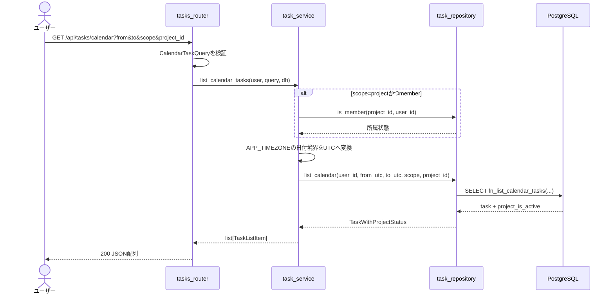
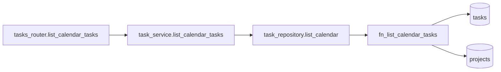
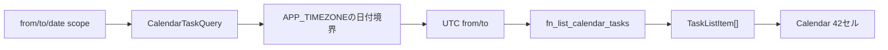

# GET /api/tasks/calendar（カレンダー用タスク一覧取得）

## 1. 概要

| 項目 | 内容 |
|------|------|
| エンドポイント | `GET /api/tasks/calendar` |
| 用途 | ダッシュボードの6週カレンダーへ期限付きタスクを表示する |
| 認証 | `get_current_user`で認証済みユーザーを取得する |
| ページング | なし。`from`〜`to`を最大63日未満の範囲で指定する |
| 実装ファイル | `api/app/api/routers/tasks_router.py`、`api/app/schemas/task.py`、`api/app/service/task_service.py`、`api/app/repository/task_repository.py`、`db/functions/fn_list_calendar_tasks.sql` |

## 2. 入出力仕様

### 2.1 Query

| パラメータ | 型 | 必須 | 制約 |
|------------|----|------|------|
| `from` | `date` | ○ | `APP_TIMEZONE`の指定日0時として解釈 |
| `to` | `date` | ○ | `from`以降、`from`との差は62日以内 |
| `scope` | `"me" \| "project"` | ○ | 表示対象スコープ |
| `project_id` | UUID | scope=`project`時○ | memberは所属プロジェクト、adminは任意のプロジェクト |

`scope=me`では、`(project_id IS NULL AND created_by=自分) OR assignee_id=自分`のタスクを返す。`scope=project`では、指定プロジェクトの全担当者のタスクを返す。いずれも`is_active=true`かつ`due_at IS NOT NULL`で、`from`を含み`to`の翌日0時を含まない。

### 2.2 Response

`GET /api/tasks`の`items[]`と同じ`TaskListItem`を配列で返す。レスポンスには`meta`を付与しない。`project_is_active`にはプロジェクトの有効状態を含め、未所属タスクは`null`とする。

### 2.3 エラー

| HTTP | code | 条件 |
|------|------|------|
| 401 | `UNAUTHENTICATED` | 未認証 |
| 404 | `NOT_FOUND` | memberが指定プロジェクトに所属していない |
| 422 | `VALIDATION_ERROR` | 日付範囲、scope、project_idの組み合わせが不正 |

## 3. 処理シーケンス

## 4. 関数・相関図

| 層 | 関数 | 入力 | 出力 |
|----|------|------|------|
| router | `list_calendar_tasks` | Query、CurrentUser、DB | `list[TaskListItem]` |
| service | `list_calendar_tasks` | CurrentUser、CalendarTaskQuery、DB | `list[TaskListItem]` |
| repository | `list_calendar` | user、UTC境界、scope、project_id | `list[TaskWithProjectStatus]` |
| DB | `fn_list_calendar_tasks` | user、UTC境界、scope、project_id | task行とproject状態 |

## 5. データ遷移

## 6. テスト設計

| 区分 | ケース | 期待結果 |
|------|--------|----------|
| 単体 | `from`/`to`の差が62日超 | 422相当のValidationError |
| 単体 | project scopeでproject_idなし | 422相当のValidationError |
| 単体 | memberの所属プロジェクト取得 | UTC境界へ変換してrepositoryを呼ぶ |
| 結合 | `me` scope | 自分の担当タスクと自分の未所属タスクだけ返す |
| 結合 | `project` scope | 指定プロジェクトの全担当者のタスクを返す |
| 境界 | JSTの2026-09-01 | 開始は2026-08-31 15:00 UTC、終了は2026-09-01 15:00 UTC |
