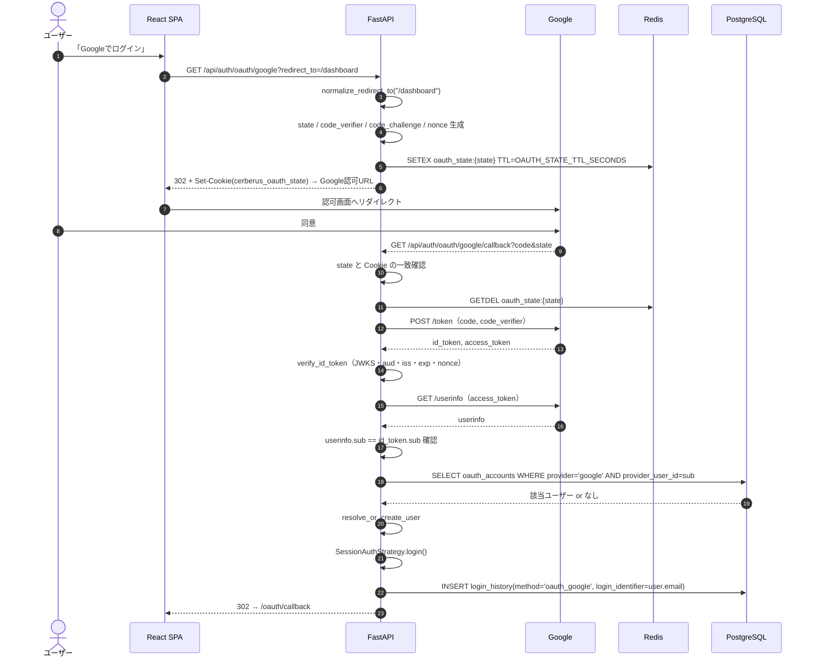
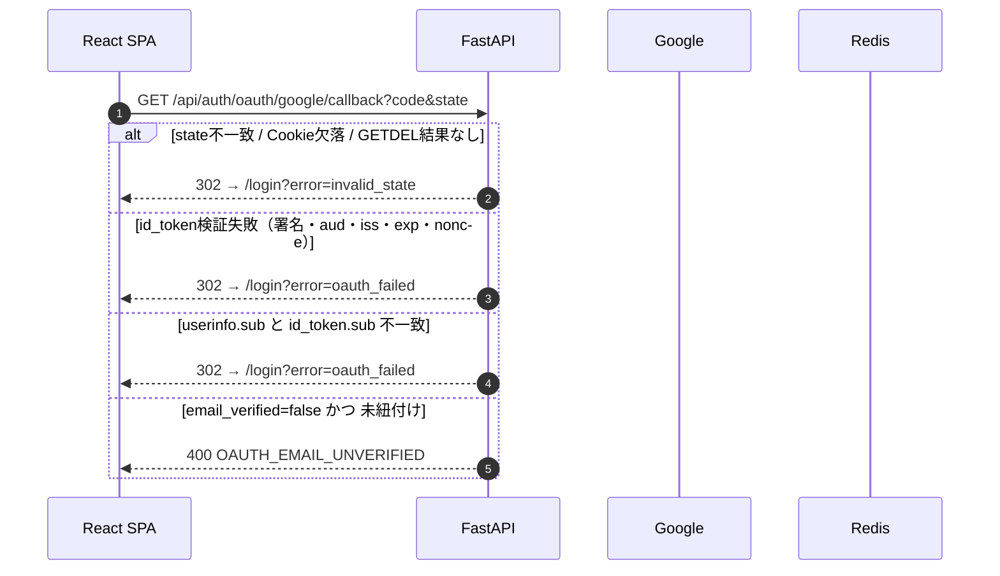
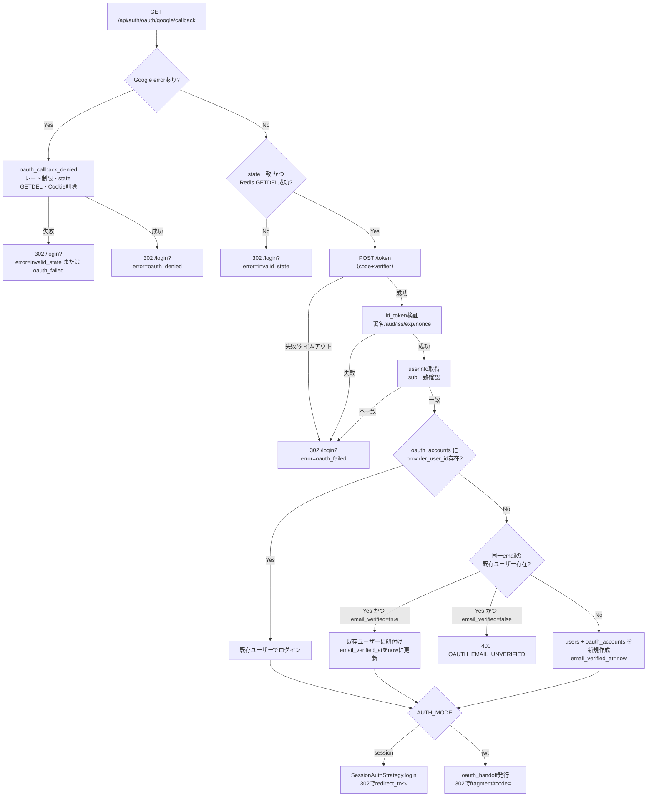
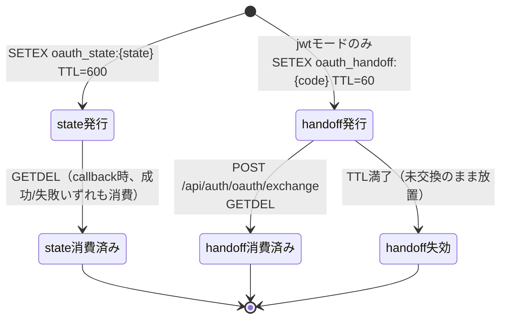
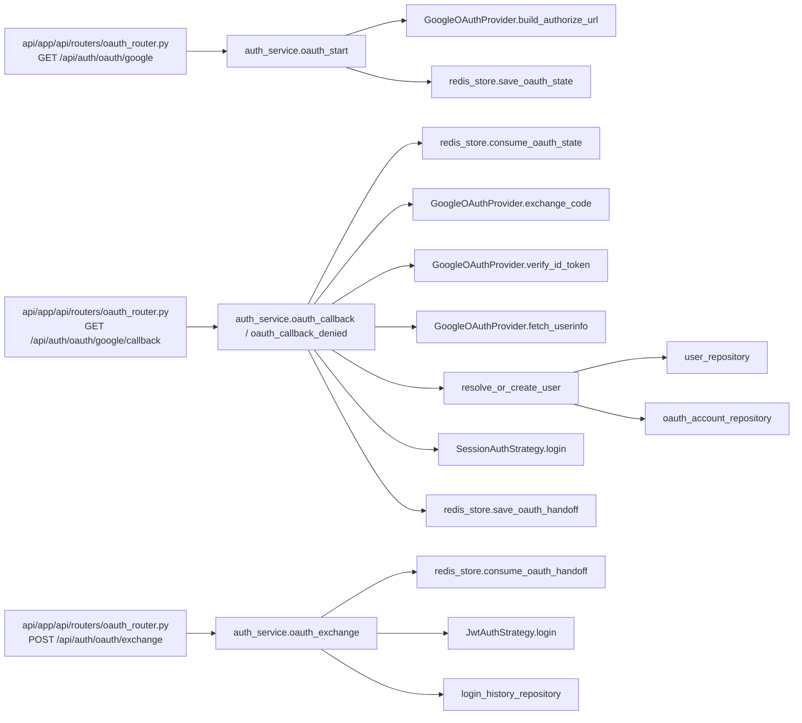

# auth/04 Google OAuth2（GoogleOAuthProvider）

## 0. 関連ドキュメント

- 基本設計：[../../basic_design/03_auth.md](../../basic_design/03_auth.md)（5章 Google OAuth2）、[../../basic_design/02_redis.md](../../basic_design/02_redis.md)（`oauth_state` / `oauth_handoff`）、[../../basic_design/04_api.md](../../basic_design/04_api.md)
- 関連詳細設計：[00_strategy_base.md](./00_strategy_base.md)、[01_session_auth.md](./01_session_auth.md)、[02_jwt_auth.md](./02_jwt_auth.md)、[08_redis_store.md](./08_redis_store.md)、[../api/auth/11_get_auth_oauth_google.md](../api/auth/11_get_auth_oauth_google.md)、[../api/auth/12_get_auth_oauth_google_callback.md](../api/auth/12_get_auth_oauth_google_callback.md)、[../api/auth/13_post_auth_oauth_exchange.md](../api/auth/13_post_auth_oauth_exchange.md)、[../database/02_table_oauth_accounts.md](../database/02_table_oauth_accounts.md)

## 1. 概要

| 項目 | 内容 |
|------|------|
| 対象 | `api/app/auth/oauth.py :: GoogleOAuthProvider`（Authorization Code Flow + PKCE(S256) による Google ログイン） |
| 責務 | 認可URLの組み立て、state/PKCE/nonceの発行と検証、token/userinfoエンドポイント呼び出し、id_token検証（JWKS）、ユーザー解決・新規作成、jwtモード向けhandoffコード発行 |
| 適用条件 | `AUTH_MODE` に関わらず常時有効。`GOOGLE_LOGIN_ENABLED` で無効化可能（認証設定APIに反映） |
| 依存先 | Redis（`oauth_state` / `oauth_handoff`）、PostgreSQL（`users` / `oauth_accounts`）、Google 認可サーバー・token/userinfo/JWKSエンドポイント |
| 実装ファイル | `api/app/auth/oauth.py`（Provider本体）、`api/app/service/auth_service.py`（`oauth_start` / `oauth_callback` / `oauth_exchange`） |

## 2. 構成要素

| 要素 | 種別 | 責務 | 備考 |
|------|------|------|------|
| `GoogleOAuthProvider` | クラス | 認可URL組み立て・code交換・userinfo取得・id_token検証 | `auth/base.py` の `AuthStrategy` とは独立。Strategyから利用される |
| `build_authorize_url` | メソッド | state/code_challenge/nonceを含む認可URLを生成 | scope固定 `openid email profile` |
| `exchange_code` | メソッド | 認可codeとcode_verifierをtokenエンドポイントへPOST | httpxの非同期クライアント使用 |
| `fetch_userinfo` | メソッド | access_tokenでuserinfoエンドポイントを呼ぶ | id_token.sub との一致確認に使用 |
| `verify_id_token` | メソッド | 署名（JWKS）・aud・iss・exp・nonceを検証 | `python-jose` 等のJWTライブラリを想定 |
| `_jwks_cache` | モジュール内キャッシュ | GoogleのJWKSをプロセス内メモリでキャッシュ | TTLは`GOOGLE_JWKS_CACHE_TTL_SECONDS` |
| `resolve_or_create_user` | 関数（`auth_service`内） | `oauth_accounts`/`users`の検索・作成・紐付け | 5.3節のアカウント紐付けルールを実装 |
| `normalize_redirect_to` | 関数 | `redirect_to` を同一オリジン相対パスへ正規化 | open redirect対策 |

## 3. 設定項目（環境変数）

| 変数名 | 型 | 既定値 | 用途 | 秘匿 |
|--------|----|--------|------|------|
| `GOOGLE_CLIENT_ID` | str | なし（必須） | Google OAuthクライアントID | `.env` / GitHub Secrets |
| `GOOGLE_CLIENT_SECRET` | str | なし（必須） | Google OAuthクライアントシークレット | `.env` / GitHub Secrets |
| `GOOGLE_REDIRECT_URI` | str | なし（必須） | コールバックURL（`/api/auth/oauth/google/callback`） | `.env` |
| `GOOGLE_LOGIN_ENABLED` | bool | `true` | Googleログインボタンの有効/無効（`/auth/config`に反映） | `.env` |
| `GOOGLE_AUTHORIZE_ENDPOINT` | str | `https://accounts.google.com/o/oauth2/v2/auth` | 認可エンドポイント | `.env` |
| `GOOGLE_TOKEN_ENDPOINT` | str | `https://oauth2.googleapis.com/token` | tokenエンドポイント | `.env` |
| `GOOGLE_USERINFO_ENDPOINT` | str | `https://openidconnect.googleapis.com/v1/userinfo` | userinfoエンドポイント | `.env` |
| `GOOGLE_JWKS_URI` | str | `https://www.googleapis.com/oauth2/v3/certs` | JWKS取得元 | `.env` |
| `GOOGLE_JWKS_CACHE_TTL_SECONDS` | int | `3600` | JWKSキャッシュの有効期間 | `.env` |
| `OAUTH_STATE_TTL_SECONDS` | int | `600` | `oauth_state:{state}` のTTL | `.env`（[08_redis_store.md](./08_redis_store.md)参照） |
| `OAUTH_HANDOFF_TTL_SECONDS` | int | `60` | `oauth_handoff:{code}` のTTL | `.env` |
| `OAUTH_REDIRECT_TO_MAX_LENGTH` | int | `2048` | `redirect_to` の最大文字数。超過時は既定の相対パスへ戻す | `.env` |
| `COOKIE_NAME_OAUTH_STATE` | str | `cerberus_oauth_state` | state保持用Cookie名 | `.env` |
| `COOKIE_SECURE` | bool | 環境依存 | state Cookieの`Secure`フラグ | `.env` |
| `FRONTEND_BASE_URL` | str | なし（必須） | `redirect_to`検証・コールバックURL組み立て | `.env` |

## 4. 全体の出入力

| 区分 | 内容 |
|------|------|
| 入力（開始） | `GET /api/auth/oauth/google?redirect_to=` のクエリ、`GOOGLE_CLIENT_ID`等の環境変数 |
| 入力（コールバック） | `GET /api/auth/oauth/google/callback?code&state` または `?error&state`、`cerberus_oauth_state` Cookie |
| 入力（交換） | `POST /api/auth/oauth/exchange` の一時code（jwtモードのみ） |
| 出力（開始） | `302 Location: {Google認可URL}` + `Set-Cookie(cerberus_oauth_state)` + Redis `SETEX oauth_state:{state}` |
| 出力（コールバック・session） | `302 Location: {FRONTEND_BASE_URL}/oauth/callback#redirect_to=...` + セッションCookie（[01_session_auth.md](./01_session_auth.md)） |
| 出力（コールバック・jwt） | `302 Location: {FRONTEND_BASE_URL}/oauth/callback#code=...` + Redis `SETEX oauth_handoff:{code}` |
| 出力（交換） | `200 {access_token, token_type, expires_in, redirect_to}` + refresh/CSRF Cookie |
| 副作用 | `oauth_accounts` / `users` へのINSERT・UPDATE、`login_history` へのINSERT（`login_identifier`は検証済みGoogle email） |

## 5. シーケンス図

### 5.1 正常系（session モード）

### 5.2 異常系（state不一致・id_token検証失敗・email未検証）

## 6. 処理フロー・分岐

## 7. データ遷移図

## 8. 関数・処理詳細

### 8.1 `api/app/auth/oauth.py :: GoogleOAuthProvider.build_authorize_url`

| 項目 | 内容 |
|------|------|
| シグネチャ / 定義 | `def build_authorize_url(state: str, code_challenge: str, nonce: str) -> str` |
| 引数 / 入力 | `state`（発行済みランダム値）、`code_challenge`（S256）、`nonce` |
| 戻り値 / 出力 | Google認可エンドポイントへのURL文字列 |
| 送出例外 / 失敗条件 | なし（純粋な文字列組み立て） |
| 処理内容 | 1. `GOOGLE_AUTHORIZE_ENDPOINT` を基点に `client_id`/`redirect_uri`/`response_type=code`/`scope=openid email profile`/`state`/`code_challenge`/`code_challenge_method=S256`/`nonce` をクエリに付与 2. URLを返す |
| 副作用 | なし |

### 8.2 `service/auth_service.py :: oauth_start`

| 項目 | 内容 |
|------|------|
| シグネチャ / 定義 | `async def oauth_start(redirect_to: str \| None, request: Request, response: Response) -> OAuthStartResult` |
| 引数 / 入力 | `redirect_to`（クエリ）、`request`/`response` |
| 戻り値 / 出力 | `OAuthStartResult`（`authorize_url`, `state`。呼び出し元ルーターが302 Locationに設定） |
| 送出例外 / 失敗条件 | なし（`redirect_to` は不正値でも既定値`/dashboard`へフォールバックし例外にしない） |
| 処理内容 | 1. `normalize_redirect_to(redirect_to)` 2. `state`/`code_verifier`/`code_challenge`/`nonce` を `secrets.token_urlsafe` 等で生成 3. `redis_store.save_oauth_state(state, redirect_to, code_verifier, nonce, ttl=OAUTH_STATE_TTL_SECONDS)` 4. `response.set_cookie(COOKIE_NAME_OAUTH_STATE, state, httponly=True, ...)` 5. `GoogleOAuthProvider.build_authorize_url(...)` を返す |
| 副作用 | Redis書き込み、Cookie設定 |

### 8.3 `service/auth_service.py :: oauth_callback`

| 項目 | 内容 |
|------|------|
| シグネチャ / 定義 | `async def oauth_callback(code: str | None, state: str | None, state_cookie: str | None, request: Request, response: Response, db: AsyncSession | None = None, *, settings: BackendSettings | None = None, provider: GoogleOAuthProvider | None = None, strategy: Any | None = None) -> OAuthCallbackResult` |
| 引数 / 入力 | クエリの `code`/`state`、Cookie `cerberus_oauth_state` |
| 戻り値 / 出力 | `OAuthCallbackResult{auth_mode, redirect_to, handoff_code}`（ルーターが正常系で302に設定） |
| 送出例外 / 失敗条件 | `InvalidStateError`、`OAuthFailedError`、`OAuthEmailUnverifiedError`、`UserInactiveError`（ルーターが302リダイレクトへ変換）。`TooManyAttemptsError`は429（`Retry-After`付与）、`ServiceUnavailableError`は503として共通エラーハンドラへ送出 |
| 処理内容 | 1. callbackレート制限を確認 2. Cookieのstateとクエリのstateを比較 3. `redis_store.consume_oauth_state(state)`（GETDEL） 4. 値がNoneなら`InvalidStateError` 5. `GoogleOAuthProvider.exchange_code(code, code_verifier)` 6. `verify_id_token(id_token, nonce)` 7. `fetch_userinfo(access_token)` とsub一致確認 8. `_resolve_or_create_user(db, userinfo)` 9. `AUTH_MODE` に応じてsession確立 or handoff発行 10. sessionモードでは`login_history`へ`login_identifier=user.email`を設定してINSERT |
| 副作用 | Redis削除・書き込み、PostgreSQL INSERT/UPDATE、Cookie設定（sessionモード） |

### 8.4 `service/auth_service.py :: _resolve_or_create_user`

| 項目 | 内容 |
|------|------|
| シグネチャ / 定義 | `async def _resolve_or_create_user(db: AsyncSession, userinfo: GoogleUserInfo) -> User` |
| 引数 / 入力 | Google idトークン由来の情報 |
| 戻り値 / 出力 | `User`（既存 or 新規作成） |
| 送出例外 / 失敗条件 | `OAuthEmailUnverifiedError`（400 `OAUTH_EMAIL_UNVERIFIED`）：未紐付けかつ`email_verified=false`の場合 |
| 処理内容 | 1. `oauth_accounts` を `provider='google' AND provider_user_id=sub` で検索 2. 存在すれば紐付け先 `users` を返す 3. なければ `email` で `users` を検索 4. 存在し `email_verified=true` なら `oauth_accounts` を追加し、`email_verified_at` がNULLなら`now()`へ更新 5. 存在し `email_verified=false` なら例外を送出 6. どちらも該当なければ新規 `users`（`password_hash=NULL`, `email_verified_at=now()`, `username='google_' + sha256(sub)[:16]`）と `oauth_accounts` を作成 |
| 副作用 | PostgreSQL INSERT/UPDATE |

### 8.5 `api/app/auth/oauth.py :: GoogleOAuthProvider.verify_id_token`

| 項目 | 内容 |
|------|------|
| シグネチャ / 定義 | `async def verify_id_token(id_token: str, expected_nonce: str) -> IdTokenClaims` |
| 引数 / 入力 | `id_token`（JWT文字列）、開始時にRedisへ保存した`nonce` |
| 戻り値 / 出力 | `IdTokenClaims{sub, email, email_verified, given_name, family_name, ...}` |
| 送出例外 / 失敗条件 | `OAuthFailedError`：署名不正・`aud != GOOGLE_CLIENT_ID`・`iss` が `accounts.google.com`/`https://accounts.google.com` 以外・`exp` 切れ・`nonce` 不一致のいずれか |
| 処理内容 | 1. `_get_jwks()` でJWKSを取得（キャッシュ利用） 2. `kid` に対応する鍵で署名検証 3. `aud`/`iss`/`exp`/`nonce` を検証 4. claimsを返す |
| 副作用 | JWKS未キャッシュ時のみ外部HTTP取得 |

### 8.6 `api/app/auth/oauth.py :: GoogleOAuthProvider._get_jwks`

| 項目 | 内容 |
|------|------|
| シグネチャ / 定義 | `async def _get_jwks(self) -> dict[str, Any]`（Provider内プライベート） |
| 引数 / 入力 | なし |
| 戻り値 / 出力 | `dict[str, Any]`（鍵集合） |
| 送出例外 / 失敗条件 | `OAuthFailedError`：Google側への接続不可時 |
| 処理内容 | 1. プロセス内メモリキャッシュの有効期限（`GOOGLE_JWKS_CACHE_TTL_SECONDS`）を確認 2. 期限内ならキャッシュを返す 3. 期限切れなら `GOOGLE_JWKS_URI` から再取得しキャッシュを更新 |
| 副作用 | プロセスメモリの更新（Redisは使用しない。複数ワーカー間では共有されず個別にキャッシュされる） |

### 8.7 `service/auth_service.py :: oauth_exchange`

| 項目 | 内容 |
|------|------|
| シグネチャ / 定義 | `async def oauth_exchange(code: str, request: Request, response: Response, db: AsyncSession | None = None, *, settings: BackendSettings | None = None, strategy: Any | None = None) -> OAuthExchangeResponse` |
| 引数 / 入力 | fragmentから渡された一時 `code` |
| 戻り値 / 出力 | `OAuthExchangeResponse{access_token, token_type, expires_in, redirect_to}` |
| 送出例外 / 失敗条件 | `OAuthHandoffInvalidError`（400 `OAUTH_HANDOFF_INVALID`）：`consume_oauth_handoff` がNoneを返した場合。その他、`UserInactiveError`、`OAuthFailedError`、`TooManyAttemptsError`、`ServiceUnavailableError` |
| 処理内容 | 1. callbackレート制限を確認 2. `redis_store.consume_oauth_handoff(code)`（GETDEL） 3. Noneなら例外 4. `user_id` から現在の有効ユーザーを再取得（`is_active`確認） 5. `JwtAuthStrategy.login(user, request, response)` 6. `login_history` へINSERT（method='oauth_google', `login_identifier=user.email`） 7. 正規化済み `redirect_to` を含めて返す |
| 副作用 | Redis削除、Cookie設定（refresh/CSRF）、PostgreSQL INSERT |

OAuthの `login_identifier` は監査・検索用に保存する検証済みGoogle emailであり、OAuthアカウントの認証・紐付けキーではない。アカウントの不変な識別には `oauth_accounts.provider_user_id`（Googleの `sub`）を使用する。パスワード、OAuth code、access token、refresh tokenは保存しない。カラムの共通定義は [basic_design/01_database.md §3.7](../../basic_design/01_database.md#37-login_history) を正とする。

## 9. 関数・要素相関図

## 10. セキュリティ・非機能考慮

| 観点 | 方針 | 根拠 |
|------|------|------|
| CSRF/リプレイ | stateはワンタイム消費（GETDEL）+ Cookie照合の二重検証 | [../../basic_design/03_auth.md](../../basic_design/03_auth.md) 5.1 |
| リプレイ（OIDC） | nonceをid_token claimと照合 | 認可コード横取り・トークン再利用対策 |
| open redirect | `redirect_to` は同一オリジン相対パスのみ許可。違反時は既定値`OAUTH_DEFAULT_REDIRECT_TO`（既定`/dashboard`） | [../../basic_design/03_auth.md](../../basic_design/03_auth.md) 5.1 |
| アカウント乗っ取り | `email_verified=false` は紐付け拒否（400） | 5.3節 |
| トークン露出防止 | jwtモードのaccess_tokenをURLに載せず、handoffコード＋fragment経由で受け渡す | 5.4節 |
| ログ出力 | `code`/`id_token`/`access_token`/`code_verifier` は平文ログに出さない。stateは検証結果（成功/失敗）のみINFO出力 | 共通ルール |
| fail-close | Google側（token/userinfo/JWKS）が不通の場合はログインを成立させず失敗リダイレクト | 要検討：具体的なHTTPステータス／リトライ方針は未定義 |
| JWKSキャッシュ | プロセス内メモリキャッシュのみ。複数ワーカー間で共有されず、各ワーカーが個別に再取得し得る | 要検討：Redis共有キャッシュ化の要否 |

## 11. テスト設計

| No | 区分 | ケース | 前提 | 期待結果 | テスト名案 |
|----|------|--------|------|----------|-----------|
| 1 | 単体 | `build_authorize_url` が必須クエリを含む | なし | scope/state/code_challenge等が含まれる | `test_build_authorize_url_includes_required_params` |
| 2 | 結合 | 正常系（新規ユーザー） | Google token/userinfoを`respx`でモック | usersとoauth_accountsが作成され302 | `test_oauth_callback_creates_new_user` |
| 3 | 結合 | 既存email・email_verified=true | 同上 | 既存ユーザーに紐付き、email_verified_atが更新される | `test_oauth_callback_links_existing_verified_email` |
| 4 | 結合 | 既存email・email_verified=false | 同上 | 400 `OAUTH_EMAIL_UNVERIFIED` | `test_oauth_callback_rejects_unverified_email` |
| 5 | 結合 | state不一致 | Cookieと異なるstateを送信 | 302 `/login?error=invalid_state` | `test_oauth_callback_rejects_state_mismatch` |
| 6 | 結合 | nonce不一致 | id_tokenのnonceを改変 | 302 `/login?error=oauth_failed` | `test_oauth_callback_rejects_nonce_mismatch` |
| 7 | 結合 | userinfo.sub不一致 | userinfoモックのsubを変更 | 302 `/login?error=oauth_failed` | `test_oauth_callback_rejects_sub_mismatch` |
| 8 | 結合 | 外部`redirect_to` | `redirect_to=https://evil.example` | 既定値`/dashboard`に正規化される | `test_oauth_start_normalizes_external_redirect_to` |
| 9 | 結合 | jwtモードのhandoff交換 | 正常フロー完了後 | access_token/redirect_to が返り、Cookieが設定される | `test_oauth_exchange_returns_tokens` |
| 10 | 結合 | handoff二重消費 | 同一codeで2回exchange | 2回目は400 `OAUTH_HANDOFF_INVALID` | `test_oauth_exchange_rejects_reused_code` |
| 11 | 網羅できない範囲 | 実際のGoogle認可画面での同意操作 | - | 自動テスト対象外（手動確認） | - |

## 12. 不明点・要検討事項

| 区分 | 内容 | 影響 |
|------|------|------|
| 要検討 | Google側（token/userinfo/JWKS）接続不能時の具体的なHTTPステータス・リトライ方針が基本設計に未記載 | エラーハンドリングの一貫性 |
| 要検討 | JWKSキャッシュを複数ワーカー間で共有するか（プロセス内メモリのみか、Redis等に載せるか）が基本設計に未記載 | JWKSローテーション反映の即時性・パフォーマンス |
| 不明 | `given_name`/`family_name` が空の場合の `last_name`/`first_name` の初期値（NULLのままか空文字か）が基本設計に未記載 | プロフィール補完UIの初期表示 |
