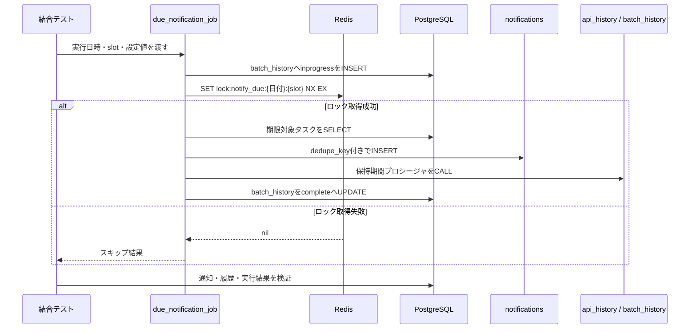

# 期限通知ジョブ結合テスト検証資料

## 1. 目的

Issue #192 の完了条件である、期限通知ジョブと `notifications`、Redis 実行ロック、保持期間パージの結合を確認する。対象はジョブ境界（`run_due_notification_job`）から PostgreSQL と Redis へ到達する経路とし、repository・service の単体テストでは確認できない状態遷移を検証する。

本資料は、子Issue #193（対象抽出・Redisロック）と #194（通知作成・保持期間パージ）が統合されたブランチで実施する。子Issueの実装ファイルには変更を加えない。

## 2. 前提条件

| 項目 | 条件 |
|------|------|
| DB | Alembic `head` 適用済みのPostgreSQL。`notifications`、`api_history`、`batch_history` と各パージプロシージャが存在する |
| Redis | `REDIS_URL` で接続でき、テスト実行中に他の期限通知ジョブが同じキーを使用しない |
| 設定 | `APP_TIMEZONE`、`NOTIFY_DUE_*`、`NOTIFICATION_RETENTION_DAYS`、`API_HISTORY_RETENTION_DAYS`、`BATCH_HISTORY_RETENTION_DAYS` を実行環境から注入する |
| データ分離 | テスト専用ユーザー、タスク、履歴を作成し、テスト終了時にロールバックまたは専用DBを破棄する |
| 秘密情報 | `.env` は読み取らず、CI Secret または実行環境の環境変数を使用する |

保持日数はソースコードに埋め込まず、各環境の設定値を基準に境界データを作成する。Redisキーの日付は `APP_TIMEZONE` のローカル実行日、DBの日時はUTCとして検証する。

## 3. 結合テスト項目

| ID | 観点 | 操作 | 合格条件 |
|----|------|------|----------|
| IN-01 | 対象抽出と通知作成 | 過去期限、翌日10時ちょうど、翌日10時より後、完了済み、未割当、期限NULLのタスクを用意して1slot実行 | 過去期限と境界時刻の未完了・担当者ありだけが通知化される。`type`、タイトル、`due_at`、担当者、`dedupe_key` が設計値と一致する |
| IN-02 | Redisロック競合 | 同じローカル日付・同じslotを2実行者から同時起動 | Redis `SET key value NX EX` の成功者だけが通知処理を実行し、敗者はDBの対象抽出・通知INSERTを行わない。成功者のロックはTTL付きで残る |
| IN-03 | 通知冪等性とslot分離 | 同じ日付・同じslotを2回実行後、別slotを1回実行 | 同一slotは `(user_id, dedupe_key)` ごとに1件だけ、別slotは同じタスクに別の1件が作成される |
| IN-04 | notificationsパージ | 保持期間より古い未読・既読通知と、保持期間内の通知を用意してジョブ末尾のパージを実行 | 古い2件だけが削除され、保持期間内の通知は残る。`read_at` の有無で削除結果が変わらない |
| IN-05 | api_history / batch_historyパージ | 各保持期間について、期限超過行と保持期間内行を用意して同じジョブのパージを実行 | `api_history.created_at`、`batch_history.started_at` の期限超過行だけが削除され、各テーブルの保持期間内行は残る |
| IN-06 | batch_historyとの相関 | 正常実行と通知処理失敗をそれぞれ実行 | 正常時は該当 `run_id` が `complete`、対象・成功・スキップ件数と `ended_at` が保存される。失敗時は `error` と `error_code` または `error_detail` が保存される |
| IN-07 | 失敗時の再実行 | 通知INSERTまたはパージを失敗させ、同じslotを再実行 | 既にcommit済みの通知は保持され、失敗した実行者が所有するRedisロックだけが解放される。再実行では既存のdedupeキーを重複作成しない |

## 4. テストデータと確認クエリ

### 4.1 期限通知

`IN-01` は `NOTIFY_DUE_TARGET_HOUR` と `APP_TIMEZONE` から算出した翌日閾値を基準にする。固定日時を実装へ埋め込まず、テスト開始時刻から次の相対値を作る。

| データ | status | assignee_id | due_at | 期待 |
|--------|--------|-------------|--------|------|
| 期限切れ | 未完了 | あり | 閾値より前 | 通知作成 |
| 境界 | 未完了 | あり | 閾値と同値 | 通知作成 |
| 範囲外 | 未完了 | あり | 閾値より後 | 通知なし |
| 完了済み | `done` | あり | 閾値以前 | 通知なし |
| 未割当 | 未完了 | NULL | 閾値以前 | 通知なし |
| 期限なし | 未完了 | あり | NULL | 通知なし |

通知作成後は、テスト対象ユーザーに限定して次を確認する。

```sql
SELECT task_id, user_id, type, title, body, due_at, dedupe_key
  FROM notifications
 WHERE user_id = :user_id
 ORDER BY dedupe_key;
```

### 4.2 保持期間パージ

`IN-04` と `IN-05` は各環境設定値を `retention_days` として扱い、期限超過データは `retention_days + 1` 日、保持対象データは `retention_days - 1` 日を目安に作成する。境界の厳密な判定は各プロシージャの `created_at` / `started_at` と `now()` の比較で確認する。

```sql
SELECT 'notifications' AS table_name, count(*)
  FROM notifications
 WHERE user_id = :user_id
UNION ALL
SELECT 'api_history', count(*)
  FROM api_history
 WHERE user_id = :user_id
UNION ALL
SELECT 'batch_history', count(*)
  FROM batch_history
 WHERE batch_name = :batch_name;
```

パージ前後で、期限超過行の識別子が消え、保持期間内行の識別子が残ることを比較する。`batch_history` は `started_at`、その他2テーブルは `created_at` を判定列とする。

## 5. 実施手順

1. 子Issue #191、#193、#194を統合したコミットで、Alembic `upgrade head` を実行する。
2. テスト専用の `DATABASE_URL` と `REDIS_URL` を環境変数として設定する。`.env` は使用しない。
3. Redisのキー接頭辞 `lock:notify_due` に残存キーがないことを確認する。共有環境ではテスト専用の実行日・slotを使用する。
4. `IN-01` から `IN-07` を順に実施し、各テストのDB行数・Redisキー・`run_id` を証跡として保存する。
5. 失敗時は `batch_history.error_code/error_detail`、ロック所有者、commit済み通知の有無を確認してから再実行する。

CIでの実行は、PostgreSQLとRedisを起動した同一ジョブから、batchの統合テスト対象だけを指定する。実際のテストファイル名・pytest markerは #191〜#194 の統合時に確定し、この資料のIDをテスト名またはテスト内コメントへ対応付ける。

## 6. 処理シーケンス



## 7. 合否判定と未確認点

次のすべてを満たした場合に Issue #192 の結合テスト完了と判定する。

- [ ] IN-01〜IN-03で、対象抽出、Redis同一slot排他、通知のdedupeが確認できる
- [ ] IN-04〜IN-05で、3テーブルの期限超過行だけが削除される
- [ ] IN-06で、正常・異常の `batch_history` が実行結果と相関する
- [ ] IN-07で、部分成功の保持と失敗後の再実行が確認できる
- [ ] 証跡に実行時の設定値名、実行日時、`run_id`、対象件数、作成／削除件数が残っている

この資料を追加した時点では、#191のジョブ本体と#194の実装が専用worktreeへ統合されていないため、IN-01〜IN-07の実行結果は未確認である。統合後に実施し、合格結果をIssue #192またはPR本文へ追記する。
