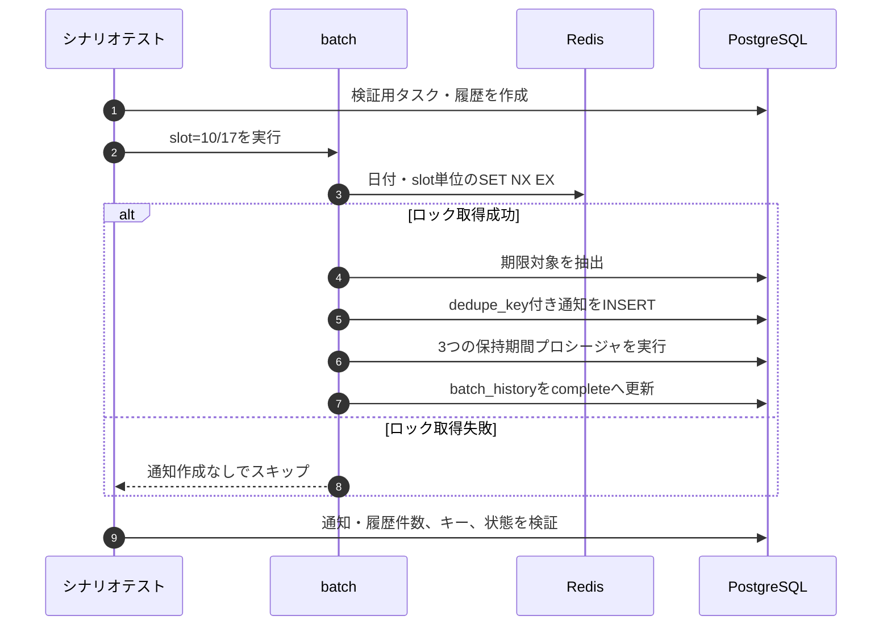
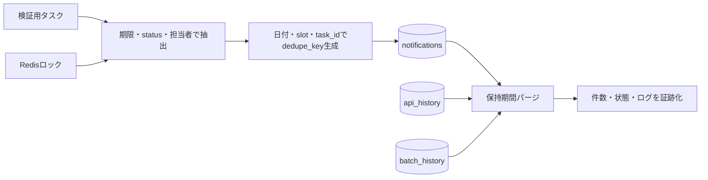

# batch/03 期限通知シナリオテスト計画

## 0. 目的と適用範囲

本書は、Issue #189 の受入条件である期限通知バッチのシナリオテストを、#190（バッチ基盤）と #192（通知ジョブ）の統合後に再現可能な形で定義する。対象は次の3点とする。

1. `APP_TIMEZONE` 基準の10時・17時実行と、翌日 `NOTIFY_DUE_TARGET_HOUR` までの期限境界
2. Redis実行ロックと `notifications(user_id, dedupe_key)` による同一実行枠の重複防止
3. `notifications`、`api_history`、`batch_history` の保持期間パージ

通知API、通知UI、イベント通知（`due_today_created` / `due_today_updated`）は対象外とする。

## 1. 前提と安全条件

| 項目 | 前提 |
|------|------|
| 実行環境 | PostgreSQL、Redis、batch専用コンテナへ接続できる検証環境。検証用DB・Redisを使用する |
| 設定 | batchジョブが読み込む環境変数を検証用に与える。値の正は [04_env_config.md](../infra/04_env_config.md) とする |
| `.env` | 本書の手順で直接読み取らない。CIまたは実行環境が注入した環境変数を使用する |
| 時刻 | 固定した`now`をジョブへ渡せる結合テストを正とし、実時計での確認は補助証跡とする |
| データ | テスト用ユーザー・プロジェクト・タスク・履歴だけを作成し、検証後にテストDBを破棄またはロールバックする |
| 手動実行 | 本番相当DBへ書き込むため、`--run-once`は検証環境だけで実行する |

保持日数、ロックTTL、対象期限時刻、チャンクサイズはテストコードへ直書きせず、検証用設定から取得する。保持期限の境界を確認する場合は、設定値を基準に「保持日数未満」と「保持日数超過」の行を作成する。

## 2. 受入シナリオ

### S-1 10時・17時の期限通知

#### 入力データ

固定した実行日の`APP_TIMEZONE`上で、次のタスクを同じ担当者に作成する。`T`は実行日のローカル日時、`H`は`NOTIFY_DUE_TARGET_HOUR`とする。

| タスク | `status` | `assignee_id` | `due_at` | 期待 |
|--------|----------|---------------|----------|------|
| 期限切れ | `open` | あり | `T`より前 | 対象 |
| 当日期限 | `open` | あり | `T`当日 | 対象 |
| 境界 | `open` | あり | 翌日`H:00:00`ちょうど | 対象 |
| 境界超過 | `open` | あり | 翌日`H:00:00`より後 | 対象外 |
| 完了済み | `done` | あり | 境界以前 | 対象外 |
| 未割当 | `open` | なし | 境界以前 | 対象外 |
| 期限なし | `open` | あり | `NULL` | 対象外 |

#### 操作と判定

1. slot=`10`でジョブを1回実行する。
2. 作成された`notifications`を担当者、`task_id`、`type`、`due_at`、`dedupe_key`で検索する。
3. 同じ入力をslot=`17`で実行する。
4. 10時・17時それぞれで、対象3タスクに`type='due_soon_batch'`が1件ずつ作成されることを確認する。
5. 境界超過・完了済み・未割当・期限なしの通知が作成されないことを確認する。
6. 10時枠と17時枠の`dedupe_key`が異なることを確認する。

#### 合格条件

- 10時枠、17時枠ともに`due_at <= 翌日H:00:00`の3件だけが対象になる。
- DBはUTCで比較・保存し、境界判定だけ`APP_TIMEZONE`に従う。
- 担当者以外のユーザーへ通知を作成しない。

### S-2 同一slotの再実行と同時実行

#### 操作と判定

1. 検証用Redisを空にし、同一実行日のslot=`10`を2プロセスから同時に起動する。
2. `lock:notify_due:{実行日のローカル日付}:10`の取得結果をログで確認する。
3. PostgreSQLで同一担当者・同一`dedupe_key`の通知件数を集計する。
4. 1プロセスの完了後、同じslotをもう一度実行する。
5. slot=`17`を実行し、10時枠とは別の通知が作成されることを確認する。

#### 合格条件

- Redis `SET key runner_id NX EX ttl` の成功者だけが対象抽出・通知作成を行う。
- 同時実行の敗者は通知INSERTを行わず、プロセス全体を異常終了させない。
- 同一slotの再実行後も、`(user_id, dedupe_key)`単位の通知は1件だけである。
- `dedupe_key`は `batch:{local_date}:{slot}:{task_id}` 形式である。
- 成功後のロックはTTLまで残り、別slotのロックとは干渉しない。

### S-3 保持期間パージ

#### 入力データ

各テーブルへ、設定された保持日数を`R`として次の行を作成する。

| テーブル | 保持期限超過 | 保持期限内 | 境界確認 |
|----------|--------------|------------|----------|
| `notifications` | `created_at`が`R`日より前。未読・既読を各1行 | `created_at`が`R`日未満 | `created_at`基準で削除されること |
| `api_history` | `created_at`が`R`日より前 | `created_at`が`R`日未満 | `created_at`基準で削除されること |
| `batch_history` | `started_at`が`R`日より前 | `started_at`が`R`日未満 | `started_at`基準で削除されること |

#### 操作と判定

1. 対象0件でもジョブが保持期間処理を実行するよう、期限通知の対象がない実行日でジョブを起動する。
2. `notifications`、`api_history`、`batch_history`の古い行と新しい行の残存数を実行前後で比較する。
3. `batch_history`の該当runが`complete`となり、パージ失敗時は`error_code`または`error_detail`が保存されることを確認する。

#### 合格条件

- 3テーブルとも保持期限超過行だけが削除される。
- `notifications`は未読・既読を問わず`created_at`で削除される。
- API履歴は`created_at`、batch履歴は`started_at`を基準にする。
- パージ済みの通知・履歴をジョブが再作成しない。

## 3. 現行実装で実行できる証跡

ジョブ本体が統合されていない段階でも、DB関数・制約・repositoryの非競合部分は次のテストで確認できる。これらはS-1〜S-3の前提条件を検証するものであり、10時/17時のscheduler起動そのものの合格を代替しない。

| 観点 | 実行テスト | 確認内容 |
|------|------------|----------|
| 期限対象抽出 | `api/tests/test_db_functions_notification_history.py::test_fn_list_due_notification_tasks_returns_only_active_assigned_due_before_threshold` | 担当者あり・有効・期限が閾値以前だけを抽出する |
| dedupe INSERT | `api/tests/test_migrations_notifications_table.py::test_create_if_absent_ignores_duplicate_dedupe_key` | `ON CONFLICT DO NOTHING`で再INSERTを無視する |
| dedupe制約 | `api/tests/test_migrations_notifications_table.py::test_uq_notifications_user_dedupe_rejects_duplicate_without_on_conflict` | `(user_id, dedupe_key)`の一意制約を確認する |
| 通知パージ | `api/tests/test_db_functions_notification_history.py::test_sp_purge_notifications_deletes_expired_regardless_of_read_state` | 古い未読・新しい行の保持を確認する |
| 通知repositoryパージ | `api/tests/test_repository_notification.py::test_purge_expired_deletes_regardless_of_read_state` | repository経由でも既読状態によらず削除する |
| API履歴パージ | `api/tests/test_repository_api_history.py::test_purge_api_history_deletes_expired_rows` | API履歴の古い行だけを削除する |
| batch履歴パージ | `batch/tests/test_repository_batch_history.py::test_purge_expired_deletes_only_old_rows` | `started_at`基準でbatch履歴の古い行だけを削除する |

実行例は、検証用環境変数が注入された状態で次のとおりとする。

```bash
cd api
pytest -q \
  tests/test_db_functions_notification_history.py::test_fn_list_due_notification_tasks_returns_only_active_assigned_due_before_threshold \
  tests/test_db_functions_notification_history.py::test_sp_purge_notifications_deletes_expired_regardless_of_read_state \
  tests/test_migrations_notifications_table.py::test_create_if_absent_ignores_duplicate_dedupe_key \
  tests/test_migrations_notifications_table.py::test_uq_notifications_user_dedupe_rejects_duplicate_without_on_conflict \
  tests/test_repository_notification.py::test_purge_expired_deletes_regardless_of_read_state \
  tests/test_repository_api_history.py::test_purge_api_history_deletes_expired_rows

cd ../batch
pytest -q tests/test_repository_batch_history.py::test_purge_expired_deletes_only_old_rows
```

## 4. 統合後に必ず追加・実行する確認

子phaseの実装を統合した後、次の確認をbatch側の結合テストとして実行し、S-1〜S-3の証跡をIssue #189へ記録する。

| 確認 | 参照設計 | 必須証跡 |
|------|----------|----------|
| schedulerが設定された実行時刻ごとにslotを渡す | [01_scheduler.md](./01_scheduler.md) | 10時・17時の登録内容、`APP_TIMEZONE`、`BATCH_ENABLED`のテスト結果 |
| 対象抽出と通知作成を同一シナリオで確認する | [02_due_notification_job.md](./02_due_notification_job.md) §4 | 作成件数、対象外件数、UTC変換後の境界値 |
| RedisロックとDB dedupeを同時に確認する | [02_due_notification_job.md](./02_due_notification_job.md) §5 | ロックキー、取得成功/失敗、TTL、通知件数 |
| 3テーブルのパージをジョブ末尾で確認する | [02_due_notification_job.md](./02_due_notification_job.md) §11 | 実行前後の各テーブル件数、`batch_history`状態 |
| Redis/DB/パージ失敗時の再実行を確認する | [02_due_notification_job.md](./02_due_notification_job.md) §6 | fail-close、`error`履歴、再実行後の重複なし |

## 5. 実行シーケンスとデータ遷移





## 6. 判定と未確認点

Issue #189を完了とするには、現行実装のDB証跡だけでなく、#190/#192統合後にS-1〜S-3を実行し、次をすべて満たすことを条件とする。

- 10時・17時の両slotで期限境界と担当者限定が合格している。
- 同一slotの同時実行・再実行で通知が重複せず、RedisロックとDB一意制約の両方が確認できる。
- 3テーブルの保持期間超過行が削除され、保持期間内の行が残っている。
- 正常系・Redis障害・DBまたはパージ失敗の`batch_history`と再実行結果を記録している。

現時点では、batchの期限通知ジョブ本体がdevelopへ統合されていないため、schedulerから通知作成・パージまでを一続きにしたS-1〜S-3のE2E結果は未確認である。Redisロックの競合動作も、現行developではロック実装の結合テストを実行できない。また、現行`BatchSettings`にAPI履歴・batch履歴の保持日数項目がないため、#192統合時に [04_env_config.md](../infra/04_env_config.md) の設定をジョブへ受け渡す実装とテストの整合を確認する。子phase統合後に、本書4章の確認を追加してから受入判定を行う。
