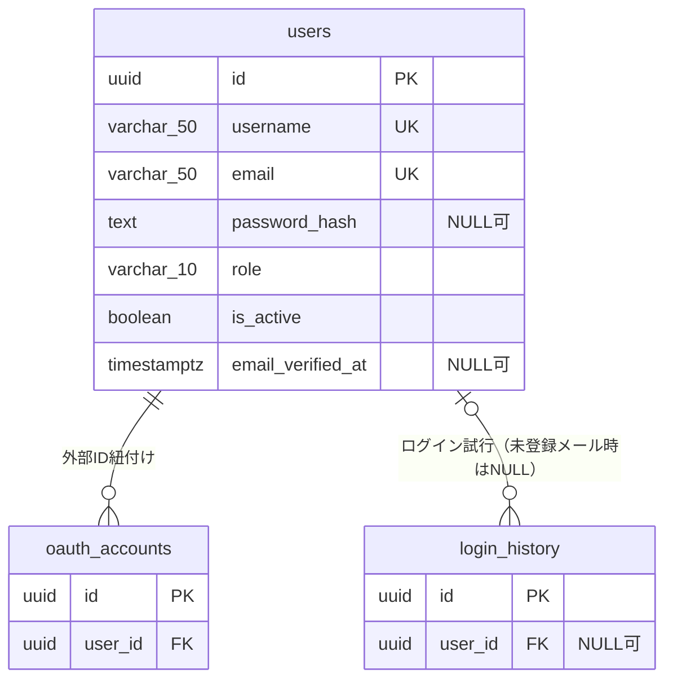
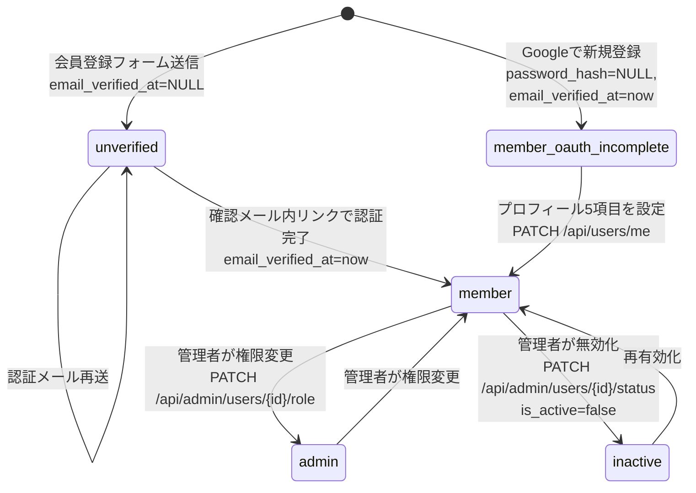
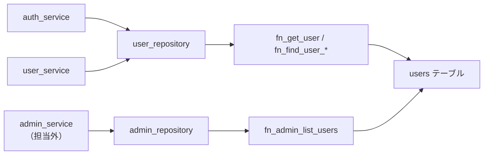

# DB詳細設計 01 users テーブル

## 0. 関連ドキュメント

- `../../basic_design/01_database.md`（§3.1 users、正）
- `../../basic_design/03_auth.md`（認証・OAuth新規ユーザー生成ロジック）
- `./00_policy.md`（命名規約・型方針・共通カラム・CHECK制約方針）
- `./02_table_oauth_accounts.md`（1:N関連）
- `./03_table_login_history.md`（1:N関連）
- `../api/auth/01_post_auth_register.md` / `../api/auth/07_post_auth_verify_email.md` / `../api/auth/11_get_auth_oauth_google.md` / `../api/auth/12_get_auth_oauth_google_callback.md` / `../api/auth/13_post_auth_oauth_exchange.md`
- `../api/users/01_get_users_me.md` / `../api/users/02_patch_users_me.md` / `../api/users/03_put_users_me_password.md`
- `../api/admin/02_patch_admin_user_role.md` / `../api/admin/03_patch_admin_user_status.md`

## 1. 概要

| 項目 | 内容 |
|------|------|
| テーブル名 / 論理名 | `users` / ユーザー |
| 役割 | 会員登録（メール/パスワード）およびGoogle OAuth新規登録によって作成されるアカウントの永続データ。認証・認可（role・is_active）・プロフィールを保持する |
| 想定件数・増加傾向 | 学習用途のため小規模（数十〜数百件）。会員登録・OAuth新規登録のたびに増加。削除APIはなく無効化のみのため単調増加 |
| ライフサイクル | 作成契機：`POST /api/auth/register` または Google OAuth初回ログイン。更新契機：メール認証完了・プロフィール編集・パスワード変更・管理者による role/is_active 変更・`updated_at` はトリガで全UPDATE時に自動更新。削除契機：**なし**（物理削除APIを提供しない。`is_active=false` による無効化のみ） |
| 関連ORMモデル | `models/user.py :: User` |

## 2. カラム定義

`basic_design/01_database.md` §3.1 の定義から逸脱しない。

| 論理名 | カラム名 | 型 | NULL | 既定値 | 主キー/一意 | 説明 |
|--------|----------|----|------|--------|--------------|------|
| ID | `id` | UUID | NO | `gen_random_uuid()` | PK | |
| ログインID | `username` | VARCHAR(50) | NO | - | UNIQUE（大文字小文字区別なし） | 半角英数字と `_` `-`。OAuth新規ユーザーはサーバーが自動生成 |
| メールアドレス | `email` | VARCHAR(50) | NO | - | UNIQUE（大文字小文字区別なし） | 簡易形式検証はCHECK制約 |
| パスワードハッシュ | `password_hash` | TEXT | YES | - | - | argon2id。Googleのみで登録したユーザーはNULL |
| 姓 | `last_name` | VARCHAR(30) | YES | - | - | 通常登録では必須（アプリ層必須）、OAuth新規ユーザーはプロフィール補完までNULL可 |
| 名 | `first_name` | VARCHAR(30) | YES | - | - | 同上 |
| 姓フリガナ | `last_name_kana` | VARCHAR(30) | YES | - | - | 同上。値がある場合はひらがな/カタカナ/数字のみ（CHECK） |
| 名フリガナ | `first_name_kana` | VARCHAR(30) | YES | - | - | 同上 |
| 生年月日 | `birth_date` | DATE | YES | - | - | プロフィール情報。OAuth新規ユーザーはNULL可 |
| ロール | `role` | VARCHAR(10) | NO | `'member'` | - | `member` / `admin`（CHECK） |
| 有効フラグ | `is_active` | BOOLEAN | NO | `true` | - | 管理者による無効化用 |
| メール認証日時 | `email_verified_at` | TIMESTAMPTZ | YES | `NULL` | - | NULLは未認証（ログイン拒否）。Google経由はGoogle側で検証済みのため作成時に`now()` |
| 作成日時 | `created_at` | TIMESTAMPTZ | NO | `now()` | - | |
| 更新日時 | `updated_at` | TIMESTAMPTZ | NO | `now()` | - | `trg_set_updated_at` トリガで自動更新 |

`profile_completed`（姓・名・姓カナ・名カナ・生年月日の5項目全てが非NULLか）はDBカラムとして持たず、`GET /api/auth/me` 等でサービス層が算出する派生値とする（基本設計 `03_auth.md` §7.4 相当の記述に整合）。

## 3. DDL

```sql
CREATE TABLE users (
    id                 UUID           NOT NULL DEFAULT gen_random_uuid(),
    username           VARCHAR(50)    NOT NULL,
    email              VARCHAR(50)    NOT NULL,
    password_hash      TEXT,
    last_name          VARCHAR(30),
    first_name         VARCHAR(30),
    last_name_kana     VARCHAR(30),
    first_name_kana    VARCHAR(30),
    birth_date         DATE,
    role               VARCHAR(10)    NOT NULL DEFAULT 'member',
    is_active          BOOLEAN        NOT NULL DEFAULT true,
    email_verified_at  TIMESTAMPTZ,
    created_at         TIMESTAMPTZ    NOT NULL DEFAULT now(),
    updated_at         TIMESTAMPTZ    NOT NULL DEFAULT now(),
    CONSTRAINT pk_users PRIMARY KEY (id),
    CONSTRAINT ck_users_role CHECK (role IN ('member', 'admin')),
    CONSTRAINT ck_users_username_format CHECK (username ~ '^[A-Za-z0-9_-]+$'),
    CONSTRAINT ck_users_email_format CHECK (email ~ '^[A-Za-z0-9_.+-]+@[A-Za-z0-9.-]+\.[A-Za-z]{2,}$'),
    CONSTRAINT ck_users_kana_format CHECK (
        (last_name_kana IS NULL OR last_name_kana ~ '^[ぁ-んァ-ヶー0-9]+$')
        AND (first_name_kana IS NULL OR first_name_kana ~ '^[ぁ-んァ-ヶー0-9]+$')
    )
);

COMMENT ON TABLE users IS 'ユーザー（会員登録またはGoogle OAuthで作成されるアカウント）';
COMMENT ON COLUMN users.password_hash IS 'argon2idハッシュ。Googleのみで登録したユーザーはNULL';
COMMENT ON COLUMN users.email_verified_at IS 'NULLは未認証を意味しログインを拒否する';

CREATE UNIQUE INDEX uq_users_username ON users (lower(username));
CREATE UNIQUE INDEX uq_users_email ON users (lower(email));
CREATE INDEX ix_users_role ON users (role);
CREATE INDEX ix_users_email_verified_at ON users (email_verified_at) WHERE email_verified_at IS NULL;
CREATE INDEX ix_users_created_at ON users (created_at DESC);

CREATE TRIGGER trg_users_set_updated_at
    BEFORE UPDATE ON users
    FOR EACH ROW
    EXECUTE FUNCTION trg_set_updated_at();
```

## 4. 制約・インデックス

| 種別 | 名称 | 対象カラム | 内容 | 目的（対応クエリ） |
|------|------|-----------|------|---------------------|
| PK | `pk_users` | `id` | 主キー | 全参照の基点 |
| CHECK | `ck_users_role` | `role` | `IN ('member','admin')` | 不正ロールの防止 |
| CHECK | `ck_users_username_format` | `username` | 半角英数字と `_` `-` のみ | ログインID形式検証（アプリ層pydanticと二重防御） |
| CHECK | `ck_users_email_format` | `email` | 簡易メール形式検証 | 不正メール形式の防止（RFC完全準拠ではない簡易チェック） |
| CHECK | `ck_users_kana_format` | `last_name_kana`, `first_name_kana` | NULLまたはひらがな/カタカナ/数字のみ | フリガナ形式検証 |
| UNIQUE | `uq_users_username` | `lower(username)` | 大文字小文字を区別しない一意制約 | ログインID重複チェック（Q-1） |
| UNIQUE | `uq_users_email` | `lower(email)` | 同上（メール） | ログイン・重複登録チェック（Q-1） |
| INDEX | `ix_users_role` | `role` | B-tree | 管理者一覧・権限フィルタ（`GET /api/admin/users`） |
| INDEX | `ix_users_email_verified_at` | `email_verified_at` | 部分インデックス（`WHERE email_verified_at IS NULL`） | 未認証ユーザーの棚卸し |
| INDEX | `ix_users_created_at` | `created_at DESC` | B-tree | 管理者ユーザー一覧の作成日時順（Q-5） |
| TRIGGER | `trg_users_set_updated_at` | - | `BEFORE UPDATE` で `trg_set_updated_at()` を実行 | `updated_at` の自動更新 |

外部キー：`users` は被参照側のみ（`oauth_accounts.user_id` / `projects.owner_id` / `project_members.user_id` / `tasks.assignee_id` / `tasks.created_by` / `task_comments.user_id` / `login_history.user_id`）。各FKの `ON DELETE` 挙動は参照元テーブルの詳細設計を参照（`users` に対する削除操作自体が提供されないため実際には発火しないが、将来の削除API追加に備えて基本設計どおりに定義する）。

## 5. SQLAlchemyモデル定義

```python
class User(Base):
    __tablename__ = "users"

    id: Mapped[uuid.UUID] = mapped_column(
        UUID(as_uuid=True), primary_key=True, server_default=text("gen_random_uuid()")
    )
    username: Mapped[str] = mapped_column(String(50), nullable=False)
    email: Mapped[str] = mapped_column(String(50), nullable=False)
    password_hash: Mapped[str | None] = mapped_column(Text, nullable=True)
    last_name: Mapped[str | None] = mapped_column(String(30), nullable=True)
    first_name: Mapped[str | None] = mapped_column(String(30), nullable=True)
    last_name_kana: Mapped[str | None] = mapped_column(String(30), nullable=True)
    first_name_kana: Mapped[str | None] = mapped_column(String(30), nullable=True)
    birth_date: Mapped[date | None] = mapped_column(Date, nullable=True)
    role: Mapped[str] = mapped_column(String(10), nullable=False, server_default="member")
    is_active: Mapped[bool] = mapped_column(Boolean, nullable=False, server_default=text("true"))
    email_verified_at: Mapped[datetime | None] = mapped_column(DateTime(timezone=True), nullable=True)
    created_at: Mapped[datetime] = mapped_column(DateTime(timezone=True), server_default=func.now())
    updated_at: Mapped[datetime] = mapped_column(DateTime(timezone=True), server_default=func.now())

    oauth_accounts: Mapped[list["OAuthAccount"]] = relationship(
        back_populates="user", cascade="all, delete-orphan", lazy="selectin"
    )
    login_histories: Mapped[list["LoginHistory"]] = relationship(
        back_populates="user", lazy="noload"
    )

    __table_args__ = (
        CheckConstraint("role IN ('member', 'admin')", name="ck_users_role"),
        CheckConstraint(r"username ~ '^[A-Za-z0-9_-]+$'", name="ck_users_username_format"),
        CheckConstraint(
            r"email ~ '^[A-Za-z0-9_.+-]+@[A-Za-z0-9.-]+\.[A-Za-z]{2,}$'",
            name="ck_users_email_format",
        ),
    )
```

`oauth_accounts` は `cascade="all, delete-orphan"` とし、ORM経由で `User` を削除する経路がある場合に整合させる（実際の削除APIは提供されないため運用上は発火しない）。`login_histories` は件数が多くなり得るため既定で `lazy="noload"` とし、必要な画面（ログイン履歴一覧）では `login_history_repository` から明示的に取得する。

## 6. ER関連図



## 7. データ遷移図



物理削除は発生しないため終端状態（`[*]`への遷移）は持たない。`password_hash` の設定（Google専用ユーザーがパスワードを追加設定する操作）はこの状態遷移とは独立した操作であり、`password_hash` が NULL の間だけ現在パスワードなしでの変更を許可する（`PUT /api/users/me/password`）。

## 8. リポジトリ関数詳細

repository層はSQL関数・プロシージャの結果をORMモデル、ORMモデル一覧、UUIDまたは`None`へ写像する薄い層であり、`is_active`や`email_verified_at`に基づくログイン可否・認証可否の業務判定は行わない。無効・未認証ユーザーを拒否する責務はservice/deps層にある。

### 8.1 `repository/user_repository.py :: get_by_id`

| 項目 | 内容 |
|------|------|
| シグネチャ | `async def get_by_id(db: AsyncSession, user_id: UUID) -> User \| None` |
| 引数 / 戻り値 | `user_id`：対象ユーザーID / 該当行または `None` |
| 発行SQL | `SELECT * FROM fn_get_user(:user_id)` |
| 使用インデックス | `pk_users`（`fn_get_user`内部） |
| 送出例外 | なし（`None` を返す。存在・`is_active`・`email_verified_at`の判定はservice/deps層） |
| 処理内容 | 1. `fn_get_user`の結果を`User` ORMモデルへ写像 2. 存在しなければ`None`を返す 3. 無効ユーザー・未認証ユーザーをrepositoryで除外しない |

### 8.2 `repository/user_repository.py :: get_by_login_identifier`

| 項目 | 内容 |
|------|------|
| シグネチャ | `async def get_by_login_identifier(db: AsyncSession, identifier: str) -> User \| None` |
| 引数 / 戻り値 | `identifier`：ログインフォームに入力された username または email / 該当行または `None` |
| 発行SQL | `SELECT * FROM fn_find_user_by_identifier(:identifier)` |
| 使用インデックス | `uq_users_username`, `uq_users_email`（関数内部） |
| 送出例外 | なし |
| 処理内容 | 1. `fn_find_user_by_identifier`の結果を`User` ORMモデルへ写像 2. usernameまたはemailの小文字一致で1件取得 3. `is_active`・`email_verified_at`の判定はservice/deps層 |

### 8.3 `repository/user_repository.py :: get_by_email`

| 項目 | 内容 |
|------|------|
| シグネチャ | `async def get_by_email(db: AsyncSession, email: str) -> User \| None` |
| 引数 / 戻り値 | `email`：検索対象メールアドレス / 該当する`User` ORMモデルまたは`None` |
| 発行SQL | `SELECT * FROM fn_find_user_by_email(:email)` |
| 使用インデックス | `uq_users_email`（`fn_find_user_by_email`内部） |
| 送出例外 | なし |
| 処理内容 | 1. 関数結果を`User` ORMモデルへ写像 2. メールアドレスの小文字一致で1件取得 3. `is_active`・`email_verified_at`の判定はservice/deps層 |

### 8.4 `repository/user_repository.py :: create`

| 項目 | 内容 |
|------|------|
| シグネチャ | `async def create(db: AsyncSession, username: str, email: str, password_hash: str \| None) -> UUID` |
| 引数 / 戻り値 | `username`・`email`・`password_hash`：`sp_register_user`の入力 / OUTパラメータ`p_user_id`のUUID |
| 発行SQL | `CALL sp_register_user(:username, :email, :password_hash, NULL)` |
| 使用インデックス | `uq_users_username`, `uq_users_email`（`sp_register_user`内部） |
| 送出例外 | `DBAPIError`（`sp_register_user`がSQLSTATE `P0001` / `P0002`を返す。service層で`ConflictError`へ変換） |
| 処理内容 | 1. `sp_register_user`がDB側でUUIDを採番し、OUTパラメータを返す 2. 通常登録は`password_hash`を渡す 3. OAuth新規登録は`password_hash=NULL`で呼び出し、メール認証日時の確定はservice層の`mark_email_verified`で行う |

### 8.5 `repository/user_repository.py :: update_profile`

| 項目 | 内容 |
|------|------|
| シグネチャ | `async def update_profile(db: AsyncSession, user_id: UUID, last_name: str \| None, first_name: str \| None, last_name_kana: str \| None, first_name_kana: str \| None, birth_date: date \| None) -> None` |
| 引数 / 戻り値 | 更新対象の各フィールド / なし |
| 発行SQL | `CALL sp_update_user_profile(:user_id, :last_name, :first_name, :last_name_kana, :first_name_kana, :birth_date)` |
| 使用インデックス | `pk_users` |
| 送出例外 | なし（対象0件の判定が必要な場合は呼び出し元で事前に検索） |
| 処理内容 | 1. `PATCH /api/users/me` のserviceが現在値とpayloadをマージ 2. repositoryは6引数をSPへ渡し、更新後のORMモデルを返さない |

### 8.6 `repository/user_repository.py :: update_password`

| 項目 | 内容 |
|------|------|
| シグネチャ | `async def update_password(db: AsyncSession, user_id: UUID, password_hash: str) -> None` |
| 引数 / 戻り値 | 対象ユーザーID・新しいパスワードハッシュ / なし |
| 発行SQL | `CALL sp_update_user_password(:user_id, :password_hash)` |
| 使用インデックス | `pk_users` |
| 送出例外 | なし |
| 処理内容 | 1. パスワードハッシュのみをSPへ渡す 2. 認証状態の失効はservice層がRedisで行う |

### 8.7 `repository/user_repository.py :: mark_email_verified`

| 項目 | 内容 |
|------|------|
| シグネチャ | `async def mark_email_verified(db: AsyncSession, user_id: UUID) -> None` |
| 引数 / 戻り値 | 対象ユーザーID / なし |
| 発行SQL | `CALL sp_verify_user_email(:user_id)` |
| 使用インデックス | `pk_users` |
| 送出例外 | なし |
| 処理内容 | 1. `POST /api/auth/verify-email`またはGoogle OAuthの検証済みemail確定後に呼び出す 2. email認証済みか、対象ユーザーが有効かの業務判定はservice/deps層が行う |

### 8.8 管理者ユーザー状態更新（`admin_repository`）

管理者のrole/is_active更新は`user_repository`の複合関数ではなく、`admin_repository.update_user_role`および`admin_repository.update_user_status`が担当する。いずれも`sp_admin_update_user_role` / `sp_admin_update_user_status`を呼び、戻り値は`None`である。更新後ユーザーの状態確認や認可判定はservice/deps層の責務とする。

### 8.9 `admin_repository.py :: list_users`

| 項目 | 内容 |
|------|------|
| シグネチャ | `async def list_users(db: AsyncSession, query: str \| None, role: str \| None, is_active: bool \| None, limit: int, offset: int) -> list[User]` |
| 引数 / 戻り値 | 管理者一覧の検索・role・有効状態・件数・オフセット / `User` ORMモデル一覧 |
| 発行SQL | `SELECT * FROM fn_admin_list_users(:query, :role, :is_active, :limit, :offset)` |
| 使用インデックス | `ix_users_role`, `ix_users_created_at`（関数内部） |
| 送出例外 | なし |
| 処理内容 | 1. 関数結果を`User` ORMモデル一覧へ写像 2. 管理者認可はservice/deps層が担う 3. `is_active`は検索条件としてDB関数へ渡すが、呼び出し元の認証可否判定とは分離する |

## 9. 関数相関図



## 10. 想定クエリと性能

| No | ユースケース | クエリ概要 | 使用インデックス | 想定計画 |
|----|--------------|-----------|-------------------|----------|
| Q-1 | ログイン | `fn_find_user_by_identifier(:identifier)` | `uq_users_email` / `uq_users_username`（関数内部） | Bitmap Or→Index Scan（件数が少なく実質フルスキャンでも許容範囲） |
| Q-5 | 管理者ユーザー一覧 | `ORDER BY created_at DESC LIMIT/OFFSET` | `ix_users_created_at` | Index Scan Backward |
| - | 未認証ユーザー棚卸し | `WHERE email_verified_at IS NULL` | `ix_users_email_verified_at`（部分インデックス） | Index Scan |
| - | ロールフィルタ | `WHERE role = 'admin'` | `ix_users_role` | Index Scan（件数が少ないため実運用ではSeq Scanに落ちる可能性あり） |

## 11. 整合性・並行制御

| 観点 | 内容 |
|------|------|
| 外部キーCASCADE | `users` は他テーブルから参照される側。`oauth_accounts.user_id` は `ON DELETE CASCADE`、`login_history.user_id` は `ON DELETE SET NULL`、`projects.owner_id` は `ON DELETE RESTRICT`、`tasks.assignee_id` は `ON DELETE SET NULL`、`tasks.created_by` / `task_comments.user_id` は `ON DELETE RESTRICT`（各詳細は参照元テーブルの詳細設計） |
| 楽観ロック | なし（`version` カラムを持たない）。同時更新はプロフィール更新・管理者による権限変更のいずれも「最後の書き込みが勝つ」方式で許容する（同時実行頻度が低いため） |
| advisory lock | 使用しない |
| トランザクション境界 | `create`（会員登録）・`update_profile`・`update_password`・`mark_email_verified`は単一SP呼び出し。管理者更新も`admin_repository`の単一SP呼び出しであり、service層の呼び出し単位でコミットする |
| 一意性違反時の扱い | `sp_register_user` が返すSQLSTATE `P0001` / `P0002`をservice層で捕捉し、`409 CONFLICT`（`DUPLICATE_USERNAME` / `DUPLICATE_EMAIL`）に変換する。通常のテーブル制約違反は`IntegrityError`として扱う |

## 12. テスト設計

| No | 区分 | ケース | 期待結果 | テスト名案 |
|----|------|--------|----------|-----------|
| 1 | 制約 | `username` 重複で登録SPを呼び出す | `DBAPIError`（SQLSTATE `P0001`） | `test_create_user_duplicate_username_raises` |
| 2 | 制約 | `email` 重複で登録SPを呼び出す（大文字小文字違い） | `DBAPIError`（SQLSTATE `P0002`、`lower()`一致） | `test_create_user_duplicate_email_case_insensitive_raises` |
| 3 | 制約 | `role` に `'member'`/`'admin'` 以外を設定 | `IntegrityError`（`ck_users_role`） | `test_users_role_check_constraint` |
| 4 | 制約 | `username` に許可外文字（例：スペース）を設定 | `IntegrityError`（`ck_users_username_format`） | `test_users_username_format_check_constraint` |
| 5 | CASCADE | `users` 削除時に `oauth_accounts` が連動削除されるか | `oauth_accounts` の該当行が0件になる | `test_delete_user_cascades_oauth_accounts`（削除APIは未提供のためDBレベルの検証のみ） |
| 6 | CASCADE | `users` 削除時に `login_history.user_id` がNULLになるか | 該当行の `user_id` が `NULL` | `test_delete_user_sets_login_history_user_id_null` |
| 7 | トリガ | UPDATE時に `updated_at` が更新されるか | 更新前後で `updated_at` が変化 | `test_users_updated_at_trigger` |
| 8 | 並行更新 | 同一ユーザーへ同時に `update_profile` を2回発行 | 後勝ちで最終状態が一貫する（例外なし） | `test_update_profile_concurrent_last_write_wins` |
| 9 | リポジトリ | `get_by_login_identifier` にusername/emailそれぞれで取得 | 同一ユーザーが取得できる | `test_get_by_login_identifier_by_username_and_email` |
| 10 | リポジトリ | `create`が`sp_register_user`のOUT UUIDを返す | `UUID`が返り、`User` ORMモデルや入力DTOを返さない | `test_user_repository_create_returns_uuid` |
| 11 | リポジトリ | `mark_email_verified` / `update_profile`が更新SPを呼ぶ | 戻り値は`None` | `test_user_repository_update_methods_return_none` |

## 13. 不明点・要検討事項

- `last_name_kana` / `first_name_kana` の正規表現に許容する文字範囲（長音記号「ー」・数字を含めるか等）は基本設計に明記がなく、本書では実務的な想定で定義した。要検討。
- `email` のCHECK制約は簡易形式検証としたが、正確な正規表現パターンは基本設計に定義がないため本書で仮に定義した。RFC準拠の厳密な検証はアプリ層（pydantic）を正とする。要検討。
- `users` に対する物理削除APIが将来追加された場合の `oauth_accounts` / `login_history` のCASCADE挙動は基本設計の記述（`ON DELETE CASCADE` / `SET NULL`）どおりで問題ないか、追加検討が必要。
