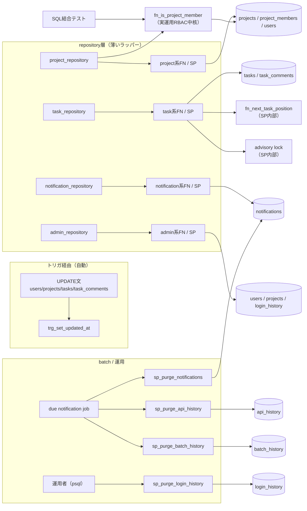

# 08 DB関数・ストアドプロシージャ詳細設計

## 関連ドキュメント

- [../../basic_design/01_database.md](../../basic_design/01_database.md)（§5 DB関数・プロシージャ、§6 マイグレーション方針）
- [09_migration.md](./09_migration.md)（本ファイルの各関数がどのAlembicリビジョンで適用されるか）
- [06_table_tasks.md](./06_table_tasks.md)（`fn_next_task_position` の対象テーブル）
- [01_table_users.md](./01_table_users.md) / [05_table_project_members.md](./05_table_project_members.md)（`fn_is_project_member` の対象テーブル）
- [07_table_task_comments.md](./07_table_task_comments.md)、[03_table_login_history.md](./03_table_login_history.md)

## 1. 概要

業務ロジックを伴うDBアクセスの正はPostgreSQLのSP/FN層である。本ファイルは、repository層が呼び出す全SP/FNのシグネチャ、責務、SQLSTATE、排他制御、テスト方法を定義する。SQL本体は実装フェーズで `db/functions/` または `db/procedures/` に配置し、Alembicから適用する。

| 項目 | 内容 |
|------|------|
| 配置場所（手動DDL置き場） | `db/functions/*.sql`（トリガ関数・通常関数）、`db/procedures/*.sql`（プロシージャ） |
| 実行される正 | `api/alembic/versions/` 配下のリビジョンファイル。上記 `.sql` は `op.execute()` で読み込んで適用する（詳細は [09_migration.md](./09_migration.md) §2） |
| 前提拡張 | `pgcrypto`（`gen_random_uuid()` 用。関数自体はこの拡張に依存しない） |
| 命名規約 | トリガ関数 `trg_*` / 値を返す関数 `fn_*` / 副作用を伴うプロシージャ `sp_*`。新規作成系SP（主キーを新規採番するもの）はOUTパラメータで採番したUUIDを返す。それ以外のSPにOUT/INOUT引数は設けない |

repository層は `CALL sp_xxx(...)` または `SELECT fn_xxx(...)` と戻り値のDTO写像だけを担当し、テーブルへの直接SELECT/INSERT/UPDATE/DELETE、業務判定、複数テーブルの整合性制御を行わない。例外は `/api/health` の `SELECT 1`、AlembicのDDL/seed、テストfixtureのみとする。

主キーのUUID採番方針は `00_policy.md` §6（DB側 `gen_random_uuid()` による一元採番）に従う。新規作成系SP（`sp_create_project` / `sp_create_task` / `sp_add_task_comment` / `sp_register_user`）はAPI側でIDを生成してINSERTすることをせず、SP内部で `gen_random_uuid()` により採番し、生成したIDをOUTパラメータとして呼び出し元へ返す。

## 2. 関数一覧

| No | 種別 | 関数名 | 引数 | 戻り値 | 用途 |
|----|------|--------|------|--------|------|
| 1 | トリガ関数 | `trg_set_updated_at` | なし | `TRIGGER` | `updated_at` の自動更新 |
| 2 | 関数 | `fn_is_project_member` | `p_project_id UUID`, `p_user_id UUID` | `BOOLEAN` | プロジェクト所属・管理者判定（DB側の二重防御） |
| 3 | 関数 | `fn_next_task_position` | `p_project_id UUID`, `p_status VARCHAR` | `INTEGER` | タスクの列内次position採番 |
| 4 | プロシージャ | `sp_purge_login_history` | `p_retention_days INTEGER` | なし | ログイン履歴の保持期間管理 |
| 5 | プロシージャ | `sp_purge_notifications` | `p_retention_days INTEGER` | なし | 通知の保持期間管理（batchから日次実行） |
| 6 | プロシージャ | `sp_purge_api_history` | `p_retention_days INTEGER` | なし | API履歴の保持期間管理（batchから日次実行） |
| 7 | プロシージャ | `sp_purge_batch_history` | `p_retention_days INTEGER` | なし | batch履歴の保持期間管理（batchから日次実行） |
| 8 | 関数 | `fn_get_project` | `p_project_id UUID` | `SETOF projects` | プロジェクト1件取得（不存在は空集合） |
| 8a | 関数 | `fn_get_user` | `p_user_id UUID` | `SETOF users` | admin/RBACの対象ユーザー取得（不存在は空集合） |
| 8b | 関数 | `fn_find_user_by_identifier` | `p_identifier VARCHAR` | `SETOF users` | login用のusername/email検索 |
| 8c | 関数 | `fn_find_user_by_email` | `p_email VARCHAR` | `SETOF users` | 認証メール・パスワードリセット対象検索 |
| 8d | 関数 | `fn_find_oauth_account` | `p_provider VARCHAR`, `p_provider_user_id TEXT` | `SETOF oauth_accounts` | OAuth紐付け検索 |
| 8e | 関数 | `fn_list_user_login_history` | `p_user_id UUID`, `p_limit INTEGER`, `p_offset INTEGER` | `SETOF login_history` | 本人のログイン履歴 |
| 8f | 関数 | `fn_list_user_oauth_accounts` | `p_user_id UUID` | `SETOF oauth_accounts` | 本人のOAuth provider一覧 |
| 9 | 関数 | `fn_list_projects` | `p_user_id UUID`, `p_include_inactive BOOLEAN`, `p_limit INTEGER`, `p_offset INTEGER` | `TABLE(project projects, member_count BIGINT, task_count_todo BIGINT, task_count_in_progress BIGINT, task_count_done BIGINT, total_count BIGINT)` | 所属/admin向け一覧。メンバー数・status別タスク数・ページング前の総件数を1回の呼び出しで返す |
| 10 | 関数 | `fn_search_member_candidates` | `p_project_id UUID`, `p_query VARCHAR`, `p_limit INTEGER`, `p_offset INTEGER` | `SETOF users` | 有効かつ未所属の候補検索 |
| 11 | 関数 | `fn_list_project_members` | `p_project_id UUID` | `SETOF project_members` | メンバー一覧 |
| 12 | プロシージャ | `sp_create_project` | `p_owner_id UUID`, `p_name VARCHAR`, `p_description TEXT`, `p_start_at TIMESTAMPTZ`, `p_end_at TIMESTAMPTZ`, `OUT p_project_id UUID` | `p_project_id UUID`（OUT） | project作成とowner登録を一体実行し、DB側で採番したproject_idをOUTで返す |
| 13 | プロシージャ | `sp_update_project` | `p_project_id UUID`, `p_name VARCHAR`, `p_description TEXT`, `p_start_at TIMESTAMPTZ`, `p_end_at TIMESTAMPTZ` | なし | project更新・期間整合性検証 |
| 14 | プロシージャ | `sp_deactivate_project` | `p_project_id UUID`, `p_is_active BOOLEAN` | なし | projectの有効/無効切替 |
| 15 | プロシージャ | `sp_add_project_member` | `p_project_id UUID`, `p_user_id UUID`, `p_invited_by UUID` | なし | 重複防止付き所属追加 |
| 16 | プロシージャ | `sp_remove_project_member` | `p_project_id UUID`, `p_user_id UUID` | なし | 担当解除後の所属削除 |
| 17 | 関数 | `fn_get_project_board` | `p_project_id UUID`, `p_include_inactive BOOLEAN` | `SETOF tasks` | カンバン取得 |
| 18 | 関数 | `fn_get_task` | `p_task_id UUID` | `SETOF tasks` | タスク1件取得 |
| 19 | 関数 | `fn_list_tasks` | `p_user_id UUID`, `p_project_id UUID`, `p_status VARCHAR`, `p_include_inactive BOOLEAN`, `p_limit INTEGER`, `p_offset INTEGER` | `SETOF tasks` | 権限スコープ付き一覧 |
| 20 | 関数 | `fn_list_task_comments` | `p_task_id UUID` | `SETOF task_comments` | コメント一覧 |
| 21 | 関数 | `fn_get_comment_with_task` | `p_comment_id UUID` | `SETOF task_comments` | コメント・所属判定用取得 |
| 22 | プロシージャ | `sp_create_task` | `p_project_id UUID`, `p_created_by UUID`, `p_assignee_id UUID`, `p_title VARCHAR`, `p_body TEXT`, `p_status VARCHAR`, `p_due_at TIMESTAMPTZ`, `p_position INTEGER`, `p_day_start_utc TIMESTAMPTZ`, `p_day_end_utc TIMESTAMPTZ`, `OUT p_task_id UUID` | `p_task_id UUID`（OUT） | task作成・position採番・当日期限通知を一体実行し、DB側で採番したtask_idをOUTで返す |
| 23 | プロシージャ | `sp_update_task` | `p_task_id UUID`, `p_editor_id UUID`, `p_version INTEGER`, `p_title VARCHAR`, `p_body TEXT`, `p_status VARCHAR`, `p_assignee_id UUID`, `p_due_at TIMESTAMPTZ`, `p_position INTEGER`, `p_day_start_utc TIMESTAMPTZ`, `p_day_end_utc TIMESTAMPTZ` | なし | version・再採番・当日期限通知を一体実行 |
| 24 | プロシージャ | `sp_deactivate_task` | `p_task_id UUID`, `p_is_active BOOLEAN` | なし | taskの有効/無効切替 |
| 25 | プロシージャ | `sp_add_task_comment` | `p_task_id UUID`, `p_user_id UUID`, `p_body TEXT`, `OUT p_comment_id UUID` | `p_comment_id UUID`（OUT） | コメント追加。DB側で採番したcomment_idをOUTで返す |
| 26 | プロシージャ | `sp_update_task_comment` | `p_comment_id UUID`, `p_user_id UUID`, `p_body TEXT` | なし | コメント更新 |
| 27 | プロシージャ | `sp_delete_task_comment` | `p_comment_id UUID`, `p_user_id UUID` | なし | コメント削除 |
| 28 | 関数 | `fn_list_notifications` | `p_user_id UUID`, `p_unread_only BOOLEAN`, `p_limit INTEGER`, `p_offset INTEGER` | `TABLE(notification notifications, task_title VARCHAR, task_project_id UUID, total_count BIGINT)` | 本人の通知一覧。task情報（`tasks`をLEFT JOIN、削除済みはNULL）とページング前の総件数を1回の呼び出しで返す |
| 28a | 関数 | `fn_count_notifications` | `p_user_id UUID`, `p_unread_only BOOLEAN` | `BIGINT` | `fn_list_notifications` の`total_count`が取得できない場合（該当0件）のフォールバック用件数取得 |
| 29 | 関数 | `fn_count_unread_notifications` | `p_user_id UUID` | `BIGINT` | 未読件数 |
| 29a | 関数 | `fn_list_due_notification_tasks` | `p_threshold TIMESTAMPTZ` | `SETOF tasks` | batchの期限通知対象抽出 |
| 30 | プロシージャ | `sp_mark_notification_read` | `p_notification_id UUID`, `p_user_id UUID` | なし | 本人の未読通知を既読化 |
| 31 | プロシージャ | `sp_mark_all_notifications_read` | `p_user_id UUID` | なし | 本人の未読通知を一括既読化 |
| 32 | 関数 | `fn_admin_list_users` | `p_query VARCHAR`, `p_role VARCHAR`, `p_is_active BOOLEAN`, `p_limit INTEGER`, `p_offset INTEGER` | `TABLE("user" users, total_count BIGINT)` | admin用ユーザー一覧。`count(*) OVER()`でページング前の総件数を1回の呼び出しで返す（#347レビュー対応） |
| 32a | 関数 | `fn_count_admin_users` | `p_query VARCHAR`, `p_role VARCHAR`, `p_is_active BOOLEAN` | `BIGINT` | `fn_admin_list_users`の`total_count`が取得できない場合（該当0件）のフォールバック用件数取得 |
| 33 | 関数 | `fn_admin_list_projects` | `p_query VARCHAR`, `p_is_active BOOLEAN`, `p_limit INTEGER`, `p_offset INTEGER` | `TABLE(project projects, total_count BIGINT)` | admin用プロジェクト一覧。`count(*) OVER()`で総件数を同時返却（#347レビュー対応） |
| 33a | 関数 | `fn_count_admin_projects` | `p_query VARCHAR`, `p_is_active BOOLEAN` | `BIGINT` | `fn_admin_list_projects`の`total_count`フォールバック用件数取得 |
| 34 | 関数 | `fn_admin_list_login_history` | `p_user_id UUID`, `p_query VARCHAR`, `p_login_method VARCHAR`, `p_success BOOLEAN`, `p_from TIMESTAMPTZ`, `p_to TIMESTAMPTZ`, `p_limit INTEGER`, `p_offset INTEGER` | `TABLE(history login_history, total_count BIGINT)` | admin用ログイン履歴一覧。`count(*) OVER()`で総件数を同時返却（#347レビュー対応） |
| 34a | 関数 | `fn_count_admin_login_history` | `p_user_id UUID`, `p_query VARCHAR`, `p_login_method VARCHAR`, `p_success BOOLEAN`, `p_from TIMESTAMPTZ`, `p_to TIMESTAMPTZ` | `BIGINT` | `fn_admin_list_login_history`の`total_count`フォールバック用件数取得 |
| 35 | プロシージャ | `sp_admin_update_user_role` | `p_actor_id UUID`, `p_target_id UUID`, `p_new_role VARCHAR`, `OUT p_old_role VARCHAR` | `p_old_role VARCHAR`（OUT） | 自己変更・対象不存在（P0010）・最後のadmin保護付きrole更新。更新前roleをOUTで返し、service層の事前SELECTを不要にする（#347レビュー対応） |
| 36 | プロシージャ | `sp_admin_update_user_status` | `p_actor_id UUID`, `p_target_id UUID`, `p_is_active BOOLEAN`, `OUT p_old_is_active BOOLEAN` | `p_old_is_active BOOLEAN`（OUT） | 自己変更・対象不存在（P0010）・最後のadmin保護付きstatus更新。更新前is_activeをOUTで返す（#347レビュー対応） |
| 37 | プロシージャ | `sp_admin_deactivate_project` | `p_project_id UUID`, `p_is_active BOOLEAN` | なし | adminによるproject無効化 |
| 38 | プロシージャ | `sp_register_user` | `p_username VARCHAR`, `p_email VARCHAR`, `p_password_hash TEXT`, `OUT p_user_id UUID` | `p_user_id UUID`（OUT） | user登録と一意性検証。DB側で採番したuser_idをOUTで返す |
| 39 | プロシージャ | `sp_verify_user_email` | `p_user_id UUID` | なし | email_verified_at更新 |
| 40 | プロシージャ | `sp_update_user_password` | `p_user_id UUID`, `p_password_hash TEXT` | なし | password更新 |
| 41 | プロシージャ | `sp_update_user_profile` | `p_user_id UUID`, `p_last_name VARCHAR`, `p_first_name VARCHAR`, `p_last_name_kana VARCHAR`, `p_first_name_kana VARCHAR`, `p_birth_date DATE` | なし | profile更新 |
| 42 | プロシージャ | `sp_upsert_oauth_account` | `p_user_id UUID`, `p_provider VARCHAR`, `p_provider_user_id TEXT` | なし | OAuthアカウント紐付け |
| 43 | プロシージャ | `sp_record_login_history` | `p_user_id UUID`, `p_login_identifier VARCHAR`, `p_login_method VARCHAR`, `p_ip_address INET`, `p_user_agent TEXT`, `p_success BOOLEAN`, `p_failure_reason VARCHAR` | なし | login履歴記録 |

## 3. 関数詳細

### 3.1 `db/functions/trg_set_updated_at.sql`

| 項目 | 内容 |
|------|------|
| シグネチャ | `trg_set_updated_at() RETURNS TRIGGER` |
| 引数 / 戻り値 | 引数なし。`NEW` レコード（`updated_at` を書き換えたもの）を返す |
| 適用対象 | `users` / `projects` / `tasks` / `task_comments` / `batch_history` の `BEFORE UPDATE FOR EACH ROW` |
| 呼び出し元 | アプリからは直接呼ばない。`UPDATE` 文実行時にPostgreSQLが自動起動する |
| 排他制御 | 対象行のロックは通常の `UPDATE` 行ロックに従う。関数自体に追加のロック取得はない |

```sql
CREATE OR REPLACE FUNCTION trg_set_updated_at()
RETURNS TRIGGER
LANGUAGE plpgsql
AS $$
BEGIN
    NEW.updated_at := now();
    RETURN NEW;
END;
$$;

-- 適用例（対象4テーブル分をAlembicリビジョンで繰り返す）
CREATE TRIGGER trg_users_set_updated_at
    BEFORE UPDATE ON users
    FOR EACH ROW
    EXECUTE FUNCTION trg_set_updated_at();
```

**テスト方法**：`UPDATE users SET last_name = 'x' WHERE id = :id;` を実行し、`updated_at` が実行前より新しい値になっていることを確認する（`test_db_functions.py::test_trg_set_updated_at_users` 等、対象4テーブル分）。

### 3.2 `db/functions/fn_is_project_member.sql`

| 項目 | 内容 |
|------|------|
| シグネチャ | `fn_is_project_member(p_project_id UUID, p_user_id UUID) RETURNS BOOLEAN` |
| 引数 | `p_project_id`：判定対象プロジェクトID。`p_user_id`：判定対象ユーザーID |
| 戻り値 | 所属または管理者であれば `true`、`users.is_active = false` または非所属・非管理者なら `false` |
| 呼び出し元 | `project_repository.is_member`、`core/deps.py::require_project_member` 等の実運用RBAC。CIのSQL結合テストでも検証する |
| 排他制御 | 参照のみ。追加ロックなし（`SELECT` はスナップショット読み取り） |

```sql
CREATE OR REPLACE FUNCTION fn_is_project_member(
    p_project_id UUID,
    p_user_id UUID
) RETURNS BOOLEAN
LANGUAGE sql
STABLE
AS $$
    SELECT EXISTS (
        SELECT 1
        FROM users u
        WHERE u.id = p_user_id
          AND u.is_active = true
          AND (
              u.role = 'admin'
              OR EXISTS (
                  SELECT 1
                  FROM project_members pm
                  WHERE pm.project_id = p_project_id
                    AND pm.user_id = p_user_id
              )
          )
    );
$$;
```

**テスト方法**：
- 所属メンバーで `true` を返すこと
- 非所属の一般ユーザーで `false` を返すこと
- 非所属でも `role = 'admin'` なら `true` を返すこと
- `is_active = false` のユーザーは所属していても `false` を返すこと

（`test_db_functions.py::test_fn_is_project_member_*`）

所属の事実判定は本関数を正とし、HTTPの404/403への変換だけをAPI層で行う。admin bypassも本関数の戻り値に含めるため、アプリ層に同じSQL条件を複製しない。

### 3.3 `db/functions/fn_next_task_position.sql`

| 項目 | 内容 |
|------|------|
| シグネチャ | `fn_next_task_position(p_project_id UUID, p_status VARCHAR) RETURNS INTEGER` |
| 引数 | `p_project_id`：対象プロジェクトID。**issue #40でNULL許容に確定**（`NULL`は未所属タスク全体を1つの仮想列として扱う）。`p_status`：対象カンバン列（`todo` / `in_progress` / `done`） |
| 戻り値 | 当該 `(project_id, status)` の列における次のposition（現在の最大値+1。行が0件なら0） |
| 呼び出し元 | `sp_create_task` / `sp_update_task` 内部のみ。repositoryから単独で呼び出さない |
| 前提 | **SPが同一トランザクション内で `pg_advisory_xact_lock` を取得済みであること**。本関数自体はロックを取得しない |

```sql
CREATE OR REPLACE FUNCTION fn_next_task_position(
    p_project_id UUID,
    p_status VARCHAR
) RETURNS INTEGER
LANGUAGE sql
AS $$
    -- project_id = p_project_id ではp_project_idがNULLの場合に常にNULL（非該当）となり
    -- 未所属タスク（project_id IS NULL）の採番が常に0を返す不具合になるため、
    -- IS NOT DISTINCT FROM でNULL同士も一致とみなす
    SELECT COALESCE(MAX(position), -1) + 1
    FROM tasks
    WHERE project_id IS NOT DISTINCT FROM p_project_id
      AND status = p_status;
$$;
```

**排他制御（呼び出し側の責務）**：

| 項目 | 内容 |
|------|------|
| ロック種別 | `pg_advisory_xact_lock(hashtext(p_project_id::text \|\| ':' \|\| p_status))` をトランザクション先頭で取得。トランザクションコミット/ロールバック時に自動解放 |
| ロック粒度 | プロジェクトID + status の組み合わせ単位（列単位）。同一プロジェクトでも別列の並行更新はブロックしない |
| 呼び出し順序 | ① advisory lock 取得 → ② `fn_next_task_position` 呼び出し（または再並べ替え処理） → ③ `INSERT`/`UPDATE` → ④ `COMMIT` |
| デッドロック対策 | 単一列に対する単一ロックのみ取得するため、複数ロックの取得順序起因のデッドロックは発生しない。列間移動（元の列 → 先の列）の場合も `LEAST/GREATEST` でロック取得順をプロジェクトID文字列＋status名の昇順に固定する |

```sql
-- sp_create_task / sp_update_task 内部の処理順序
SELECT pg_advisory_xact_lock(hashtext(:project_id || ':' || :status));
SELECT fn_next_task_position(:project_id, :status) AS next_position;
-- position再採番・task更新・通知INSERTを同一SP内で実行
```

**テスト方法**：
- 空の列に対して `0` を返すこと
- 既存position `{0,1,2}` に対して `3` を返すこと
- 2つの並行トランザクションが同一 `(project_id, status)` に対して同時採番を試みても、advisory lock により直列化され、position の重複が発生しないこと（`asyncio.gather` で同時実行するテスト、または `pytest-postgresql` の2コネクションを使った統合テスト）

（`test_db_functions.py::test_fn_next_task_position_*`）

### 3.4 `db/procedures/sp_purge_login_history.sql`

| 項目 | 内容 |
|------|------|
| シグネチャ | `sp_purge_login_history(p_retention_days INTEGER)` |
| 引数 | `p_retention_days`：保持日数。環境変数 `LOGIN_HISTORY_RETENTION_DAYS`（既定90）をアプリ側から渡す |
| 戻り値 | なし（`PROCEDURE`。副作用として `login_history` の行を削除） |
| 呼び出し元 | アプリ内cronは設けない（学習範囲外、`basic_design/01_database.md` §5.4）。運用者が `psql` から月次で手動実行する |
| 排他制御 | `DELETE` 対象行に対する通常の行ロックのみ。大量削除時のロック長時間化を避けるため、運用手順として `LIMIT` によるバッチ削除を推奨する（下記「運用時の注意」参照） |

```sql
CREATE OR REPLACE PROCEDURE sp_purge_login_history(
    p_retention_days INTEGER
)
LANGUAGE plpgsql
AS $$
BEGIN
    DELETE FROM login_history
    WHERE created_at < now() - (p_retention_days || ' days')::interval;
END;
$$;
```

**呼び出し方法（運用者が手動実行）**：

```sql
CALL sp_purge_login_history(<LOGIN_HISTORY_RETENTION_DAYS>);
```

`LOGIN_HISTORY_RETENTION_DAYS` はハードコードせず、実行時に `psql -v retention_days=${LOGIN_HISTORY_RETENTION_DAYS}` のように環境変数値を明示的に渡す運用とする（[../infra/04_env_config.md](../infra/04_env_config.md) 参照）。

**運用時の注意（要検討）**：`login_history` の想定件数が大きくなった場合、`DELETE` 一括実行が長時間ロックを保持する可能性がある。バッチ分割削除（`LIMIT` + ループ）への変更要否は基本設計に明記がなく要検討。学習用途の想定データ量では現状のシンプルな実装で問題ないと判断する。

**テスト方法**：
- `p_retention_days` より古い `created_at` の行が削除されること
- `p_retention_days` 以内の行が削除されずに残ること
- 空テーブルに対して呼び出してもエラーにならないこと

（`test_db_functions.py::test_sp_purge_login_history_*`）

### 3.5 `db/procedures/sp_purge_notifications.sql`

| 項目 | 内容 |
|------|------|
| シグネチャ | `sp_purge_notifications(p_retention_days INTEGER)` |
| 呼び出し元 | `batch/app/jobs/due_notification_job.py`。運用者が手動で実行するAPIは提供しない |
| 処理 | `DELETE FROM notifications WHERE created_at < now() - (p_retention_days || ' days')::interval` |
| 排他制御 | PostgreSQLの通常のDELETE行ロック。通知作成とは別トランザクションで実行する |
| 入力検証 | `p_retention_days > 0` でない場合は例外にする |

```sql
CREATE OR REPLACE PROCEDURE sp_purge_notifications(
    p_retention_days INTEGER
)
LANGUAGE plpgsql
AS $$
BEGIN
    IF p_retention_days <= 0 THEN
        RAISE EXCEPTION 'p_retention_days must be positive';
    END IF;
    DELETE FROM notifications
     WHERE created_at < now() - (p_retention_days || ' days')::interval;
END;
$$;
```

テストでは保持期間境界、未読・既読双方の削除、空テーブル、0以下の拒否を確認する。

### 3.6 `db/procedures/sp_purge_api_history.sql`

| 項目 | 内容 |
|------|------|
| シグネチャ | `sp_purge_api_history(p_retention_days INTEGER)` |
| 呼び出し元 | batchのジョブ終了処理（運用者向けAPIは提供しない） |
| 処理 | `api_history.created_at`が保持期限より前の行をDELETE |
| 入力検証 | `p_retention_days > 0` でない場合は例外 |
| 保持設定 | `API_HISTORY_RETENTION_DAYS`（既定30） |

```sql
CREATE OR REPLACE PROCEDURE sp_purge_api_history(p_retention_days INTEGER)
LANGUAGE plpgsql
AS $$
BEGIN
    IF p_retention_days <= 0 THEN
        RAISE EXCEPTION 'p_retention_days must be positive';
    END IF;
    DELETE FROM api_history
     WHERE created_at < now() - (p_retention_days || ' days')::interval;
END;
$$;
```

### 3.7 `db/procedures/sp_purge_batch_history.sql`

| 項目 | 内容 |
|------|------|
| シグネチャ | `sp_purge_batch_history(p_retention_days INTEGER)` |
| 呼び出し元 | batchのジョブ終了処理（運用者向けAPIは提供しない） |
| 処理 | `batch_history.started_at`が保持期限より前の行をDELETE |
| 入力検証 | `p_retention_days > 0` でない場合は例外 |
| 保持設定 | `BATCH_HISTORY_RETENTION_DAYS`（既定30） |

```sql
CREATE OR REPLACE PROCEDURE sp_purge_batch_history(p_retention_days INTEGER)
LANGUAGE plpgsql
AS $$
BEGIN
    IF p_retention_days <= 0 THEN
        RAISE EXCEPTION 'p_retention_days must be positive';
    END IF;
    DELETE FROM batch_history
     WHERE started_at < now() - (p_retention_days || ' days')::interval;
END;
$$;
```

### 3.8 業務SP/FNの内部処理契約

下表はSQL本体を実装する際の最小契約である。`SELECT ...` はFN内部の参照、`UPDATE/INSERT/DELETE` はSP内部の更新を表し、repositoryが発行するSQLではない。

| オブジェクト | 内部SQL・判定 | ロック / エラー |
|--------------|---------------|-----------------|
| `fn_get_user` | `users`を主キーで参照し、存在しなければ空集合 | 参照スナップショット |
| `fn_get_project` | `projects`を主キーで参照し、存在しなければ空集合 | 参照スナップショット |
| `fn_list_projects` | `project_members`と`projects`を結合し、adminは全件、それ以外は所属を抽出。`project_members`を`project_id`単位でCOUNT集計した`member_count`、`tasks`を`project_id`・`status`単位でCOUNT集計した`task_count_todo`/`task_count_in_progress`/`task_count_done`（`is_active=true`のタスクのみ）を同一クエリでLEFT JOINし、`LIMIT/OFFSET`適用前の対象件数を`total_count`として各行に付与する | `LIMIT/OFFSET`、参照のみ |
| `fn_search_member_candidates` | 有効usersからquery前方一致を検索し、対象projectのmembershipを除外 | 参照のみ |
| `fn_list_project_members` | `project_members`とusersを結合し、joined_at昇順で返す | 参照のみ |
| `sp_create_project` | `gen_random_uuid()`で採番したidで`projects` INSERT後にownerの`project_members`をINSERTし、採番したidをOUTで返す | 1トランザクション。期間不正はP0009 |
| `sp_update_project` | 指定フィールドを`projects`へUPDATE | 行ロック。期間不正はP0009 |
| `sp_deactivate_project` | `projects.is_active`だけをUPDATE | 関連行は変更しない |
| `sp_add_project_member` | membership存在を確認し、無ければINSERT | 重複はP0003 |
| `sp_remove_project_member` | ownerでないことを確認し、tasksのassigneeをNULL化後DELETE | 同一トランザクション。ownerはP0004 |
| `fn_get_project_board` | tasksをproject/status/position順で参照し、inactive条件を適用 | 参照のみ |
| `fn_get_task` | tasksを主キーで参照 | 参照のみ |
| `fn_list_tasks` | user role・所属・未所属作成者条件を適用してtasksをページング | 参照のみ |
| `fn_list_task_comments` | task_commentsと表示用usersを結合しcreated_at昇順で返す | 参照のみ |
| `fn_get_comment_with_task` | comment、task、project owner、投稿者の判定材料を一括取得 | 参照のみ |
| `sp_create_task` | advisory lock→末尾position→`gen_random_uuid()`で採番したidでtasks INSERT（採番したidをOUTで返す）→`p_day_start_utc <= p_due_at < p_day_end_utc` の場合だけnotifications INSERT | lock保持中の1トランザクション。日境界はAPIがAPP_TIMEZONEからUTCへ変換して渡す |
| `sp_update_task` | versionを検証し、status/positionを再採番してtasks UPDATE。`due_at`変更後が`p_day_start_utc <= p_due_at < p_day_end_utc` の場合だけ通知をINSERT | 不一致はP0005、担当者無効はP0006。重複は`(user_id, dedupe_key)`で防止 |
| `sp_deactivate_task` | `tasks.is_active`をUPDATE | position詰めなし |
| `sp_add_task_comment` | `gen_random_uuid()`で採番したidでtask_comments INSERTし、採番したidをOUTで返す | task不存在等はAPIへ事実結果を返す |
| `sp_update_task_comment` | comment本文をUPDATE | 投稿者比較はAPIで実施 |
| `sp_delete_task_comment` | commentをDELETE | 投稿者比較はAPIで実施 |
| `fn_list_notifications` | user_id必須、未読条件、tasksとのLEFT JOINによるtask情報（削除済みはNULL）、ウィンドウ関数`count(*) OVER()`によるページング前total_count、created_at順を一括返却 | 他人の通知は結果に含めない。`total_count`は該当0件の場合は取得できない（`fn_count_notifications`で別途取得） |
| `fn_count_notifications` | user_id必須・未読条件（`fn_list_notifications`と同一条件）でCOUNTを返す | `fn_list_notifications`の該当行が0件のときのフォールバックとしてのみ使用する |
| `fn_count_unread_notifications` | `read_at IS NULL` の件数を返す | 参照のみ |
| `fn_list_due_notification_tasks` | threshold以下・未完了・担当者ありのtasksを返す | batch専用の参照FN |
| `sp_mark_notification_read` | user_id一致かつ未読の行だけ`COALESCE(read_at, now())`で更新 | 対象外は空結果相当 |
| `sp_mark_all_notifications_read` | user_id一致かつ未読の行を一括UPDATE | 既読は上書きしない |
| `fn_admin_list_users` | role/status/queryをusersへ適用し、ウィンドウ関数`count(*) OVER()`によるページング前total_countとともに一覧返却 | admin APIからのみ呼ぶ。`total_count`は該当0件の場合は取得できない（`fn_count_admin_users`で別途取得） |
| `fn_count_admin_users` | `fn_admin_list_users`と同一条件でCOUNTを返す | `fn_admin_list_users`の該当行が0件のときのフォールバックとしてのみ使用する |
| `fn_admin_list_projects` | query/statusをprojectsへ適用し、ウィンドウ関数`count(*) OVER()`によるtotal_countとともに一覧返却 | admin APIからのみ呼ぶ。member_count/task_counts集計は含まない（issue #348で対応予定） |
| `fn_count_admin_projects` | `fn_admin_list_projects`と同一条件でCOUNTを返す | `fn_admin_list_projects`の該当行が0件のときのフォールバックとしてのみ使用する |
| `fn_admin_list_login_history` | login_historyを条件（`created_at >= p_from`、`created_at < p_to`による期間絞り込みを含む）・created_at降順でページングし、ウィンドウ関数`count(*) OVER()`によるtotal_countとともに返却 | admin APIからのみ呼ぶ。`api/admin/07_get_admin_login_history.md` §2.1のfrom/to確定仕様に対応。`total_count`は該当0件の場合は取得できない（`fn_count_admin_login_history`で別途取得） |
| `fn_count_admin_login_history` | `fn_admin_list_login_history`と同一条件でCOUNTを返す | `fn_admin_list_login_history`の該当行が0件のときのフォールバックとしてのみ使用する |
| `sp_admin_update_user_role` | 自己変更判定→admin保護判定専用の固定キーで`pg_advisory_xact_lock`を取得し全体を直列化→対象行を`FOR UPDATE`取得（`NOT FOUND`ならP0010）→最後の有効adminを判定後role UPDATE。更新前roleを`OUT p_old_role`で返し、service層の事前存在確認SELECTを不要にする | P0007/P0008/P0010、advisory lock（固定キー。対象ユーザー単位のロックでは異なる2人のadminへの同時降格を直列化できないため） |
| `sp_admin_update_user_status` | 自己変更判定→admin保護判定専用の固定キーで`pg_advisory_xact_lock`を取得し全体を直列化→対象行を`FOR UPDATE`取得（`NOT FOUND`ならP0010）→最後の有効adminを判定後is_active UPDATE。更新前is_activeを`OUT p_old_is_active`で返し、service層の事前存在確認SELECTを不要にする | P0007/P0008/P0010、advisory lock（固定キー。理由は上記と同様） |
| `sp_admin_deactivate_project` | projects.is_activeをadmin権限前提でUPDATE | 関連行は変更しない |
| `fn_find_user_by_identifier` | lower(username/email)でusersを参照 | login時の有効状態・verified判定材料 |
| `fn_find_user_by_email` | lower(email)でusersを参照 | 未存在でも同じ正常応答を許容 |
| `fn_find_oauth_account` | providerとprovider_user_idでoauth_accountsを参照 | 参照のみ |
| `fn_list_user_login_history` | login_historyをuser_id・created_at順で参照 | 参照のみ |
| `fn_list_user_oauth_accounts` | oauth_accountsをuser_idで参照 | 参照のみ |
| `sp_register_user` | `gen_random_uuid()`で採番したidでusersをINSERTし、採番したidをOUTで返す | 一意性はP0001/P0002 |
| `sp_verify_user_email` | users.email_verified_atをUPDATE | 対象なしはAPIで400/404へ変換 |
| `sp_update_user_password` | users.password_hashをUPDATE | 全認証失効はAPIのRedis処理 |
| `sp_update_user_profile` | usersのprofile列をUPDATE | 指定値の検証はAPI、更新はSP |
| `sp_upsert_oauth_account` | users作成/verified更新とoauth_accounts紐付け | 同一トランザクション |
| `sp_record_login_history` | `login_identifier`・`user_agent`・`failure_reason`を含めてlogin_historyをINSERT | 認証成否を記録。`login_history`のNOT NULL列（`login_identifier`・`login_method`・`success`）はすべて引数で受け取る。`login_identifier`の値は呼び出し元が認証方式に応じて設定し、通常ログインはusername/email原文、Google OAuthは検証済みGoogle emailとする（OAuthの`sub`は記録しない） |

task SPが通知をINSERTする場合は `(user_id, dedupe_key)` の一意制約へ `ON CONFLICT DO NOTHING` を適用する。Pコードを発生させる条件、transaction境界、テストは各行を[§6](#6-テスト設計)の結合テストへ対応付ける。

## 4. エラーコード対応表

DBが業務エラーを返す場合は `RAISE EXCEPTION ... USING ERRCODE = 'P0xxx'` を使用する。下表をDB側とAPI側の唯一の対応表とし、同じ業務コードに複数のPコードを割り当てない。不存在・所属不可などの参照事実は例外ではなく空集合または `false` で返す。

| SQLSTATE | API code | HTTP | 発生主体 |
|----------|----------|------|----------|
| `P0001` | `DUPLICATE_USERNAME` | 409 | user作成系の一意性違反 |
| `P0002` | `DUPLICATE_EMAIL` | 409 | user作成系の一意性違反 |
| `P0003` | `ALREADY_MEMBER` | 409 | `sp_add_project_member` |
| `P0004` | `OWNER_CANNOT_BE_REMOVED` | 409 | `sp_remove_project_member` |
| `P0005` | `TASK_CONFLICT` | 409 | `sp_update_task` のversion不一致 |
| `P0006` | `ASSIGNEE_INACTIVE` | 409 | task作成・更新時の担当者検証 |
| `P0007` | `SELF_MODIFICATION_NOT_ALLOWED` | 409 | admin role/status変更 |
| `P0008` | `LAST_ADMIN_REQUIRED` | 409 | 最後の有効adminの降格・無効化 |
| `P0009` | `DB_INVALID_STATE` | 400 | 期間・status・保持日数などDB業務状態の不正 |

`P0001`〜`P0009`は重複・欠番なしで予約する。ドライバのSQLSTATEをマッピングテーブルへ渡し、未定義のSQLSTATEは `INTERNAL_ERROR`、接続・タイムアウトは `SERVICE_UNAVAILABLE` とする。API側の一覧は [basic_design/04_api.md](../../basic_design/04_api.md) §4.2に反映する。

## 5. 関数相関図（repositoryはSP/FN呼び出しのみ）



## 6. テスト設計

| No | 区分 | ケース | 期待結果 | テスト名案 |
|----|------|--------|----------|-----------|
| 1 | 正常系 | `trg_set_updated_at`：対象4テーブルいずれかを `UPDATE` | `updated_at` が更新される | `test_trg_set_updated_at_updates_timestamp` |
| 2 | 正常系 | `fn_is_project_member`：所属メンバーで判定 | `true` | `test_fn_is_project_member_member_returns_true` |
| 3 | 正常系 | `fn_is_project_member`：非所属の管理者で判定 | `true` | `test_fn_is_project_member_admin_returns_true` |
| 4 | 異常系 | `fn_is_project_member`：無効化ユーザー（`is_active=false`）で判定 | `false` | `test_fn_is_project_member_inactive_returns_false` |
| 5 | 正常系 | `fn_next_task_position`：空の列 | `0` | `test_fn_next_task_position_empty_column` |
| 6 | 正常系 | `fn_next_task_position`：既存position `{0,1,2}` | `3` | `test_fn_next_task_position_existing_rows` |
| 7 | 並行系 | `fn_next_task_position`：同一列への同時採番2並列 | position重複なし、直列化される | `test_fn_next_task_position_concurrent_no_duplicate` |
| 8 | 正常系 | `sp_purge_login_history`：保持期間超過行あり | 対象行が削除される | `test_sp_purge_login_history_deletes_expired` |
| 9 | 正常系 | `sp_purge_login_history`：保持期間内の行 | 削除されない | `test_sp_purge_login_history_keeps_recent` |
| 10 | 異常系 | `sp_purge_login_history`：空テーブルに対して実行 | エラーなく正常終了 | `test_sp_purge_login_history_empty_table_noop` |
| 11 | 正常系 | `sp_purge_notifications`：保持期間超過行あり | 未読・既読を問わず対象行が削除される | `test_sp_purge_notifications_deletes_expired` |
| 12 | 異常系 | `sp_purge_notifications`：保持日数0以下 | 明示的なエラーで終了 | `test_sp_purge_notifications_rejects_non_positive_days` |
| 13 | 正常系 | `sp_purge_api_history`：保持期間超過行あり | 対象行が削除される | `test_sp_purge_api_history_deletes_expired` |
| 14 | 異常系 | `sp_purge_api_history`：保持日数0以下 | 明示的なエラーで終了 | `test_sp_purge_api_history_rejects_non_positive_days` |
| 15 | 正常系 | `sp_purge_batch_history`：保持期間超過行あり | 対象行が削除される | `test_sp_purge_batch_history_deletes_expired` |
| 16 | 異常系 | `sp_purge_batch_history`：保持日数0以下 | 明示的なエラーで終了 | `test_sp_purge_batch_history_rejects_non_positive_days` |
| 17 | 結合 | projects/member系FN・SP全件 | 所属範囲、owner自動登録、重複・owner削除エラー、論理削除非連鎖を確認 | `test_project_db_contracts` |
| 18 | 結合 | task系FN・SP全件 | version不一致、position再採番、assignee検証、コメントCRUDを確認 | `test_task_db_contracts` |
| 19 | 並行 | `sp_create_task` / `sp_update_task` 同一列2接続 | advisory lockで直列化しposition重複なし | `test_task_sp_concurrent_position` |
| 20 | 結合 | notification系FN・SP全件 | 他人の通知を返さず、既読済みを上書きしない | `test_notification_db_contracts` |
| 21 | 結合 | admin系FN・SP全件 | 自己変更禁止、最後のadmin保護、一覧取得を確認 | `test_admin_db_contracts` |
| 22 | 結合 | SQLSTATE `P0001`〜`P0009` | API code・HTTP statusへ一意に変換 | `test_db_sqlstate_mapping` |
| 23 | 結合 | `sp_create_task`：担当者あり・APP_TIMEZONE当日期限 | `due_today_created`が1件作成される | `test_sp_create_task_inserts_due_today_notification_for_assignee` |
| 24 | 結合 | `sp_create_task`：担当者なしまたは翌日期限 | 通知が作成されない | `test_sp_create_task_skips_notification_without_assignee_or_for_future` |
| 25 | 結合 | `sp_update_task`：期限変更なし・当日/翌日変更・同一日時再設定 | 当日変更時だけ通知され、dedupeで1件に収まる | `test_sp_update_task_notifies_only_when_due_at_changes_to_today_and_deduplicates` |

## 7. 不明点・要検討事項

- `fn_is_project_member` を将来的にRLSポリシーへ組み込むかは要検討。ただし現行の実運用RBACでは本関数を使用する。
- `sp_purge_login_history` のバッチ削除化（大量データ時のロック長時間化対策）は基本設計のスコープ外であり、想定データ量次第で要検討。
- `db/functions/` `db/procedures/` の `.sql` をAlembicから読み込むAPIは実装担当が確定する（詳細は [09_migration.md](./09_migration.md) 参照）。
- `APP_TIMEZONE`の日境界はAPI側で計算する。`task_repository`は当日開始・翌日開始をUTCへ変換し、`p_day_start_utc`・`p_day_end_utc`とUTC化済みの`p_due_at`をtask SPへ渡す。DBセッションのタイムゾーンやGUCは変更しない。
- ~~adminのDB更新とRedisセッション失効は同一トランザクションにできないため、順序・再試行・監査ログを要検討~~ → issue #40で確認。両方を伴うのは無効化API（`sp_admin_update_user_status`）のみで、「DB先行→成功後Redis失効」で確定済み（[`00_policy.md` §11](./00_policy.md)参照）。role変更・強制ログアウトはDB/Redisいずれか一方のみの更新のため対象外。
