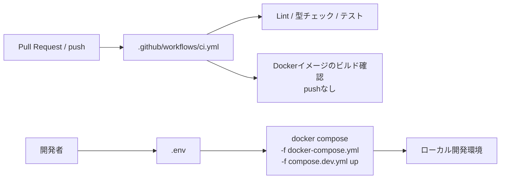

# infra/06 CDワークフロー廃止方針

## 1. 決定事項

本プロジェクトは開発・学習用途に限定するため、継続的デリバリー（CD）は実施しない。GitHub ActionsはCIによるLint・型チェック・テスト・Dockerイメージのビルド確認だけを担当し、アプリケーションの起動・反映は開発者がローカルでDocker Composeを手動実行する。

## 2. 対象外にする要素

| 要素 | 方針 |
|------|------|
| `.github/workflows/cd.yml` | 使用しない。実装ファイルは配置しない |
| GHCR | CIからイメージをpushしない。ローカルイメージだけを使用する |
| self-hosted runner | 現行運用では登録・起動しない。将来の登録方法は[09_self_hosted_runner.md](./09_self_hosted_runner.md)に記載する |
| GitHub Environment `production` | CD用途では使用しない |
| 自動ロールバック | 実施しない。障害時はローカルのComposeとログを使って手動復旧する |

## 3. CIとの責務分担



## 4. ローカル開発の入出力

| 区分 | 内容 |
|------|------|
| 入力 | `.env`（ローカル設定）、`docker-compose.yml`、`compose.dev.yml`、ソースコード |
| 出力 | backend、frontend、batch、PostgreSQL、Redis、Mailpitのローカルコンテナ |
| 確認 | `GET http://localhost:${FRONTEND_PORT}/api/health` |
| 副作用 | PostgreSQLのvolumeへのデータ保存、backend起動時のAlembic適用、Redis再起動時のセッション失効 |

## 5. ローカル実行手順

```bash
docker compose -f docker-compose.yml -f compose.dev.yml up
```

停止する場合は次を実行する。

```bash
docker compose -f docker-compose.yml -f compose.dev.yml down
```

環境変数の一覧と型は[04_env_config.md](./04_env_config.md)、Composeの詳細は[01_docker_compose.md](./01_docker_compose.md)を参照する。`.env`はコミットしない。

## 6. テスト設計

| No | 区分 | 確認内容 | 期待結果 |
|----|------|----------|----------|
| 1 | CI | `ci.yml`の品質検証 | lint、型チェック、テストが成功する |
| 2 | CI | Dockerイメージビルド | backend、frontend、batchのビルドが成功し、pushは発生しない |
| 3 | 手動 | ローカルCompose起動 | 全サービスが起動し、`/api/health`が正常応答する |
| 4 | 静的 | CDファイルの不在確認 | `cd.yml`、CD専用actionlint設定、CD専用環境変数が再導入されていない |

CDのGHCR push、self-hosted runner反映、Environment承認、ロールバックは現行スコープ外のためテストしない。

## 7. 将来CDを再導入する場合

CDが必要になった場合は、まず要件定義書・基本設計書・本書を更新し、対象環境、Secrets、runner、GHCR、ヘルスチェック、ロールバック方針を合意する。その後、専用Issueを起票してworkflowを新規設計する。現在のローカル設定やrunner手順をそのまま本番設定として流用しない。

## 8. 不明点・要検討事項

| 区分 | 内容 |
|------|------|
| 要検討 | 将来CDを再導入する場合のデプロイ対象環境、Secrets管理者、承認者、ロールバック検証環境は未定義 |
| 不明 | CD再導入時にGHCRを継続利用するか、別のイメージ配布方式を採用するかは未決定 |
