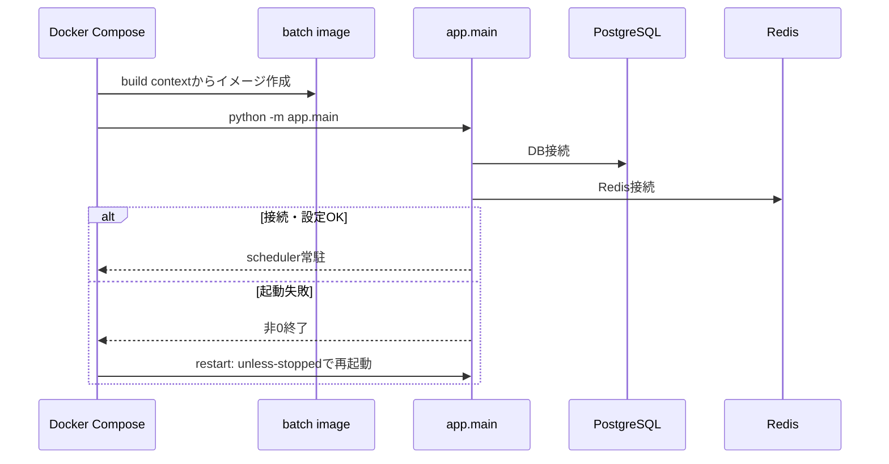
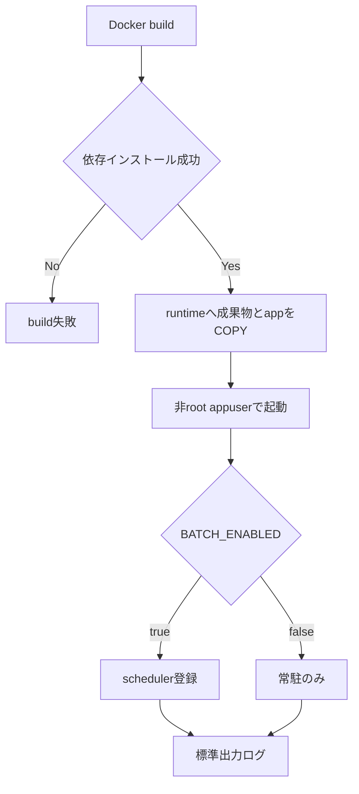
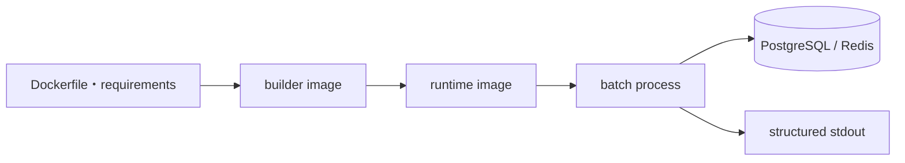
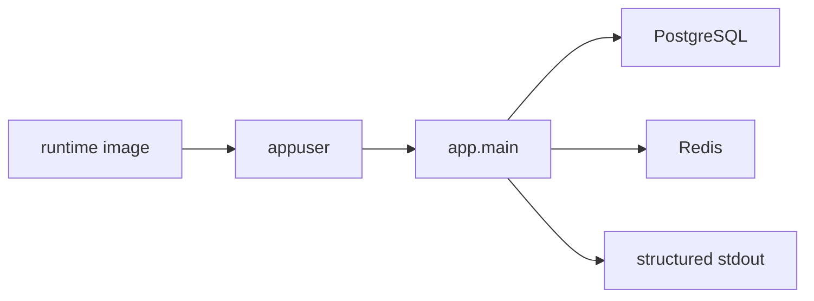

# infra/08 batch Dockerfile詳細設計

## 0. 関連ドキュメント

- 基本設計：[../../basic_design/06_infra_cicd.md](../../basic_design/06_infra_cicd.md) §2.1・§3
- 詳細設計：[01_docker_compose.md](./01_docker_compose.md)、[04_env_config.md](./04_env_config.md)、[../batch/00_overview.md](../batch/00_overview.md)

## 1. 概要

| 項目 | 内容 |
|------|------|
| 対象 | `batch/Dockerfile`、`batch/requirements.txt` |
| 目的 | 期限通知スケジューラをAPIプロセスから分離した常駐コンテナとして実行する |
| ベース | builder/runtimeとも `python:3.14-slim` |
| 起動 | `python -m app.main` |
| ポート | 公開しない |
| 実行ユーザー | 非root `appuser` |
| マイグレーション | 実行しない。DBスキーマはbackendの起動処理が準備する |

## 2. 想定Dockerfile

```dockerfile
FROM python:3.14-slim AS builder
WORKDIR /build
COPY batch/requirements.txt ./requirements.txt
RUN pip install --no-cache-dir --prefix=/install -r requirements.txt

FROM python:3.14-slim AS runtime
ENV PYTHONDONTWRITEBYTECODE=1 PYTHONUNBUFFERED=1
WORKDIR /app
RUN addgroup --system appgroup && adduser --system --ingroup appgroup appuser
COPY --from=builder /install /usr/local
COPY batch/app ./app
USER appuser
CMD ["python", "-m", "app.main"]
```

実装時は依存バージョンを`batch/requirements.txt`で固定し、APIのrequirementsを暗黙に共有しない。`DATABASE_URL`、`REDIS_URL`、`APP_TIMEZONE`等はComposeの環境変数から注入する。

## 3. ビルド・起動設定

| 項目 | 設定 |
|------|------|
| build context | リポジトリルート |
| dockerfile | `batch/Dockerfile` |
| restart | `unless-stopped` |
| depends_on | `postgres` / `redis` の`service_healthy` |
| healthcheck | `python -c "import os; os.kill(1, 0)"`でPID 1の生存を確認 |
| logging | backendと同じ標準出力の構造化ログ。秘密情報を含めない |
| network | `cerberus_net`のみ |

## 4. 全体の出入力

| 区分 | 内容 |
|------|------|
| 入力 | Docker build context、`batch/requirements.txt`、Composeから注入される環境変数 |
| 出力 | 非rootで起動する `python -m app.main` プロセス、標準出力の構造化ログ |
| 責務 | batchの実行環境をbackendイメージから分離し、DB/Redisへの接続設定を実行時に受け取る |
| 例外 | build失敗はイメージを作成しない。起動時の設定・DB接続失敗はコンテナの再起動方針へ委譲する |

## 5. 起動シーケンス



## 6. 処理フロー・分岐



## 7. データ遷移図



イメージbuild中に業務データは扱わない。実行時にのみ環境変数を受け取り、batchプロセスからDB/Redisへ接続する。

## 8. 処理・要素詳細

| 要素 | 入力 | 出力・責務 | 失敗時 |
|------|------|------------|--------|
| builder stage | `batch/requirements.txt` | `/install`へ依存を配置 | pip失敗でbuild停止 |
| runtime stage | 依存成果物、`batch/app` | 非root実行可能なイメージ | COPY失敗でbuild停止 |
| `app.main` | Compose環境変数 | schedulerまたは待機プロセス | 非0終了、Composeが再起動 |
| healthcheck | `app.main`プロセス | 生存判定 | unhealthy。直近ジョブの成否は判定しない |

## 9. 要素相関図



## 10. セキュリティ・非機能

- rootで実行せず、書き込み可能領域をアプリの一時領域に限定する。
- `JWT_SECRET_KEY`、OAuth secret、SMTP passwordはbatchへ渡さない。
- batchはHTTPポートを持たず、APIを経由せずにDB/Redisへ内部接続する。
- `BATCH_ENABLED=false`でもコンテナは常駐できるが、定期ジョブは登録しない。

## 11. テスト設計

| ケース | 期待結果 | テスト名案 |
|--------|----------|------------|
| batchイメージのビルド | Docker buildが成功する | `test_batch_image_builds` |
| 非root確認 | `id -u`が0でない | `test_batch_container_runs_non_root` |
| 起動 | `python -m app.main`が設定を読み常駐する | `test_batch_entrypoint_starts_scheduler` |
| DB未準備 | depends_on待機後も再起動で復旧できる | `test_batch_restarts_after_database_readiness` |
| DB/Redis直接接続 | batchイメージ内からComposeサービス名でPostgreSQL/Redisへ接続する | `test_batch_container_connects_to_postgres_and_redis` |

## 12. 不明点・要検討事項

- `healthcheck` をプロセス生存確認からジョブ成功確認へ拡張するかは運用設計で要検討とする。
- Dockerの停止猶予時間がチャンク処理に十分かは、実装後の実環境で確認する。
