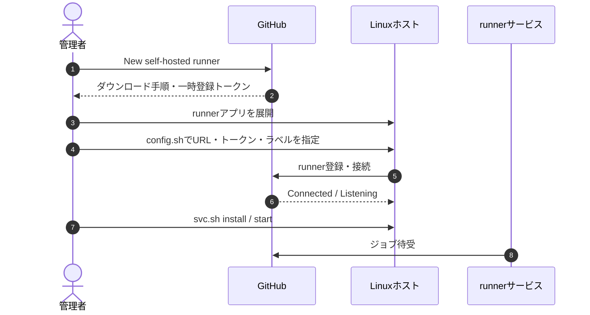

# infra/09 self-hosted runner登録手順（将来用）

## 1. 位置づけ

本プロジェクトは開発・学習用途のため、現在はself-hosted runnerを使用しない。本書は、将来CDを再導入する場合の登録手順だけを定義する。CDを再導入する際は、要件定義書・基本設計書・詳細設計書・workflowを同時に更新する。

## 2. 前提

| 項目 | 内容 |
|------|------|
| 対象 | Linux x64ホスト |
| 権限 | リポジトリ管理者またはOrganization管理者 |
| 必須ソフトウェア | GitHub Actions runner、Docker Engine、Docker Compose v2 |
| 通信 | GitHub ActionsとGHCRへの外向きHTTPS通信 |
| 実行ユーザー | rootではない専用ユーザー。Dockerを実行できること |
| ラベル | `self-hosted`、`linux`、`cerberus` |

## 3. 登録手順

1. GitHubリポジトリの `Settings` → `Actions` → `Runners` → `New self-hosted runner` を開く。
2. `Linux` と対象アーキテクチャを選択する。
3. GitHub画面に表示されたrunnerのダウンロード・展開コマンドを対象ホストで実行する。
4. GitHub画面に表示された一時トークンを使い、次の形式で登録する。

```bash
./config.sh \
  --url https://github.com/oikawa-d/task_management \
  --token <GitHub画面に表示された登録トークン> \
  --name cerberus-development \
  --labels cerberus
```

登録トークンは秘密情報として扱い、Issue・チャット・ログへ記録しない。トークンが失効した場合はGitHub画面から再発行する。

## 4. サービス化

接続確認は次のコマンドで行う。

```bash
./run.sh
```

`Connected to GitHub` と `Listening for Jobs` が表示されたら、`Ctrl+C`で停止してサービス化する。

```bash
sudo ./svc.sh install
sudo ./svc.sh start
sudo ./svc.sh status
```

runnerユーザーがDockerを実行できることを確認する。

```bash
docker ps
docker compose version
```

## 5. GitHub上の確認

Runner一覧で次を確認する。

- 状態が `Idle` または実行中になること
- `self-hosted`、`linux`、`cerberus` のラベルが付いていること
- 対象workflowの `runs-on` とラベルが一致すること

## 6. 停止・削除

一時停止する場合はrunnerホストで実行する。

```bash
sudo ./svc.sh stop
```

完全に登録解除する場合は、GitHubのRunner一覧から対象runnerを削除し、対象ホストで次を実行する。

```bash
./config.sh remove --token <GitHub画面に表示された削除トークン>
```

runnerアプリケーションのディレクトリは、登録解除と利用停止を確認してから管理者が削除する。自動削除は行わない。

## 7. 処理の流れ



## 8. セキュリティ上の注意

- 公開リポジトリでは、信頼できないworkflowをself-hosted runnerで実行しない。
- `pull_request`から本番相当ホストへ到達するworkflowを作成しない。
- runnerホストに不要な認証情報や本番秘密情報を保存しない。
- 使用しない期間はrunnerサービスを停止し、必要がなくなったらGitHubから登録解除する。
