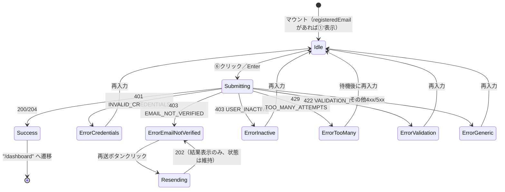
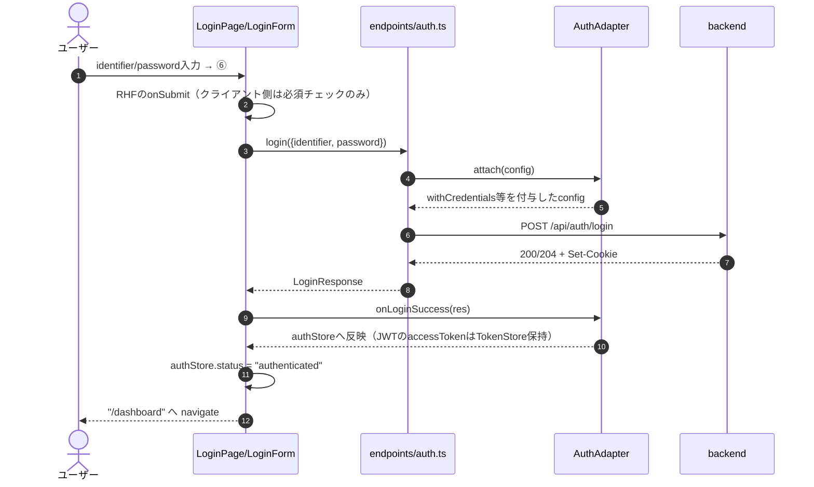
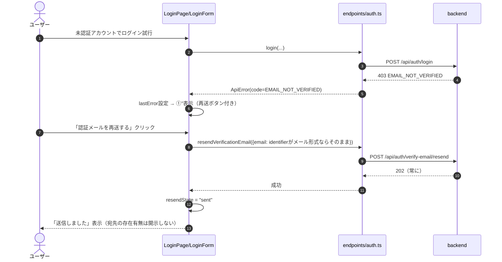
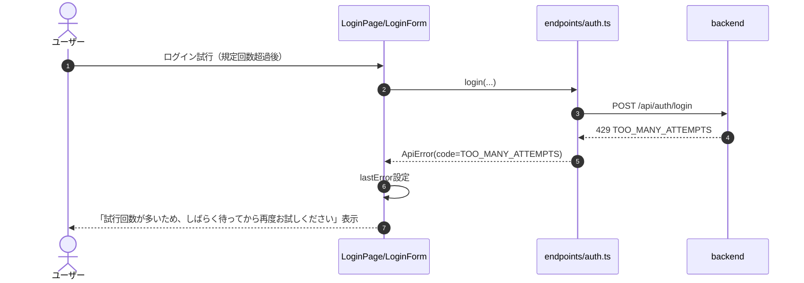
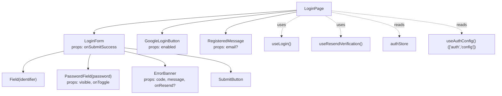
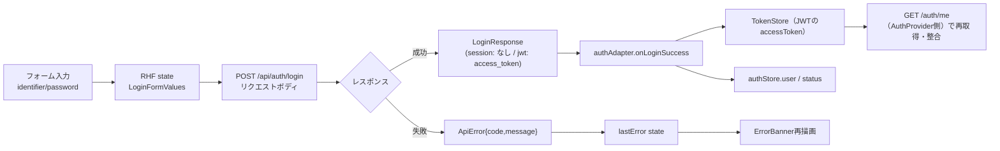

# ログイン画面詳細設計（/login）

## 0. 関連ドキュメント

| ドキュメント | 内容 |
|--------------|------|
| [../../basic_design/05_frontend.md](../../basic_design/05_frontend.md) | §2 ルーティング、§6 APIクライアント層、§7.1 画面別仕様（ログイン） |
| [../../basic_design/04_api.md](../../basic_design/04_api.md) | §3.1 認証スキーマ、§4 エラー設計 |
| [../../basic_design/03_auth.md](../../basic_design/03_auth.md) | §3.2 ログインシーケンス、§6.2 判定順序、§6.3 認証メール再送 |
| [../api/auth/02_post_auth_login.md](../api/auth/02_post_auth_login.md) | POST /api/auth/login 詳細 |
| [../api/auth/08_post_auth_verify_email_resend.md](../api/auth/08_post_auth_verify_email_resend.md) | POST /api/auth/verify-email/resend 詳細 |
| [../api/auth/05_get_auth_config.md](../api/auth/05_get_auth_config.md) | GET /api/auth/config 詳細 |
| [../api/auth/11_get_auth_oauth_google.md](../api/auth/11_get_auth_oauth_google.md) | GET /api/auth/oauth/google 詳細 |
| [./02_register.md](./02_register.md) | 会員登録画面（登録直後の遷移元） |
| [./03_password_forgot.md](./03_password_forgot.md) | パスワード再設定要求画面（遷移先） |

## 1. 概要

| 項目 | 内容 |
|------|------|
| 画面名 / パス | ログイン画面 / `/login` |
| レイアウト | `AuthLayout` |
| ガード | 未認証のみ（`authStore.status === 'authenticated'` の場合は `/dashboard` へリダイレクト）。`/` からのリダイレクト先でもあるため、認証済みユーザーが `/` にアクセスした場合はこのガードが `/dashboard` へ送る |
| 対応要件 | 要件書§2-1 |
| 主なユースケース | メール/ユーザー名 + パスワードでのログイン、Googleログイン開始、メール未認証時の再送、登録直後の案内表示 |
| 実装ファイル | `src/features/auth/pages/LoginPage.tsx`、`src/features/auth/components/LoginForm.tsx`、`src/features/auth/components/GoogleLoginButton.tsx` |

## 2. 画面レイアウト

```
┌───────────────────────────────────────────┐
│               Cerberus                     │  ← ①ロゴ
│                                             │
│  [①' 登録直後メッセージ（条件表示）]         │
│  [①''メール未認証エラー（条件表示）]         │
│                                             │
│  IDもしくはメールアドレス                    │
│  [② input: identifier                 ]    │
│                                             │
│  パスワード                                  │
│  [③ input: password       (④ 👁 トグル)]    │
│                                             │
│  [⑤ INVALID_CREDENTIALS / 429 エラー表示]   │
│                                             │
│  [⑥        ログイン         ]（ボタン）      │
│                                             │
│  ──────────── または ────────────           │
│  [⑦   Googleでログイン   ]（ボタン）         │
│                                             │
│  ⑧ 新規会員登録はこちら                      │
│  ⑨ パスワードを忘れた方はこちら              │
└───────────────────────────────────────────┘
```

レスポンシブ時：幅 480px 未満ではフォーム幅を `100% - 32px` に、Googleボタンとログインボタンは常に縦積み。文字サイズは `--font-scale` に連動して拡縮する（§13参照）。

## 3. UI要素仕様

| No | 要素 | 種別 | 初期値 | 入力制約 | 活性条件 | イベント／遷移 |
|----|------|------|--------|----------|----------|----------------|
| ① | ロゴ | 静的テキスト | "Cerberus" | - | 常時 | - |
| ①' | 登録直後メッセージ | Alert(info) | 非表示 | - | `location.state.registeredEmail` が存在する場合のみ表示 | 「確認メールを送信しました（{email}）」 |
| ①'' | メール未認証エラー | Alert(error) + 再送ボタン | 非表示 | - | 直前のログイン試行が 403 `EMAIL_NOT_VERIFIED` の場合のみ表示 | §7参照 |
| ② | identifier入力 | text input | `""` | 必須、1〜255文字 | 常時活性 | onChange でstate更新、Enter送信対象 |
| ③ | パスワード入力 | password/text input | `""` | 必須、1文字以上（バックエンドと重複した強度検証はしない） | 常時活性 | onChange でstate更新、Enter送信対象 |
| ④ | 表示/非表示トグル | icon button | 非表示（`type=password`） | - | 常時活性 | クリックで `type` を `password` ⇔ `text` に切替 |
| ⑤ | エラーメッセージ | インラインエラー | 非表示 | - | 送信失敗時 | §11参照 |
| ⑥ | ログインボタン | submit button | 活性 | - | `isSubmitting=false` かつ ②③が非空 | クリック／Enterで送信 |
| ⑦ | Googleでログイン | button | 活性 | - | `authConfig.google_login_enabled === true` の場合のみ表示 | `window.location.href = "{VITE_API_BASE_URL}/auth/oauth/google"` |
| ⑧ | 新規会員登録リンク | link | - | - | 常時 | `/register` へ遷移 |
| ⑨ | パスワード再設定リンク | link | - | - | 常時 | `/password/forgot` へ遷移 |

## 4. 使用API

| No | 呼び出しタイミング | メソッド／パス | 送信内容 | 成功時処理 | 失敗時処理 | queryKey / mutationKey |
|----|--------------------|-----------------|----------|------------|------------|--------------------------|
| 1 | マウント時（`AuthProvider` 経由。本画面独自では呼ばない） | GET `/auth/config` | - | `authConfig` を store に保持、⑦の表示可否決定 | トースト表示のみ（ログイン自体はブロックしない） | `['auth', 'config']` |
| 2 | ⑥クリック／Enter | POST `/auth/login` | `{ identifier, password }` | session: `authStore` を `authenticated` に更新し `/dashboard` へ `navigate`。jwt: `access_token` を保存後に同様 | §11参照 | `mutationKey: ['auth', 'login']` |
| 3 | ①''の再送ボタンクリック | POST `/auth/verify-email/resend` | `{ email: lastAttemptedIdentifierIfEmail }` | 結果に関わらず「送信しました」表示（§7） | 同上（202固定のためエラー分岐なし） | `mutationKey: ['auth', 'resendVerification']` |

## 5. 状態管理

| 区分 | 名称 | 型 | 初期値 | 更新契機 | 永続化 |
|------|------|----|--------|----------|--------|
| ローカルstate（RHF） | `LoginFormValues { identifier, password }` | オブジェクト | `{ identifier: "", password: "" }` | 入力・送信 | なし |
| ローカルstate | `showPassword` | boolean | `false` | ④クリック | なし |
| ローカルstate | `lastError` | `{ code: string; message: string; retryAfterSec?: number } \| null` | `null` | ログイン失敗時に設定、再送信時にクリア | なし |
| ローカルstate | `resendState` | `'idle' \| 'sending' \| 'sent'` | `'idle'` | 再送ボタン操作 | なし |
| Zustand `authStore` | `user`, `status` | - | §5.1参照（[05_frontend.md#5](../../basic_design/05_frontend.md)）。JWTのaccessTokenはAuthAdapterへ注入したTokenStoreが保持する | ログイン成功時にuser/statusを更新 | しない |
| TanStack Query | `['auth', 'config']` | `AuthConfig` | - | `AuthProvider` 起動時に取得しキャッシュ | しない |
| React Router `location.state` | `registeredEmail?: string` | - | `/register` からの `navigate` 時のみ | - | なし（画面遷移1回のみ有効） |

## 6. 画面状態遷移図



## 7. 処理シーケンス

### 7.1 通常ログイン（成功）



### 7.2 メール未認証（403）と再送



### 7.3 429（レート制限）



## 8. コンポーネント構成・相関図



## 9. 関数・カスタムフック詳細

### 9.1 `hooks/useLogin.ts :: useLogin`

| 項目 | 内容 |
|------|------|
| シグネチャ | `function useLogin(): UseMutationResult<LoginResponse, ApiError, LoginFormValues>` |
| 引数 | なし |
| 戻り値 | TanStack Query の `mutation` オブジェクト |
| 処理内容 | 1. `endpoints/auth.ts#login` を呼ぶ 2. 成功時に `authAdapter.onLoginSuccess` → JWTはTokenStoreへaccessTokenを保存し、authStoreのuser/statusを更新 3. 失敗時は `ApiError` をそのまま呼び出し元へ伝播 |
| 副作用 | API呼び出し、`authStore` 更新、成功時に呼び出し元で `navigate("/dashboard")` |

### 9.2 `hooks/useResendVerification.ts :: useResendVerification`

| 項目 | 内容 |
|------|------|
| シグネチャ | `function useResendVerification(): UseMutationResult<void, ApiError, { email: string }>` |
| 引数 | なし |
| 戻り値 | `mutation` オブジェクト |
| 処理内容 | 1. `endpoints/auth.ts#resendVerificationEmail` を呼ぶ 2. 202固定のため成功時のみ `resendState="sent"` |
| 副作用 | API呼び出しのみ。`authStore` は変更しない |

### 9.3 `components/LoginForm.tsx :: buildResendPayload`

| 項目 | 内容 |
|------|------|
| シグネチャ | `function buildResendPayload(identifier: string): { email: string } \| null` |
| 引数 | `identifier`: フォーム入力値 |
| 戻り値 | `identifier` がメール形式（zod `z.string().email()`）ならその値、username形式なら `null`（この場合再送ボタンはメール再入力欄を表示する） |
| 処理内容 | 1. zodの `emailSchema.safeParse` で判定 2. 該当すれば `{email: identifier}` を返す |
| 副作用 | なし |

## 10. バリデーション

| フィールド | zodスキーマ | ルール | エラーメッセージ | バックエンド対応 |
|-----------|-------------|--------|-------------------|-------------------|
| `identifier` | `loginSchema.identifier` | `z.string().min(1).max(50)` | 「IDまたはメールアドレスを入力してください」 | pydantic `identifier: str`（[04_api.md §3.1](../../basic_design/04_api.md#31-認証)） |
| `password` | `loginSchema.password` | `z.string().min(1)` | 「パスワードを入力してください」 | pydantic `password: str` |

クライアント側は必須チェックのみ行い、パスワード強度検証はログイン画面では行わない（登録画面のみ）。再送フォーム（identifierがusername形式の場合）の `email` は `z.string().email()`。

## 11. エラーハンドリング

| APIエラーコード / HTTP | 画面表示 | 遷移 | 再試行導線 |
|--------------------------|----------|------|------------|
| 401 `INVALID_CREDENTIALS` | ⑤「IDまたはパスワードが正しくありません」（統一文言、どちらが誤りか示さない） | なし | 再入力後に再送信可 |
| 403 `EMAIL_NOT_VERIFIED` | ①''「メール認証が完了していません」＋再送ボタン | なし | 再送ボタン（何度でも可、サーバー側で間隔制限） |
| 403 `USER_INACTIVE` | ⑤「アカウントが無効化されています。管理者にお問い合わせください」 | なし | なし（管理者対応待ち） |
| 429 `TOO_MANY_ATTEMPTS` | ⑤「試行回数が多いため、しばらく待ってから再度お試しください」 | なし | 一定時間後に再入力可（具体的な待機秒数はAPIレスポンスに含まれないため画面には表示しない。要検討：§15参照） |
| 422 `VALIDATION_ERROR` | 各フィールド直下にエラー表示 | なし | 修正後に再送信 |
| その他 4xx/5xx | 共通トースト「エラーが発生しました。しばらくしてから再度お試しください」 | なし | 再送信可 |
| ネットワークエラー | 共通トースト「通信に失敗しました」 | なし | 再送信可 |

## 12. データ遷移図



## 13. アクセシビリティ・表示設定

| 項目 | 内容 |
|------|------|
| 文字サイズ | 全テキストを `rem` 指定し `--font-scale` に連動（[05_frontend.md §8](../../basic_design/05_frontend.md#8-アクセシビリティ設定文字サイズ)） |
| キーボード操作 | Tab順は ②→④→③→⑥→⑦→⑧→⑨。②③でのEnterキーは⑥のsubmitと同じ挙動 |
| `aria-*` | ②③に `aria-required="true"`、⑤エラー表示に `role="alert"`、④に `aria-label="パスワードを表示/非表示"` と `aria-pressed` |
| フォーカス管理 | マウント時に②へ自動フォーカス。送信失敗時は⑤へ `aria-live="assertive"` で通知しフォーカスは移動させない（入力継続を妨げないため） |
| コントラスト | エラー文言・トグルアイコンはWCAG AA相当のコントラスト比を確保（具体色はデザイントークンに準拠、本書では規定しない） |

## 14. テスト設計

| No | 区分 | ケース | 前提（MSWのモック応答等） | 期待結果 | テスト名案 |
|----|------|--------|----------------------------|----------|-------------|
| 1 | 単体（zod） | identifier/password 未入力 | - | バリデーションエラーメッセージ表示、送信ブロック | `loginSchema rejects empty fields` |
| 2 | コンポーネント | 正常ログイン（session） | `POST /auth/login` → 204 | `/dashboard` へ遷移、authStoreがauthenticated | `LoginForm success (session) navigates to dashboard` |
| 3 | コンポーネント | 正常ログイン（jwt） | `POST /auth/login` → 200 `{access_token}` | TokenStoreにaccessTokenを保存し、`/dashboard` へ遷移 | `LoginForm success (jwt) stores access token` |
| 4 | コンポーネント | 401 INVALID_CREDENTIALS | `POST /auth/login` → 401 | 統一エラー文言表示 | `LoginForm shows unified error on invalid credentials` |
| 5 | コンポーネント | 403 EMAIL_NOT_VERIFIED → 再送 | `POST /auth/login` → 403、`POST /verify-email/resend` → 202 | 再送ボタン表示 → クリックで「送信しました」表示 | `LoginForm resend verification flow` |
| 6 | コンポーネント | 429 TOO_MANY_ATTEMPTS | `POST /auth/login` → 429 | 待機案内メッセージ表示 | `LoginForm shows rate limit message` |
| 7 | コンポーネント | 登録直後の遷移 | `location.state.registeredEmail = "a@example.com"` | ①'メッセージ表示 | `LoginPage shows post-registration banner` |
| 8 | コンポーネント | パスワード表示トグル | - | クリックで `type` が `text`⇔`password` 切替 | `PasswordField toggles visibility` |
| 9 | コンポーネント | Googleログインボタン非表示 | `authConfig.google_login_enabled=false` | ⑦が描画されない | `LoginPage hides Google button when disabled` |
| 10 | 結合 | 認証済みユーザーが `/login` へアクセス | `authStore.status="authenticated"` | `/dashboard` へリダイレクト | `guards redirect authenticated user away from /login` |
| 11 | 結合 | 未認証で `/` へアクセス | - | `/login` へリダイレクトし、ログイン画面が描画される | `router redirects root to /login when unauthenticated` |
| 12 | 結合 | 認証済みで `/` へアクセス | `authStore.status="authenticated"` | `/login` 経由で最終的に `/dashboard` へ到達する | `router redirects root to /dashboard when authenticated` |
| 網羅できない範囲 | - | 実際のGoogle認可画面遷移、`window.location.href` によるフルページ遷移の検証 | - | jsdom環境では実ナビゲーションを検証できないため、遷移URLの組み立てのみ単体で検証し、実操作は手動確認とする | - |

## 15. 不明点・要検討事項

| 区分 | 内容 | 影響 |
|------|------|------|
| 要検討 | 429 `TOO_MANY_ATTEMPTS` 応答に具体的な待機秒数（`Retry-After` ヘッダ等）が含まれるかが基本設計（[03_auth.md](../../basic_design/03_auth.md)、[04_api.md](../../basic_design/04_api.md)）に明記されていない。現状は汎用文言のみ表示する設計とした | カウントダウン表示等のUX改善を行う場合は、APIレスポンス仕様の追加検討が必要 |
| 不明 | ①''再送導線で、`identifier` がusername形式（メールでない）だった場合の再送用メールアドレス入力欄の要否 | 現行設計では再送ボタンを非表示にせず、メール再入力欄を出す想定としたが、基本設計に明記がないため要確認 |
