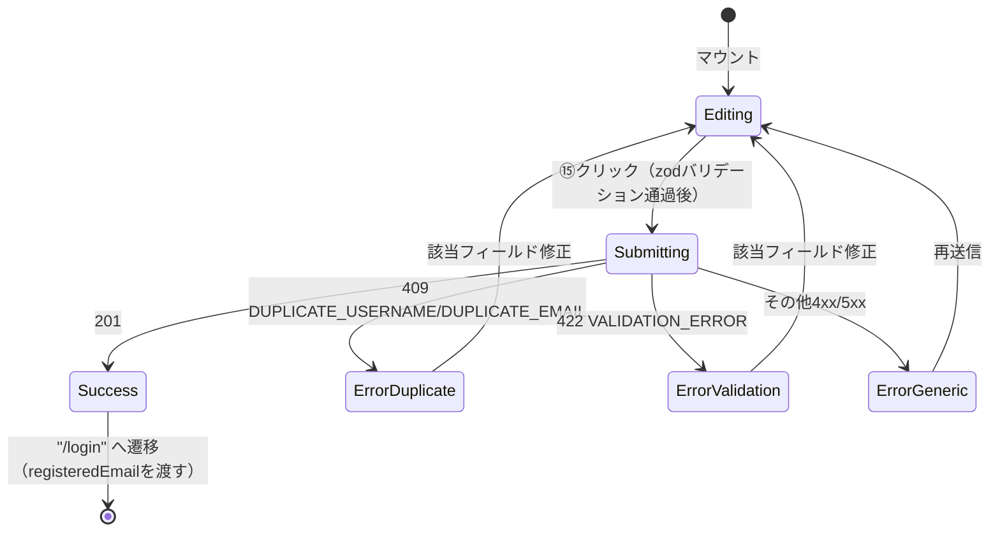
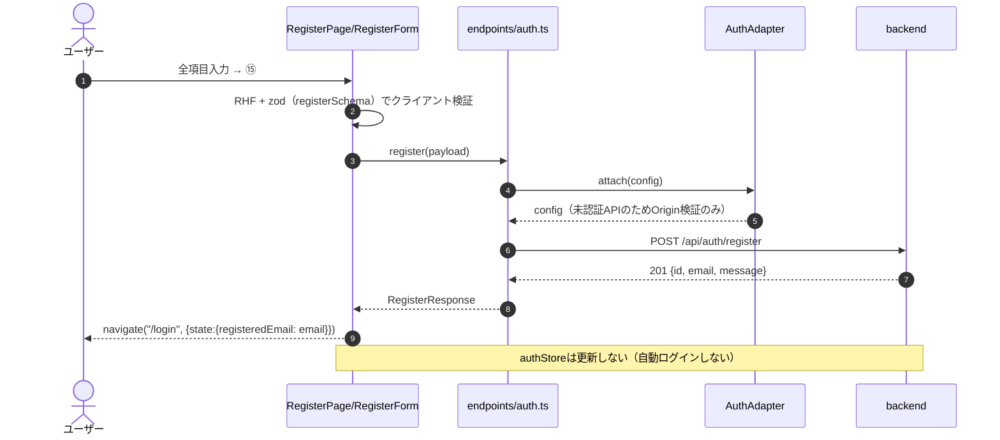
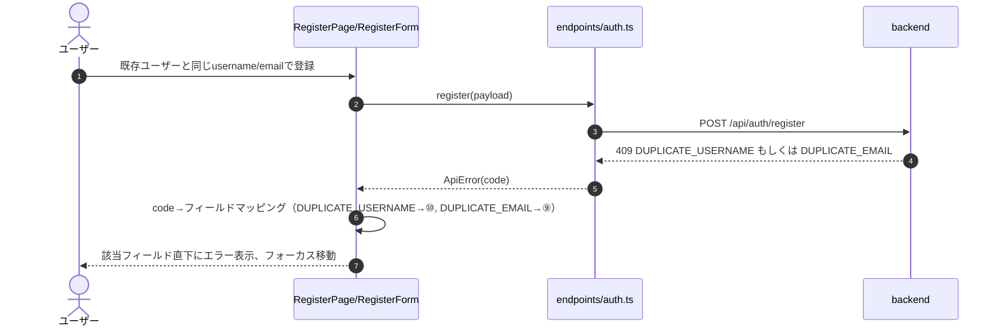
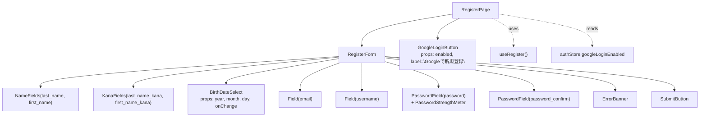

# 会員登録画面詳細設計（/register）

## 0. 関連ドキュメント

| ドキュメント | 内容 |
|--------------|------|
| [../../basic_design/05_frontend.md](../../basic_design/05_frontend.md) | §2 ルーティング、§6 APIクライアント層、§7.2 画面別仕様（会員登録） |
| [../../basic_design/04_api.md](../../basic_design/04_api.md) | §3.1 認証スキーマ（register）、§4 エラー設計 |
| [../../basic_design/03_auth.md](../../basic_design/03_auth.md) | §6.4 登録・認証の関数 |
| [../api/auth/01_post_auth_register.md](../api/auth/01_post_auth_register.md) | POST /api/auth/register 詳細 |
| [./01_login.md](./01_login.md) | ログイン画面（登録成功後の遷移先） |

## 1. 概要

| 項目 | 内容 |
|------|------|
| 画面名 / パス | 会員登録画面 / `/register` |
| レイアウト | `AuthLayout` |
| ガード | 未認証のみ |
| 対応要件 | 要件書§2-2 |
| 主なユースケース | メール/パスワードでの新規登録、Google新規登録への導線 |
| 実装ファイル | `src/features/auth/pages/RegisterPage.tsx`、`src/features/auth/components/RegisterForm.tsx` |

## 2. 画面レイアウト

```
┌───────────────────────────────────────────┐
│               Cerberus 会員登録              │  ← ①見出し
│                                             │
│  姓                     名                   │
│  [② input: last_name] [③ input: first_name]│
│  セイ                   メイ                 │
│  [④ input: last_name_kana][⑤ first_name_kana]│
│                                             │
│  生年月日                                    │
│  [⑥ 年▼] [⑦ 月▼] [⑧ 日▼]                   │
│                                             │
│  メールアドレス                              │
│  [⑨ input: email                     ]     │
│                                             │
│  ユーザー名（ID）                            │
│  [⑩ input: username                  ]     │
│                                             │
│  パスワード                                  │
│  [⑪ input: password       (👁 トグル)]      │
│  [⑫ 強度インジケータ ▓▓▓░░]                 │
│                                             │
│  パスワード（確認）                          │
│  [⑬ input: password_confirm          ]     │
│                                             │
│  [⑭ 409重複エラー / その他エラー表示]        │
│                                             │
│  [⑮        登録する         ]（ボタン）      │
│  ──────────── または ────────────           │
│  [⑯   Googleで新規登録   ]（ボタン）         │
│                                             │
│  ⑰ 既にアカウントをお持ちの方はこちら          │
└───────────────────────────────────────────┘
```

レスポンシブ時：姓/名、セイ/メイの2カラムは幅480px未満で縦積みに、生年月日3プルダウンは常に横並び（幅を等分・最小幅で折返し防止）。

## 3. UI要素仕様

| No | 要素 | 種別 | 初期値 | 入力制約 | 活性条件 | イベント／遷移 |
|----|------|------|--------|----------|----------|----------------|
| ① | 見出し | 静的テキスト | "会員登録" | - | 常時 | - |
| ② | 姓 | text input | `""` | 必須、1〜30文字 | 常時活性 | onChange |
| ③ | 名 | text input | `""` | 必須、1〜30文字 | 常時活性 | onChange |
| ④ | セイ（カナ） | text input | `""` | 必須、1〜30文字、ひらがな・カタカナ・数字のみ | 常時活性 | onChange |
| ⑤ | メイ（カナ） | text input | `""` | 必須、1〜30文字、ひらがな・カタカナ・数字のみ | 常時活性 | onChange |
| ⑥ | 生年月日：年 | select | 未選択 | 必須、選択範囲は現在年から100年前まで（画面側の目安。厳密な妥当性はzod＋サーバー側で検証） | 常時活性 | onChange で⑧の日数選択肢を再計算（うるう年考慮） |
| ⑦ | 生年月日：月 | select | 未選択 | 必須、1〜12 | 常時活性 | 同上 |
| ⑧ | 生年月日：日 | select | 未選択 | 必須、選択中の年月に応じた日数（28〜31） | ⑥⑦選択後に活性 | onChange |
| ⑨ | メールアドレス | text input(email) | `""` | 必須、50文字以内、メール形式 | 常時活性 | onChange |
| ⑩ | ユーザー名 | text input | `""` | 必須、3〜50文字、`^[A-Za-z0-9_-]+$` | 常時活性 | onChange |
| ⑪ | パスワード | password/text input | `""` | 必須、8文字以上、英大文字/英小文字/数字/記号のうち2種類以上 | 常時活性 | onChangeで⑫再計算 |
| ⑫ | 強度インジケータ | progress bar + ラベル | 「未入力」 | - | ⑪入力中に更新 | §9.1参照 |
| ⑬ | パスワード確認 | password/text input | `""` | 必須、⑪と一致 | 常時活性 | onChange |
| ⑭ | エラー表示 | インラインエラー（フィールド単位）＋バナー | 非表示 | - | 送信失敗時 | §11参照 |
| ⑮ | 登録するボタン | submit button | 活性 | - | `isSubmitting=false` かつ全必須項目が入力済み | クリックで送信 |
| ⑯ | Googleで新規登録 | button | 活性 | - | `authConfig.google_login_enabled === true` の場合のみ表示 | `window.location.href = "{VITE_API_BASE_URL}/auth/oauth/google"`（ログイン画面と同一の開始URL） |
| ⑰ | ログインへのリンク | link | - | - | 常時 | `/login` へ遷移 |

## 4. 使用API

| No | 呼び出しタイミング | メソッド／パス | 送信内容 | 成功時処理 | 失敗時処理 | queryKey / mutationKey |
|----|--------------------|-----------------|----------|------------|------------|--------------------------|
| 1 | マウント時（`AuthProvider`（`authBootstrap`）経由。本画面独自では呼ばない） | GET `/auth/config` | - | `authStore.googleLoginEnabled` へ保持、⑯の表示可否決定 | トースト表示のみ | - |
| 2 | ⑮クリック | POST `/auth/register` | `{ username, email, password, password_confirm, last_name, first_name, last_name_kana, first_name_kana, birth_date }` | `authStore` は更新しない。`navigate("/login", { state: { registeredEmail: email } })` | §11参照 | `mutationKey: ['auth', 'register']` |

## 5. 状態管理

| 区分 | 名称 | 型 | 初期値 | 更新契機 | 永続化 |
|------|------|----|--------|----------|--------|
| ローカルstate（RHF） | `RegisterFormValues`（②〜⑬に対応する全フィールド） | オブジェクト | 全て空文字／未選択 | 入力・送信 | なし |
| ローカルstate | `showPassword` / `showPasswordConfirm` | boolean | `false` | ⑪⑬の目アイコンクリック | なし |
| ローカルstate | `passwordStrength` | `0〜4`（整数） | `0` | ⑪onChange時に再計算 | なし |
| ローカルstate | `fieldErrors` | `Record<string, string>` | `{}` | 409/422応答時に該当フィールドへマッピング | なし |
| Zustand `authStore` | - | - | 登録処理では**更新しない**（自動ログインしないため） | - | - |
| Zustand `authStore` | `googleLoginEnabled` | boolean | `false` | `authBootstrap`（`AuthProvider` 起動時）が `GET /auth/config` のレスポンスを保持 | しない |

## 6. 画面状態遷移図



## 7. 処理シーケンス

### 7.1 通常登録（成功）



### 7.2 409重複エラー



## 8. コンポーネント構成・相関図



## 9. 関数・カスタムフック詳細

### 9.1 `components/PasswordStrengthMeter.tsx :: calcPasswordStrength`

| 項目 | 内容 |
|------|------|
| シグネチャ | `function calcPasswordStrength(password: string): 0 \| 1 \| 2 \| 3 \| 4` |
| 引数 | `password`: 入力中のパスワード文字列 |
| 戻り値 | 0＝未入力・要件未達、1〜4＝満たす文字種数（大文字/小文字/数字/記号）＋長さ8文字以上を基準に加点した強度レベル |
| 処理内容 | 1. 長さ8文字以上か判定 2. 文字種（大文字・小文字・数字・記号）の充足数をカウント 3. 8文字未満は最大でも1、以降は文字種数に応じてレベルを決定 |
| 副作用 | なし（純関数） |

### 9.2 `hooks/useRegister.ts :: useRegister`

| 項目 | 内容 |
|------|------|
| シグネチャ | `function useRegister(): UseMutationResult<RegisterResponse, ApiError, RegisterFormValues>` |
| 引数 | なし |
| 戻り値 | `mutation` オブジェクト |
| 処理内容 | 1. `birth_date` を `YYYY-MM-DD` 文字列へ整形 2. `endpoints/auth.ts#register` を呼ぶ 3. 成功時は呼び出し元が `navigate` を実行（`authStore` は変更しない） |
| 副作用 | API呼び出しのみ |

### 9.3 `components/BirthDateSelect.tsx :: getDaysInMonth`

| 項目 | 内容 |
|------|------|
| シグネチャ | `function getDaysInMonth(year: number \| undefined, month: number \| undefined): number` |
| 引数 | `year`, `month`（未選択時は `undefined`） |
| 戻り値 | 選択中の年月の日数（未選択時は暫定で31日を返しUI上は31日分の選択肢を表示） |
| 処理内容 | 1. `year`/`month` が両方選択済みなら `new Date(year, month, 0).getDate()` で算出（うるう年考慮） 2. 未選択時は31を返す |
| 副作用 | なし（純関数） |

## 10. バリデーション

| フィールド | zodスキーマ | ルール | エラーメッセージ | バックエンド（pydantic）対応 |
|-----------|-------------|--------|-------------------|-------------------------------|
| `username` | `registerSchema.username` | `z.string().min(3).max(50).regex(/^[A-Za-z0-9_-]+$/)` | 「3〜50文字の英数字・ハイフン・アンダースコアで入力してください」 | `username`（[04_api.md §3.1](../../basic_design/04_api.md#31-認証)） |
| `email` | `registerSchema.email` | `z.string().max(50).email()` | 「メールアドレスの形式が正しくありません」 | `email` |
| `password` | `registerSchema.password` | `z.string().min(8).refine(2種類以上の文字種)` | 「8文字以上で、英大文字/英小文字/数字/記号のうち2種類以上を含めてください」 | `password`（同一規則） |
| `password_confirm` | `registerSchema` の `.refine`（オブジェクト全体） | `password_confirm === password` | 「パスワードが一致しません」 | `password_confirm` |
| `last_name` / `first_name` | `registerSchema.last_name` / `first_name` | `z.string().min(1).max(30)` | 「30文字以内で入力してください」 | `last_name` / `first_name` |
| `last_name_kana` / `first_name_kana` | 同上 | `z.string().min(1).max(30).regex(/^[ぁ-んァ-ヶー0-9]+$/)`（ひらがな・カタカナ・数字のみ） | 「ひらがな・カタカナ・数字で入力してください」 | `last_name_kana` / `first_name_kana` |
| `birth_date`（⑥⑦⑧統合） | `registerSchema.birth_date` | `z.string()`（3プルダウンから合成した `YYYY-MM-DD`）＋未来日不可 | 「正しい生年月日を選択してください」 | `birth_date`（未来日不可） |

zodスキーマは `registerSchema`（`src/features/auth/schemas/registerSchema.ts`）に集約し、バックエンドの pydantic 規則（[04_api.md §3.1](../../basic_design/04_api.md#31-認証)）と1対1で対応させる。規則を変更する場合は両方を同時に更新する運用とする。

## 11. エラーハンドリング

| APIエラーコード / HTTP | 画面表示 | 遷移 | 再試行導線 |
|--------------------------|----------|------|------------|
| 409 `DUPLICATE_USERNAME` | ⑩直下に「このユーザー名は既に使用されています」 | なし | 修正後に再送信 |
| 409 `DUPLICATE_EMAIL` | ⑨直下に「このメールアドレスは既に登録されています」 | なし | 修正後に再送信、または`/login`へ誘導リンクを併記 |
| 422 `VALIDATION_ERROR` | `details[].field` を該当フィールド直下に表示 | なし | 修正後に再送信 |
| その他 4xx/5xx | ⑭バナーに共通エラー「登録に失敗しました。しばらくしてから再度お試しください」 | なし | 再送信可 |
| ネットワークエラー | 共通トースト「通信に失敗しました」 | なし | 再送信可 |

## 12. データ遷移図

```mermaid
flowchart LR
    A["フォーム入力<br/>姓名/カナ/生年月日/メール/PW"] --> B["RHF state<br/>RegisterFormValues"]
    B --> C["zod検証（registerSchema）"]
    C -->|"OK"| D["POST /api/auth/register<br/>リクエストボディ"]
    C -->|"NG"| E["fieldErrors state"]
    D --> F{"レスポンス"}
    F -->|"201"| G["RegisterResponse{id,email,message}"]
    G --> H["navigate(\"/login\", {state:{registeredEmail}})"]
    F -->|"409/422/その他"| I["ApiError"]
    I --> E
    E --> J["各フィールド直下・バナー再描画"]
```

## 13. アクセシビリティ・表示設定

| 項目 | 内容 |
|------|------|
| 文字サイズ | 全テキストを `rem` 指定し `--font-scale` に連動 |
| キーボード操作 | Tab順は②→③→④→⑤→⑥→⑦→⑧→⑨→⑩→⑪→⑫（読み上げのみ、フォーカス対象外）→⑬→⑮→⑯→⑰ |
| `aria-*` | 各必須項目に `aria-required="true"`、⑫に `aria-live="polite"` で強度変化を通知、⑭に `role="alert"` |
| フォーカス管理 | 送信失敗時は最初のエラーフィールドへ自動フォーカス |
| 生年月日プルダウン | `<select>` にそれぞれ `aria-label="年"` `"月"` `"日"` を付与し、スクリーンリーダーで単独項目として識別可能にする |

## 14. テスト設計

| No | 区分 | ケース | 前提（MSWのモック応答等） | 期待結果 | テスト名案 |
|----|------|--------|----------------------------|----------|-------------|
| 1 | 単体（zod） | パスワード強度不足（1種類のみ） | - | バリデーションエラー | `registerSchema rejects weak password` |
| 2 | 単体（zod） | フリガナに漢字を含む | - | バリデーションエラー | `registerSchema rejects non-kana input` |
| 3 | 単体（zod） | 未来日の生年月日 | - | バリデーションエラー | `registerSchema rejects future birth_date` |
| 4 | 単体 | `calcPasswordStrength` の境界値（0/1/2文字種、8文字未満） | - | 期待レベルを返す | `calcPasswordStrength boundary values` |
| 5 | 単体 | `getDaysInMonth` うるう年（2028年2月） | - | 29を返す | `getDaysInMonth handles leap year` |
| 6 | コンポーネント | 正常登録 | `POST /auth/register` → 201 | `/login` へ遷移し `registeredEmail` を渡す | `RegisterForm success navigates to login with state` |
| 7 | コンポーネント | 409 DUPLICATE_EMAIL | `POST /auth/register` → 409 | ⑨直下にエラー表示 | `RegisterForm shows duplicate email error` |
| 8 | コンポーネント | 409 DUPLICATE_USERNAME | `POST /auth/register` → 409 | ⑩直下にエラー表示 | `RegisterForm shows duplicate username error` |
| 9 | コンポーネント | 422 VALIDATION_ERROR（複数フィールド） | `POST /auth/register` → 422 `details:[...]` | 各フィールドにエラー分配 | `RegisterForm maps validation details to fields` |
| 10 | コンポーネント | Googleで新規登録ボタン非表示 | `authConfig.google_login_enabled=false` | ⑯が描画されない | `RegisterPage hides Google button when disabled` |
| 網羅できない範囲 | - | 実際のメール受信・確認メールのリンク遷移 | - | フロントの責務外（Mailpit/実SMTPの確認は手動確認とする） | - |

## 15. 不明点・要検討事項

| 区分 | 内容 | 影響 |
|------|------|------|
| 要検討 | 生年月日プルダウンの年選択範囲（何年前まで遡るか）が基本設計に明記されていない。本書では画面側の目安として「現在年から100年前まで」としたが確定値ではない | 選択肢生成ロジックの上限値を確定する必要がある |
| なし | 上記以外は基本設計と矛盾する記述なし | - |
