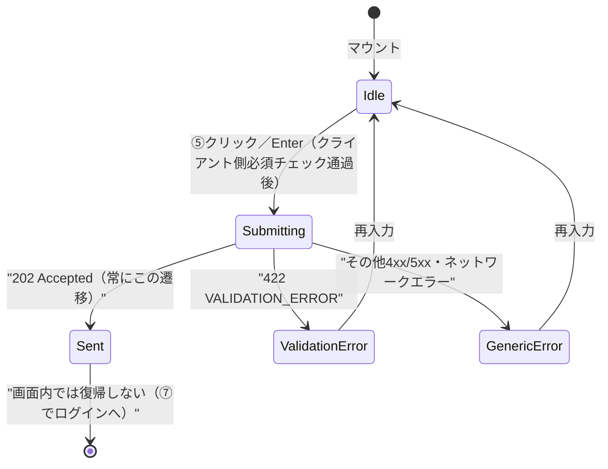
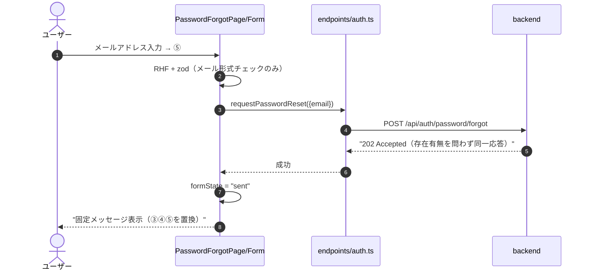
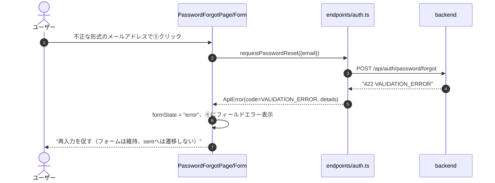
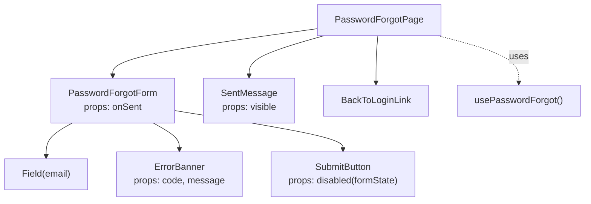
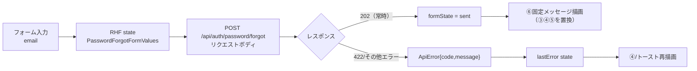

# パスワード再設定要求画面詳細設計（/password/forgot）

## 0. 関連ドキュメント

| ドキュメント | 内容 |
|--------------|------|
| [../../basic_design/05_frontend.md](../../basic_design/05_frontend.md) | §2 ルーティング、§6 APIクライアント層 |
| [../../basic_design/04_api.md](../../basic_design/04_api.md) | §2.1 エンドポイント一覧、§4 エラー設計 |
| [../../basic_design/03_auth.md](../../basic_design/03_auth.md) | §7 パスワードリセット |
| [../api/auth/09_post_auth_password_forgot.md](../api/auth/09_post_auth_password_forgot.md) | POST /api/auth/password/forgot 詳細 |
| [./01_login.md](./01_login.md) | ログイン画面（遷移元・遷移先） |
| [./04_password_reset.md](./04_password_reset.md) | パスワード再設定画面（メール内リンクの遷移先） |

## 1. 概要

| 項目 | 内容 |
|------|------|
| 画面名 / パス | パスワード再設定要求画面 / `/password/forgot` |
| レイアウト | `AuthLayout` |
| ガード | 公開（認証不要）。認証済みユーザーがアクセスしてもリダイレクトはしない（ログイン中でも別アカウントのリセットを要求できる必要はないが、基本設計に排他規定がないため未認証専用ガードは課さない。要検討：§15参照） |
| 対応要件 | 要件書§3.1（認証機能）。画面自体は要件書§2の画面一覧No.8に定義される |
| 主なユースケース | メールアドレスを入力し、パスワード再設定用メールの送信を要求する |
| 実装ファイル | `frontend/src/features/auth/pages/PasswordForgotPage.tsx`、`frontend/src/features/auth/components/PasswordForgotForm.tsx` |

## 2. 画面レイアウト

```
┌───────────────────────────────────────────┐
│               Cerberus                     │  ← ①ロゴ
│                                             │
│  ②パスワードをお忘れの方                     │
│  登録済みのメールアドレスを入力してください   │
│                                             │
│  メールアドレス                              │
│  [③ input: email                     ]    │
│                                             │
│  [④ 422バリデーションエラー表示]             │
│                                             │
│  [⑤        送信         ]（ボタン）          │
│                                             │
│  [⑥ 送信完了メッセージ（条件表示、置換）]     │
│                                             │
│  ⑦ ログイン画面に戻る                        │
└───────────────────────────────────────────┘
```

- ③④⑤：送信前フォーム一式。送信成功後は③④⑤を⑥のメッセージ表示に置き換え、フォームへは戻さない（再送したい場合は⑦でログイン画面経由から再度本画面へ遷移させる想定。同一画面内の「もう一度送信」導線は設けない）
- ⑥：`basic_design/04_api.md` §3.1 の固定文言をそのまま表示し、入力したメールアドレスの存在有無を画面側でも一切示唆しない

レスポンシブ：幅480px未満ではフォーム幅を`100% - 32px`にする。文字サイズは`--font-scale`に連動（§13参照）。

## 3. UI要素仕様

| No | 要素 | 種別 | 初期値 | 入力制約 | 活性条件 | イベント／遷移 |
|----|------|------|--------|----------|----------|----------------|
| ① | ロゴ | 静的テキスト | "Cerberus" | - | 常時 | - |
| ② | 見出し・案内文 | 静的テキスト | - | - | `formState === 'idle' \| 'submitting' \| 'error'` の間のみ表示 | - |
| ③ | メールアドレス入力 | text input | `""` | 必須、メール形式、50文字以内 | `formState !== 'sent'` | onChangeでstate更新、Enter送信対象 |
| ④ | バリデーション／エラー表示 | インラインエラー | 非表示 | - | 送信失敗時 | §11参照 |
| ⑤ | 送信ボタン | submit button | 活性 | - | `formState !== 'submitting' && formState !== 'sent'` かつ③が非空 | クリック／Enterで送信。二重送信防止のため送信中は非活性化 |
| ⑥ | 送信完了メッセージ | Alert(success) | 非表示 | - | `formState === 'sent'` の場合のみ、③④⑤の代わりに表示 | 固定文言（[09_post_auth_password_forgot.md](../api/auth/09_post_auth_password_forgot.md) §2.2） |
| ⑦ | ログイン画面へ戻るリンク | link | - | - | 常時 | `/login` へ遷移 |

## 4. 使用API

| No | 呼び出しタイミング | メソッド／パス | 送信内容 | 成功時処理 | 失敗時処理 | queryKey / mutationKey |
|----|--------------------|-----------------|----------|------------|------------|--------------------------|
| 1 | ⑤クリック／Enter | POST `/auth/password/forgot` | `{ email }` | `formState = 'sent'`（202固定のため常に同一表示、③④⑤を⑥に置換） | 422はフィールドエラー、その他4xx/5xxはトースト。**202以外の応答であっても「存在しない」ことを示す文言は出さない** | `mutationKey: ['auth', 'passwordForgot']` |

## 5. 状態管理

| 区分 | 名称 | 型 | 初期値 | 更新契機 | 永続化 |
|------|------|----|--------|----------|--------|
| ローカルstate（RHF） | `PasswordForgotFormValues { email }` | オブジェクト | `{ email: "" }` | 入力・送信 | なし |
| ローカルstate | `formState` | `'idle' \| 'submitting' \| 'sent' \| 'error'` | `'idle'` | 送信開始・202受信・4xx/5xx受信 | なし |
| ローカルstate | `lastError` | `{ code: string; message: string } \| null` | `null` | 422/その他エラー時に設定 | なし |

`sent` に遷移した後は明示的な「戻る」操作がない限りフォームへ復帰しない（連投抑止。§15参照）。

## 6. 画面状態遷移図



## 7. 処理シーケンス

### 7.1 通常の要求（常に202）



### 7.2 バリデーションエラー（422）



## 8. コンポーネント構成・相関図



## 9. 関数・カスタムフック詳細

### 9.1 `hooks/usePasswordForgot.ts :: usePasswordForgot`

| 項目 | 内容 |
|------|------|
| シグネチャ | `function usePasswordForgot(): UseMutationResult<void, ApiError, { email: string }>` |
| 引数 | なし |
| 戻り値 | TanStack Query の `mutation` オブジェクト |
| 処理内容 | 1. `endpoints/auth.ts#requestPasswordReset` を呼ぶ 2. 202固定のため成功時は常に同一処理（呼び出し元で`formState="sent"`に設定） |
| 副作用 | API呼び出しのみ。`authStore` は変更しない（未認証画面のため関与しない） |

### 9.2 `components/PasswordForgotForm.tsx :: handleSubmit`

| 項目 | 内容 |
|------|------|
| シグネチャ | `function handleSubmit(values: PasswordForgotFormValues): Promise<void>` |
| 引数 | `values`：RHFが検証済みのフォーム値 |
| 戻り値 | なし（Promiseは`mutateAsync`の完了を表す） |
| 処理内容 | 1. `formState = "submitting"` 2. `usePasswordForgot().mutateAsync(values)` を呼ぶ 3. 成功時は`onSent()`（親から渡された`formState="sent"`への遷移関数）を呼ぶ 4. 失敗時は`lastError`を設定し`formState="error"`へ |
| 副作用 | API呼び出し、`formState`/`lastError`更新 |

## 10. バリデーション

| フィールド | zodスキーマ | ルール | エラーメッセージ | バックエンド対応 |
|-----------|-------------|--------|-------------------|-------------------|
| `email` | `passwordForgotSchema.email` | `z.string().email().max(50)` | 「メールアドレスの形式が正しくありません」 | pydantic `PasswordForgotRequest.email`（`EmailStr`、50文字以内。[09_post_auth_password_forgot.md](../api/auth/09_post_auth_password_forgot.md) §10） |

## 11. エラーハンドリング

| APIエラーコード / HTTP | 画面表示 | 遷移 | 再試行導線 |
|--------------------------|----------|------|------------|
| 202（常にこの応答） | ⑥固定メッセージ（③④⑤を置換） | なし | ⑦経由でログイン画面から再訪問すれば再送可能 |
| 422 `VALIDATION_ERROR` | ④フィールドエラー「メールアドレスの形式が正しくありません」 | なし | 修正後に再送信可 |
| その他 4xx/5xx | 共通トースト「エラーが発生しました。しばらくしてから再度お試しください」 | なし | 再送信可（`formState`は`idle`へ戻る） |
| ネットワークエラー | 共通トースト「通信に失敗しました」 | なし | 再送信可 |

## 12. データ遷移図



## 13. アクセシビリティ・表示設定

| 項目 | 内容 |
|------|------|
| 文字サイズ | 全テキストを`rem`指定し`--font-scale`に連動（[05_frontend.md §8](../../basic_design/05_frontend.md#8-アクセシビリティ設定文字サイズ)） |
| キーボード操作 | Tab順は③→⑤→⑦。③でのEnterキーは⑤のsubmitと同じ挙動 |
| `aria-*` | ③に`aria-required="true"`、④に`role="alert"`、⑥に`role="status" aria-live="polite"`（202受信時にスクリーンリーダーへ通知するため） |
| フォーカス管理 | マウント時に③へ自動フォーカス。送信成功時は⑥の見出しへフォーカスを移動する（フォーム自体が非表示に置き換わるため、フォーカスロストを防ぐ） |

## 14. テスト設計

| No | 区分 | ケース | 前提（MSWのモック応答等） | 期待結果 | テスト名案 |
|----|------|--------|----------------------------|----------|-------------|
| 1 | 単体（zod） | email未入力・不正形式 | - | バリデーションエラー表示、送信ブロック | `passwordForgotSchema rejects empty or invalid email` |
| 2 | コンポーネント | 正常送信（存在するメール想定） | `POST /auth/password/forgot` → 202 | ③④⑤が非表示になり⑥固定メッセージが表示される | `PasswordForgotForm shows fixed message after 202` |
| 3 | コンポーネント | 正常送信（存在しないメール想定） | `POST /auth/password/forgot` → 202（同一応答） | 上記と全く同じ表示になる（存在有無の差異なし） | `PasswordForgotForm shows identical message regardless of email existence` |
| 4 | コンポーネント | 422 VALIDATION_ERROR | `POST /auth/password/forgot` → 422 | ④にフィールドエラー表示、フォームは維持 | `PasswordForgotForm shows field error on 422` |
| 5 | コンポーネント | 送信中の二重クリック防止 | 送信APIをpending状態でモック | ⑤が非活性化され2回目のmutateが呼ばれない | `PasswordForgotForm disables submit button while pending` |
| 6 | コンポーネント | 送信完了後にフォーム欄が再表示されないこと | 202受信後 | ③⑤が画面上に存在しない（`sent`状態から`idle`へ戻る導線がないことの確認） | `PasswordForgotForm does not offer resubmission after sent` |
| 7 | 結合 | ⑦クリックで`/login`へ遷移 | - | `navigate('/login')` | `PasswordForgotPage back link navigates to /login` |
| 8 | 結合 | サーバー側レート制限 | MSW: 429 `TOO_MANY_ATTEMPTS`、`Retry-After`付き | 待機時間を案内し、送信完了画面を維持 | `shows password forgot rate limit message` |

## 15. 不明点・要検討事項

| 区分 | 内容 | 影響 |
|------|------|------|
| 確定 | サーバー側はIP単位5回/900秒で制限し、超過時は429 `TOO_MANY_ATTEMPTS`（`Retry-After`付き）を返す | ページ再読み込み・再訪問を含む連投を抑止する |
| 要検討 | 認証済みユーザーが本画面にアクセスした場合にダッシュボードへリダイレクトすべきかは基本設計（[05_frontend.md §2](../../basic_design/05_frontend.md#2-画面一覧とルーティング)）に明記がなく、本設計では「公開画面のためリダイレクトしない」とした | ログイン中ユーザーの導線として不要なアクセスを許容する点の妥当性確認 |
