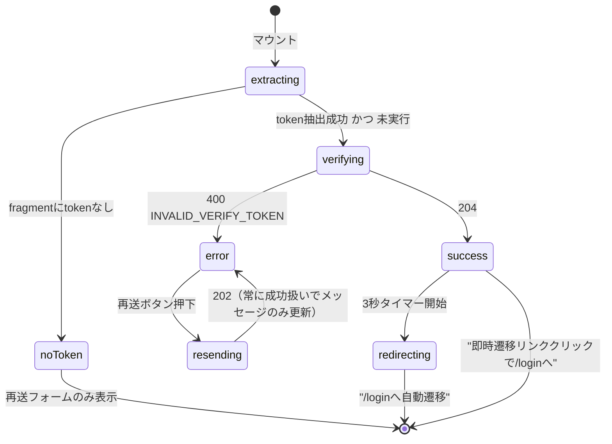
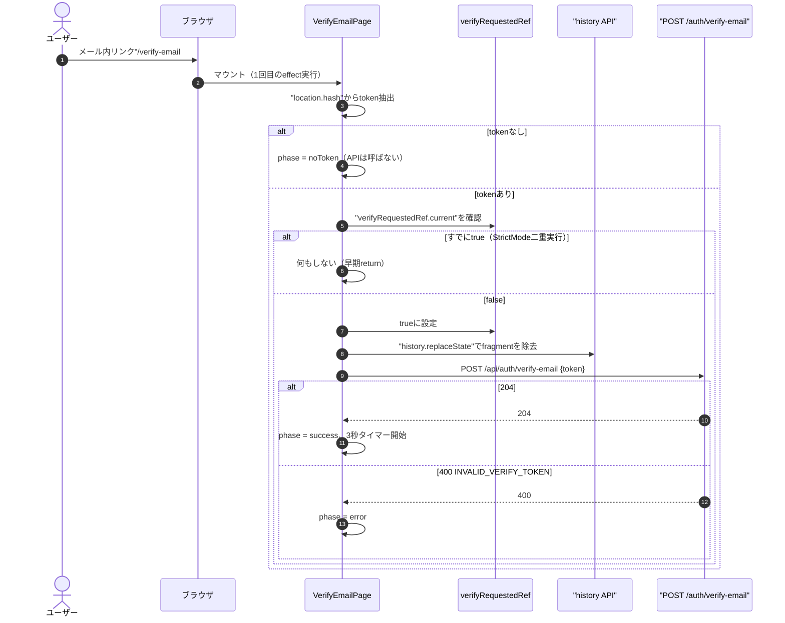
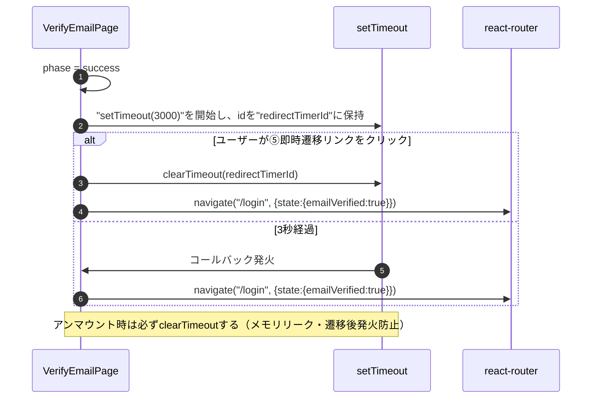
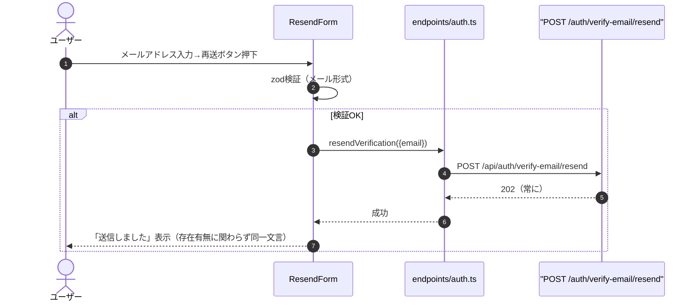
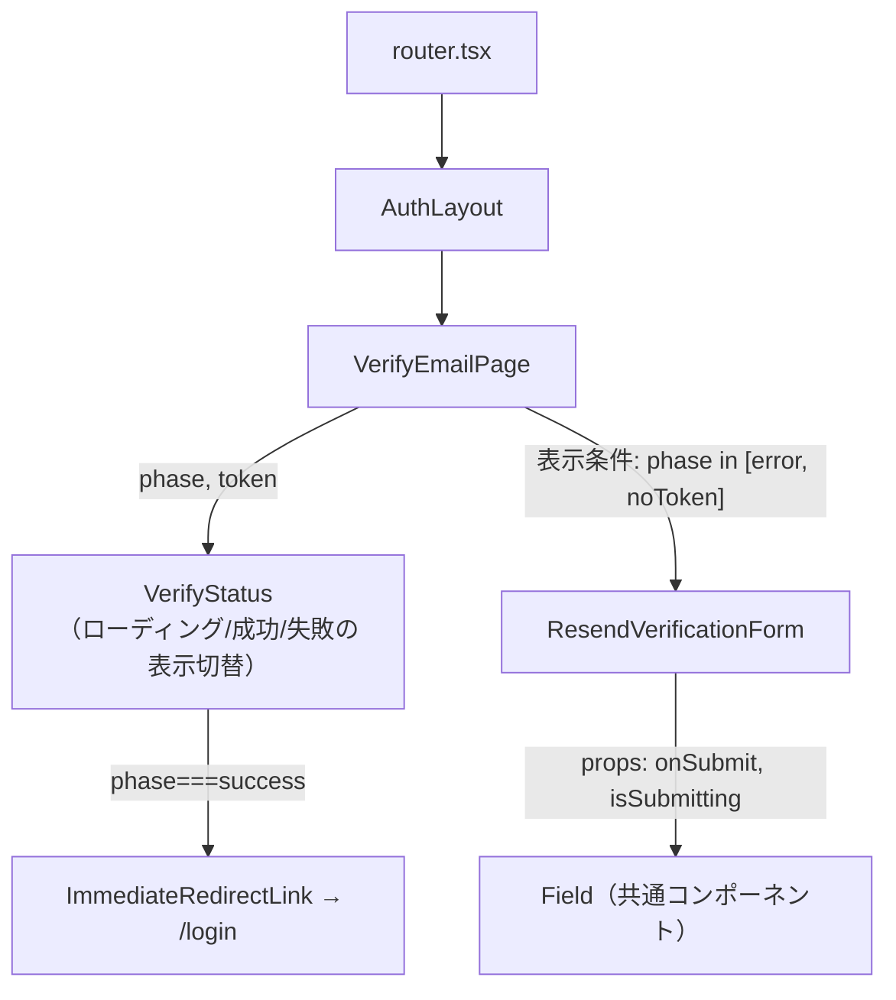
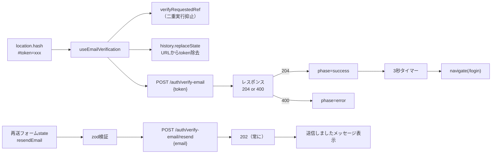

# メール認証画面詳細設計（`/verify-email#token=`）

## 0. 関連ドキュメント

| ドキュメント | 内容 |
|---|---|
| [../../basic_design/05_frontend.md](../../basic_design/05_frontend.md) | §2 画面一覧、§7.3 メール認証の仕様 |
| [../../basic_design/04_api.md](../../basic_design/04_api.md) | §3.1 `/auth/verify-email` `/auth/verify-email/resend` スキーマ |
| [../../basic_design/03_auth.md](../../basic_design/03_auth.md) | §6 会員登録とメール認証、§6.1 シーケンス、§6.3 再送 |
| [../api/auth/07_post_auth_verify_email.md](../api/auth/07_post_auth_verify_email.md) | 使用API：POST /api/auth/verify-email |
| [../api/auth/08_post_auth_verify_email_resend.md](../api/auth/08_post_auth_verify_email_resend.md) | 使用API：POST /api/auth/verify-email/resend |
| [./01_login.md](./01_login.md) | 成功後の遷移先 |
| [./02_register.md](./02_register.md) | 到達経路の起点（登録直後の確認メール） |

## 1. 概要

| 項目 | 内容 |
|------|------|
| 画面名 / パス | メール認証画面 / `/verify-email#token=xxx` |
| レイアウト | AuthLayout |
| ガード | 公開（認証不要） |
| 対応要件 | `basic_design/05_frontend.md` §2 No.5／§7.3 |
| 主なユースケース | 確認メール内リンクからの到達→トークン検証→ログイン画面へ自動遷移。トークン無効時の再送 |
| 実装ファイル | `frontend/src/features/auth/pages/VerifyEmailPage.tsx`、`frontend/src/features/auth/components/VerifyEmailPanel.tsx` |

確認メール本文のURLは `basic_design/03_auth.md` §7.2 のとおり `{FRONTEND_BASE_URL}/verify-email#token=...` であり、query stringではなくfragmentを使う。fragment（`#`以降）はHTTPリクエストに含まれず、サーバーのアクセスログやReferer・中間プロキシのログにも記録されないため、メール認証トークンの露出経路を最小化できる。本画面はfragmentから取得したトークンを、画面遷移を伴わない `history.replaceState` で速やかにURLから除去し、以降はPOST本文でのみサーバーへ送る。

## 2. 画面レイアウト

```
┌──────────────────────────────────────┐
│                Cerberus               │  ← ①ロゴ／ヘッダー
│                                        │
│         メールアドレスを確認中です     │  ← ②見出し（状態により文言変化）
│              [ ローディング ]          │  ← ③ローディングスピナー（検証中のみ）
│                                        │
│   ✓ メール認証が完了しました           │  ← ④成功メッセージ（成功時のみ）
│   3秒後にログイン画面へ移動します      │
│   今すぐ移動する →                    │  ← ⑤即時遷移リンク（成功時のみ）
│                                        │
│   ✕ リンクの有効期限が切れているか、   │  ← ⑥失敗メッセージ（失敗時のみ）
│   既に使用済みです                    │
│                                        │
│   メールアドレス     [__________]     │  ← ⑦再送フォーム（失敗時／token欠落時）
│         [ 認証メールを再送する ]       │  ← ⑧再送ボタン
└──────────────────────────────────────┘
```

- token欠落時：③④⑥は表示せず、②を「リンクが不正です」に差し替えたうえで⑦⑧のみを表示する（APIは呼ばない）。
- レスポンシブ：縦積みを維持し、固定px幅を使わない。

## 3. UI要素仕様

| No | 要素 | 種別 | 初期値 | 入力制約 | 活性条件 | イベント／遷移 |
|----|------|------|--------|----------|----------|----------------|
| ① | ロゴ | 静的表示 | - | - | 常時 | - |
| ② | 見出し | 静的表示 | "メールアドレスを確認中です" | - | 状態に応じ文言切替 | - |
| ③ | ローディングスピナー | 静的表示 | 表示 | - | `verifying` 状態のみ | - |
| ④ | 成功メッセージ | 静的表示 | 非表示 | - | `success` 状態のみ | - |
| ⑤ | 即時遷移リンク | link | 非表示 | - | `success` 状態のみ | クリックで即 `/login` へ`navigate` |
| ⑥ | 失敗メッセージ | 静的表示 | 非表示 | - | `error` 状態のみ | `role="alert"` |
| ⑦ | メールアドレス入力 | text input | "" | メール形式、50文字以内 | `error` または `noToken` 状態のみ表示 | 入力毎にzod検証 |
| ⑧ | 再送ボタン | button submit | disabled | - | ⑦が有効な形式かつ送信中でない | クリックで再送API呼び出し |

## 4. 使用API

| No | 呼び出しタイミング | メソッド／パス | 送信内容 | 成功時処理 | 失敗時処理 | queryKey / mutationKey |
|----|---------------------|-----------------|----------|------------|------------|--------------------------|
| 1 | マウント時（tokenあり時のみ、1回だけ） | `POST /api/auth/verify-email` | `{ token }` | 204 → `success` 状態へ、3秒後に `/login` へ自動`navigate`（`state: { emailVerified: true }`） | 400 `INVALID_VERIFY_TOKEN` → `error` 状態へ、⑦⑧を表示 | `mutationKey: ['auth', 'verifyEmail']` |
| 2 | ⑧ボタン押下 | `POST /api/auth/verify-email/resend` | `{ email }` | 202 → 常に「送信しました」を表示（成否を問わずユーザー列挙対策） | ネットワークエラー等のみ共通トースト（422以外は基本発生しない） | `mutationKey: ['auth', 'resendVerification']` |

## 5. 状態管理

| 区分 | 名称 | 型 | 初期値 | 更新契機 | 永続化 |
|------|------|-----|--------|----------|--------|
| ローカルstate | `phase` | `"noToken" \| "verifying" \| "success" \| "error"` | `token`抽出結果から決定 | マウント時／API応答時 | しない |
| ローカルref | `verifyRequestedRef` | `boolean`（`useRef`） | `false` | mutation実行直前に`true`化。StrictMode二重実行の抑止に使用 | しない（レンダー非依存） |
| ローカルstate（RHF） | `resendEmail` | `string` | "" | 入力毎 | しない |
| ローカルstate | `redirectTimerId` | `number \| null` | null | 成功時にセット、アンマウント時にクリア | しない |
| authStore | 参照なし | - | - | - | - |

## 6. 画面状態遷移図



## 7. 処理シーケンス

### 7.1 マウント〜トークン検証（StrictMode対応含む）



`React.StrictMode` では開発時にマウント直後の `useEffect` が意図的に2回実行される。トークンはワンタイム消費（`basic_design/03_auth.md` §6.1 の `GETDEL`）のため、素朴に実装すると1回目で消費されたトークンで2回目が必ず400になる。`verifyRequestedRef`（`useRef`）はレンダーを起こさない同期フラグであり、`useEffect` の2回目実行時点でも値が保持されるため、これを見て2回目以降の呼び出しを抑止する。

### 7.2 成功後の自動遷移



### 7.3 認証メール再送



## 8. コンポーネント構成・相関図



## 9. 関数・カスタムフック詳細

### 9.1 `VerifyEmailPage.tsx :: useEmailVerification`

| 項目 | 内容 |
|------|------|
| シグネチャ | `function useEmailVerification(): { phase: VerifyPhase }` |
| 引数 | なし |
| 戻り値 | `phase`：`"noToken" \| "verifying" \| "success" \| "error"` |
| 処理内容 | 1. `useRef(false)` で `verifyRequestedRef` を保持する<br>2. `useEffect` 内で `location.hash` から `token` を抽出する<br>3. tokenが無ければ `phase="noToken"` として終了（API呼び出しなし）<br>4. tokenがあり `verifyRequestedRef.current === false` の場合のみ、`true` に設定してから `history.replaceState` でURLを整形し、`POST /auth/verify-email` を実行する<br>5. 204なら `phase="success"`、400なら `phase="error"` を設定する<br>6. `verifyRequestedRef.current === true` の状態で再度effectが走った場合（StrictMode）は何もしない |
| 副作用 | API呼び出し（最大1回）、`history.replaceState` |

### 9.2 `VerifyEmailPage.tsx :: useAutoRedirect`

| 項目 | 内容 |
|------|------|
| シグネチャ | `function useAutoRedirect(active: boolean, delayMs: number): void` |
| 引数 | `active`（`phase==="success"`のときtrue）、`delayMs`（既定3000。マジックナンバーを避け `EMAIL_VERIFY_REDIRECT_DELAY_MS` 相当の定数から取得） |
| 戻り値 | なし |
| 処理内容 | 1. `active` が `true` に変化した時点で `setTimeout(delayMs)` を開始する<br>2. コールバックで `navigate("/login", { state: { emailVerified: true } })` を実行する<br>3. クリーンアップ関数で `clearTimeout` する |
| 副作用 | 画面遷移（タイマー経由） |

## 10. バリデーション

| フィールド | zodスキーマ | 規則 | エラーメッセージ | バックエンド対応 |
|------------|--------------|------|--------------------|--------------------|
| `resendEmail` | `resendVerificationSchema.email` | メール形式、50文字以内 | "有効なメールアドレスを入力してください" | pydantic `RegisterRequest.email` と同一規則（`basic_design/04_api.md` §3.1） |

`token` はfragmentから抽出するのみでフォーム入力ではないため、zod検証の対象外とする。

## 11. エラーハンドリング

| APIエラーコード / HTTP | 画面表示 | 遷移 | 再試行導線 |
|---|---|---|---|
| `400 INVALID_VERIFY_TOKEN` | "リンクの有効期限が切れているか、既に使用済みです" | 画面内に留まる | 再送フォームからメール再送 |
| token欠落（クライアント側判定） | "リンクが不正です" | 画面内に留まる（APIは呼ばない） | 再送フォームからメール再送 |
| `POST /auth/verify-email/resend` の応答 | 常に202として「送信しました」表示 | 画面内に留まる | 再送間隔制限は`basic_design/03_auth.md` §6.3参照（クライアント側は制限を意識せず常に送信可能とし、サーバー側の間隔制御に委ねる） |
| その他4xx/5xx | 共通トースト表示 | 画面内に留まる | - |

## 12. データ遷移図



## 13. アクセシビリティ・表示設定

| 項目 | 内容 |
|------|------|
| 文字サイズ | `--font-scale` に追従する `rem` 指定 |
| キーボード操作 | ⑦⑧のみフォーカス対象（③④⑤⑥は静的表示）。Enterで再送送信 |
| `aria-*` | ⑥失敗メッセージは `role="alert"`、④成功メッセージは `role="status"` かつ `aria-live="polite"`（3秒後の自動遷移をスクリーンリーダーにも通知） |
| フォーカス管理 | `error` / `noToken` 状態遷移時に⑦へ初期フォーカスを移す |

## 14. テスト設計

| No | 区分 | ケース | 前提（MSWのモック応答等） | 期待結果 | テスト名案 |
|----|------|--------|---------------------------|----------|------------|
| 1 | 単体 | `useEmailVerification`：token抽出成功 | `location.hash="#token=abc"`、MSW: `POST /auth/verify-email` → 204 | `phase`が`verifying`→`success`、API呼び出し1回 | `verifies token once and transitions to success` |
| 2 | 単体 | `useEmailVerification`：StrictMode二重マウント | 同上をeffect2回実行相当でシミュレート | `POST /auth/verify-email` の呼び出しは1回のみ | `does not call verify API twice under double invocation` |
| 3 | 単体 | `useEmailVerification`：token欠落 | `location.hash=""` | `phase="noToken"`、API呼び出しなし | `does not call API when token is missing` |
| 4 | 単体 | `useAutoRedirect` | `active=true, delayMs=3000` | 3000ms後に`navigate`が1回呼ばれる（fake timers使用） | `navigates to login after delay` |
| 5 | コンポーネント | 400応答 | MSW: 400 `INVALID_VERIFY_TOKEN` | 失敗メッセージ＋再送フォーム表示 | `shows resend form on invalid token` |
| 6 | コンポーネント | 再送ボタン押下 | MSW: `POST /auth/verify-email/resend` → 202 | 「送信しました」表示（存在有無問わず） | `shows sent message regardless of email existence` |
| 7 | コンポーネント | 即時遷移リンククリック | phase=success | `clearTimeout`後に即`navigate`が呼ばれる | `navigates immediately when link clicked` |
| 網羅できない範囲 | - | 実際のメールクライアント・複数タブでの同時アクセス | - | - | 手動確認とする（トークンはワンタイム消費のため2つ目のタブは常に400になる想定） |

## 15. 不明点・要検討事項

| 区分 | 内容 | 影響 |
|------|------|------|
| 要検討 | 3秒の自動遷移遅延を環境変数化するか、フロント側定数（例：`EMAIL_VERIFY_REDIRECT_DELAY_MS`）として固定するか。`basic_design/05_frontend.md` に環境変数としての明記なし | 実装時にconfig化の要否を判断する必要あり |
| 不明 | 認証メール再送のクライアント側レート制限UI（サーバー側60秒制限に対し、連打防止のdisabled化など）の要否 | UI仕様の細部に影響。基本設計に明記がないため今回は「送信中はボタンをdisabledにする」最小対応とした |
