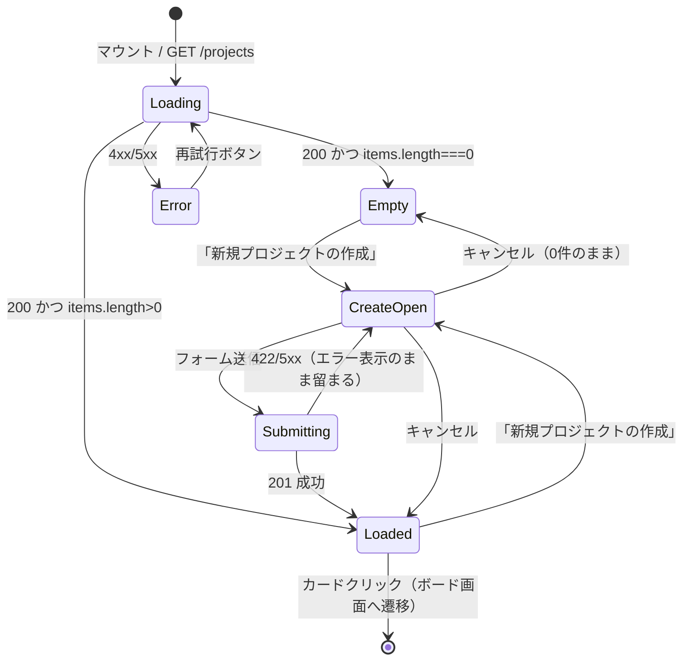
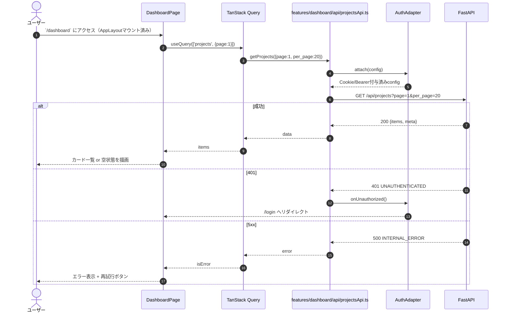
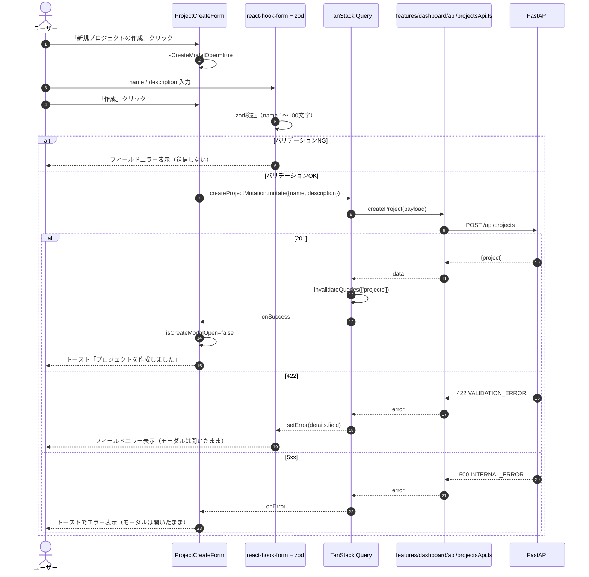
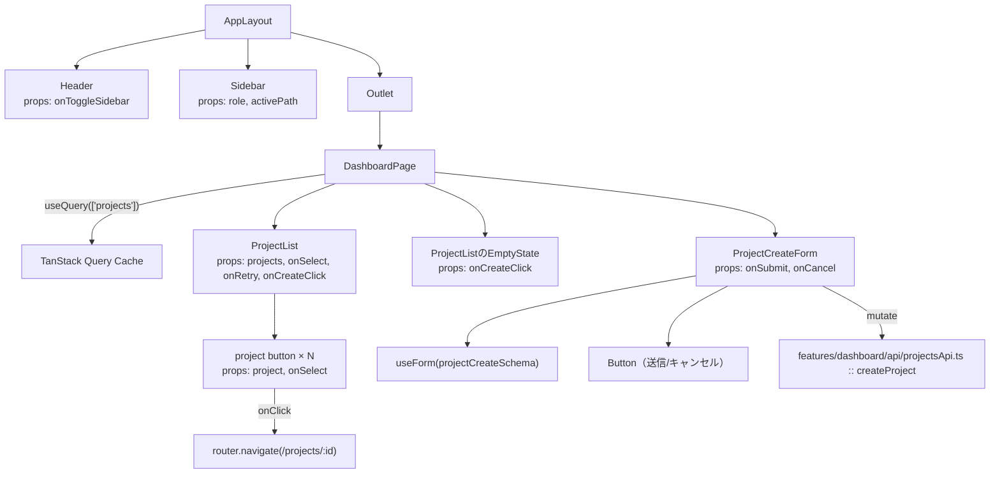
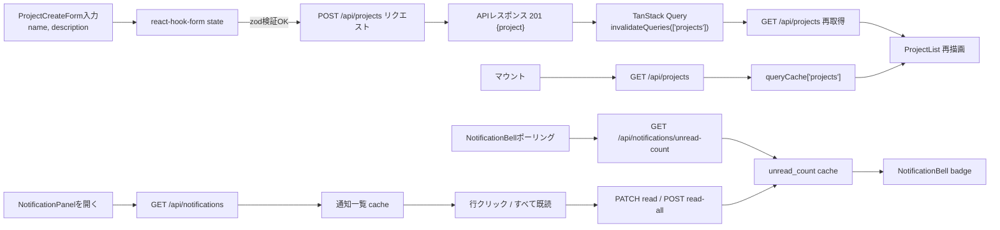

# ダッシュボード詳細設計（`/dashboard`）

## 0. 関連ドキュメント

| ドキュメント | 内容 |
|--------------|------|
| [../../basic_design/05_frontend.md](../../basic_design/05_frontend.md) | §3 共通レイアウト、§3.1 通知ベル・通知パネル、§5 状態管理、§7.4 ダッシュボード仕様、§7.8 通知 |
| [../../basic_design/04_api.md](../../basic_design/04_api.md) | §2.3 プロジェクトAPI、§2.6 通知API、§3.2 `GET /projects` レスポンス、§3.3 通知スキーマ |
| [../api/projects/01_get_projects.md](../api/projects/01_get_projects.md) | `GET /api/projects` 詳細設計 |
| [../api/projects/02_post_projects.md](../api/projects/02_post_projects.md) | `POST /api/projects` 詳細設計 |
| [../api/notifications/01_get_notifications.md](../api/notifications/01_get_notifications.md) | `GET /api/notifications` 詳細設計 |
| [../api/notifications/02_get_notifications_unread_count.md](../api/notifications/02_get_notifications_unread_count.md) | `GET /api/notifications/unread-count` 詳細設計 |
| [../api/notifications/03_patch_notification_read.md](../api/notifications/03_patch_notification_read.md) | `PATCH /api/notifications/{id}/read` 詳細設計 |
| [../api/notifications/04_post_notifications_read_all.md](../api/notifications/04_post_notifications_read_all.md) | `POST /api/notifications/read-all` 詳細設計 |
| [./07_project_board.md](./07_project_board.md) | カード選択後の遷移先。通知行クリック時の遷移先でもある |

## 1. 概要

| 項目 | 内容 |
|------|------|
| 画面名 / パス | ダッシュボード `/dashboard`（`/` は `/login` へのリダイレクト専用パス。[05_frontend.md 2.1](../../basic_design/05_frontend.md#21-ルートパス--の扱い)） |
| レイアウト | AppLayout（左サイドバー + ヘッダー。詳細は本書§2、共通仕様は [05_frontend.md §3](../../basic_design/05_frontend.md#3-共通レイアウト)） |
| ガード | 認証必須（`RequireAuth`）。未認証は `/login` へリダイレクト |
| 対応要件 | 要件書§2-3 |
| 主なユースケース | 自分が所属するプロジェクトを一覧し、カードから `/projects/:projectId` へ遷移する。新規プロジェクトを作成する |
| 現行実装ファイル | `frontend/src/features/dashboard/pages/DashboardPage.tsx`、`frontend/src/features/dashboard/components/ProjectList.tsx`、`frontend/src/features/dashboard/components/ProjectCreateForm.tsx`、`frontend/src/features/dashboard/hooks/useProjects.ts`、`frontend/src/features/dashboard/hooks/useCreateProject.ts`、`frontend/src/features/dashboard/api/projectsApi.ts` |
| 未実装・実装予定ファイル | `frontend/src/features/dashboard/components/ProjectCreateModal.tsx`、`frontend/src/features/dashboard/components/Calendar.tsx`、`frontend/src/features/dashboard/hooks/useDashboard.ts`、`frontend/src/lib/api/projects.ts`、`frontend/src/stores/projectStore.ts` |

> 現行developでは、プロジェクト一覧・作成・ボードへの遷移を`features/dashboard`配下の実装で提供している。カレンダー、選択中プロジェクトを保持する統合state、`useDashboard`による統合フックは未実装であり、上表の「未実装・実装予定ファイル」は現行実装として参照しない。
>
> §2以降のUI・処理仕様は目標仕様を示す。現行実装では作成UIはモーダルではなく`ProjectCreateForm`として表示され、カレンダー領域はプレースホルダである。
>
> #159の受入条件は、未マージブランチのコミットではなく現行developの動作で判定する。現行実装は初回取得と作成成功後の一覧再取得を満たすが、作成したプロジェクトの選択state更新および403/409の個別反映は未実装である。

## 2. 画面レイアウト

```
┌────────────────────────────────────────────────────────────┐
│①≡│                  Cerberus                              │ ← Header
├──┴────────────────────────────────────────────────────────┤
│┌────────┐ ┌──────────────────────────────────────────────┐│
││②Sidebar│ │③見出し「プロジェクト」    ④[+ 新規プロジェクト]││
││ home   │ │┌────────┐┌────────┐┌────────┐               ││
││ 管理(*)│ ││⑤Card   ││ Card   ││ Card   │  …グリッド配置 ││
││ 設定   │ ││ 名称    ││        ││        │               ││
││        │ ││⑥人数   ││        ││        │               ││
││ログアウト││⑦todo/ip/││        ││        │               ││
││        │ ││  done   ││        ││        │               ││
││        │ │└────────┘└────────┘└────────┘               ││
││        │ │⑧空状態（0件時）：カード領域の代わりに          ││
││        │ │  「まだプロジェクトがありません」+ 作成導線    ││
││        │ │⑬ページネーション（2ページ以上で表示）         ││
│└────────┘ └──────────────────────────────────────────────┘│
└────────────────────────────────────────────────────────────┘
```

- ①ハンバーガー：サイドバー開閉（`uiStore.sidebarOpen`、localStorage永続）
- ②Sidebar：`home` / `管理`（`role==='admin'` のみ描画） / `設定` / `ログアウト`。共通仕様は [05_frontend.md §3](../../basic_design/05_frontend.md#3-共通レイアウト)
- ③④ヘッダー行：見出しと新規作成ボタン
- ⑤カード：プロジェクト名、説明の先頭、オーナー表示名
- ⑥メンバー数バッジ、⑦ステータス別タスク件数バッジ（todo/in_progress/done）
- ⑧空状態：`items.length === 0` のとき表示

レスポンシブ：カードグリッドは `grid-template-columns: repeat(auto-fill, minmax(16rem, 1fr))` とし、幅に応じて列数が自動で変わる。狭幅ではサイドバーは既定で閉じ、ハンバーガーで開閉する（開閉判定は `uiStore` の値をそのまま使い、画面幅による自動制御は行わない。要検討：初期表示時のブレークポイント別デフォルト値は基本設計に定めがなく未定義）。

## 3. UI要素仕様

| No | 要素 | 種別 | 初期値 | 入力制約 | 活性条件 | イベント／遷移 |
|----|------|------|--------|----------|----------|----------------|
| ① | ハンバーガー | button | `uiStore.sidebarOpen` | - | 常時 | クリックで `uiStore.toggleSidebar()` |
| ② | Sidebar項目 | nav link | - | - | 「管理」は `role==='admin'` のみ表示 | クリックで各パスへ`navigate` |
| ③ | 見出し | text | 「プロジェクト」固定 | - | - | - |
| ④ | 新規プロジェクトボタン | button | - | - | 常時活性 | クリックで `ProjectCreateModal` を開く（`isCreateModalOpen=true`） |
| ⑤ | ProjectCard | card (button相当) | `useProjects()` の1件 | - | 常時活性 | クリックで `navigate('/projects/' + id)` |
| ⑥ | メンバー数バッジ | badge | `member_count` | - | - | - |
| ⑦ | タスク件数バッジ | badge×3 | `task_counts.{todo,in_progress,done}` | - | - | - |
| ⑧ | 空状態メッセージ | text + button | - | - | `items.length===0` の時のみ表示 | 「作成する」ボタンは④と同じモーダルを開く |
| ⑨ | ProjectCreateModal / name | text input | `""` | 1〜100文字必須（[04_api.md §3.2](../../basic_design/04_api.md#32-プロジェクトタスク)） | - | 入力毎に `react-hook-form` へ反映 |
| ⑩ | ProjectCreateModal / description | textarea | `""` | 任意、0〜2000文字（issue #40で確定。[04_api.md §3.2](../../basic_design/04_api.md#32-プロジェクトタスク)） | - | 入力毎に反映 |
| ⑪ | ProjectCreateModal / 作成ボタン | button | - | - | `isValid && !isSubmitting` | クリックで `createProjectMutation.mutate()` |
| ⑫ | ProjectCreateModal / キャンセル | button | - | - | 常時 | モーダルを閉じ `reset()` |
| ⑬ | ページネーション | pagination | `meta.page`等 | - | `meta.total_pages > 1` | ページ番号クリックで該当ページを再取得 |
| ⑭ | NotificationBell | button + badge | `unread_count` | - | 常時 | クリックで通知パネルを開き、未読件数を表示 |
| ⑮ | NotificationPanel | dialog/list | 通知一覧 | - | ⑭クリック時 | 行クリックで既読化・対象タスクへ遷移、「すべて既読」で一括既読化 |

## 4. 使用API

| No | 呼び出しタイミング | メソッド／パス | 送信内容 | 成功時処理 | 失敗時処理 | queryKey / mutationKey |
|----|--------------------|-----------------|----------|------------|------------|--------------------------|
| 1 | マウント時／⑬ページ切替 | `GET /api/projects?page={page}&per_page={perPage}` | ページ番号・件数 | `items` をカード描画し、`meta.page` / `meta.total_pages` を⑬へ反映 | 401はAuthAdapterが処理、その他はエラー表示領域にリトライボタン | `queryKey: ['projects', { page, perPage }]` |
| 2 | 「新規プロジェクトの作成」送信 | `POST /api/projects` | `{ name, description }` | `201` → モーダルを閉じ `invalidateQueries(['projects'])` → 作成された `projects.name` をトーストで通知 | 422はフィールドエラー表示、それ以外はトーストでエラー表示 | `mutationKey: ['createProject']` |
| 3 | ヘッダー表示・ポーリング | `GET /api/notifications/unread-count` | なし | `unread_count` を⑬へ反映 | 401はAuthAdapter、503は次回ポーリングで再試行 | `queryKey: ['notifications', 'unread-count']` |
| 4 | ⑭を開く | `GET /api/notifications?page=1&per_page=20` | クエリのみ | 通知一覧と未読件数を描画 | 401はAuthAdapter、その他はパネル内エラー | `queryKey: ['notifications', { page: 1 }]` |
| 5 | 通知行クリック | `PATCH /api/notifications/{notification_id}/read` | なし | `read_at` と未読件数をキャッシュへ反映後、taskがあればボードへ遷移 | 404は対象行を再取得、その他はトースト | `mutationKey: ['notification-read']` |
| 6 | 「すべて既読」クリック | `POST /api/notifications/read-all` | なし | `updated_count` / `unread_count` を反映 | 403/503はパネル内またはトースト表示 | `mutationKey: ['notifications-read-all']` |

## 5. 状態管理

| 区分 | 名称 | 型 | 初期値 | 更新契機 | 永続化 |
|------|------|----|--------|----------|--------|
| ローカルstate | `isCreateModalOpen` | `boolean` | `false` | ④⑧クリックで`true`、作成成功/キャンセルで`false` | なし |
| ローカルstate | `page` / `perPage` | `number` | `1` / `20` | ⑬操作。作成成功時は`page=1`へ戻して再取得 | なし |
| React Hook Form | `ProjectCreateForm`（`name`, `description`） | `zod` スキーマ由来 | `{name:'', description:''}` | 入力・送信・リセット | なし |
| Zustand（`uiStore`） | `sidebarOpen`, `fontScale` | `boolean` / `number` | localStorage復元値、無ければ `true` / `1.0` | ①操作、設定画面での変更 | localStorage |
| Zustand（`authStore`） | `user.role` | `'member'\|'admin'` | `/auth/me` 由来 | ログイン/ログアウト | メモリのみ |
| TanStack Query | `['projects', {page, perPage}]` | `Page<ProjectSummary>` | 未取得 | `page` / `perPage`変更時fetch、`createProject`成功時に`invalidate` | しない（[05_frontend.md §5](../../basic_design/05_frontend.md#5-状態管理)） |
| TanStack Query | `['notifications', 'unread-count']` / `['notifications', {page}]` | 件数 / `NotificationListResponse` | 未取得 | ポーリング、パネル開閉、既読操作時 | しない |

## 6. 画面状態遷移図



## 7. 処理シーケンス

### 7.1 初期表示



### 7.2 新規プロジェクト作成



## 8. コンポーネント構成・相関図



## 9. 関数・カスタムフック詳細

### 9.1 `features/dashboard/hooks/useProjects.ts :: useProjects`

| 項目 | 内容 |
|------|------|
| シグネチャ | `function useProjects(params?: ProjectListParams): UseQueryResult<ProjectListResponse>` |
| 引数 | `page`（既定1）、`per_page`（既定20）、`include_inactive`（既定false） |
| 戻り値 | TanStack Queryのプロジェクト一覧取得結果 |
| 処理内容 | `queryKey: ['projects', { page, perPage }]` を組み立て、`projectsApi.getProjects`をqueryFnとして実行する |
| 副作用 | `GET /api/projects` 呼び出し |

### 9.2 `features/dashboard/hooks/useCreateProject.ts :: useCreateProject`

| 項目 | 内容 |
|------|------|
| シグネチャ | `function useCreateProject(): UseMutationResult<ProjectSummary, unknown, ProjectCreateRequest>` |
| 引数 | `mutate(payload)` または `mutateAsync(payload)` にプロジェクト作成入力を渡す |
| 戻り値 | TanStack Queryのプロジェクト作成mutation結果 |
| 処理内容 | `projectsApi.createProject`をmutationFnとして実行し、成功時に`['projects']`をinvalidateする |
| 副作用 | `POST /api/projects` 呼び出し、成功時にプロジェクト一覧を再取得 |

### 9.3 `features/dashboard/components/ProjectCreateForm.tsx :: ProjectCreateForm`

| 項目 | 内容 |
|------|------|
| シグネチャ | `function ProjectCreateForm(props: { onSubmit: (payload: ProjectCreateRequest) => Promise<void>; onCancel: () => void }): JSX.Element` |
| 引数 | `onSubmit`：作成処理、`onCancel`：フォームを閉じる処理 |
| 戻り値 | JSX |
| 処理内容 | 1. `useForm(zodResolver(projectCreateSchema))` でフォーム初期化 2. `onSubmit`へ入力値を渡す 3. 422時は`setError`でフィールドへ反映 4. その他の失敗はフォーム内へ表示 |
| 副作用 | `POST /api/projects` 呼び出し、入力エラー表示 |

### 9.4 未実装・実装予定の統合機能

`useDashboard`、`getCalendarTasks`、`projectStore`、`ProjectCreateModal`、`Calendar`は設計上の予定であり、現行developには実装されていない。これらを実装ファイルとして参照する変更は、別Issueで受入条件を定義してから行う。

## 10. バリデーション

| フィールド | zodルール | エラーメッセージ | バックエンド対応 |
|-----------|-----------|-------------------|-------------------|
| `name` | `z.string().min(1).max(100)` | 「プロジェクト名を1〜100文字で入力してください」 | `POST /projects` name（[04_api.md §3.2](../../basic_design/04_api.md#32-プロジェクトタスク)） |
| `description` | `z.string().max(2000).optional()` | 「説明は2000文字以内で入力してください」 | `POST/PATCH /projects` description（issue #40で確定。[04_api.md §3.2](../../basic_design/04_api.md#32-プロジェクトタスク)） |

## 11. エラーハンドリング

| APIエラーコード / HTTP | 画面表示 | 遷移 | 再試行導線 |
|------------------------|----------|------|------------|
| 401 `UNAUTHENTICATED` | なし（AuthAdapterが処理） | `/login` | - |
| 422 `VALIDATION_ERROR` | モーダル内フィールドにエラー表示 | 遷移なし（モーダル開いたまま） | 修正して再送信 |
| 5xx `INTERNAL_ERROR` / `SERVICE_UNAVAILABLE` | 一覧取得時：画面中央にエラーメッセージ＋再試行ボタン／作成時：トースト | 遷移なし | 一覧は再試行ボタン、作成はモーダル開いたまま再送信 |

## 12. データ遷移図



## 13. アクセシビリティ・表示設定

| 項目 | 内容 |
|------|------|
| 文字サイズ | `--font-scale` に追従（`rem`指定。[05_frontend.md §8](../../basic_design/05_frontend.md#8-アクセシビリティ設定文字サイズ)） |
| キーボード操作 | カードは `role="button" tabIndex=0`、Enter/Spaceで遷移。モーダルはフォーカストラップ、Escで閉じる |
| `aria-*` | モーダルに `role="dialog" aria-modal="true" aria-labelledby="create-project-title"`。空状態バナーは `role="status"` |
| フォーカス管理 | モーダルオープン時に `name` 入力へ自動フォーカス、閉じたら開いたトリガー要素へフォーカスを戻す |

## 14. テスト設計

| No | 区分 | ケース | 前提（MSWのモック応答等） | 期待結果 | テスト名案 |
|----|------|--------|---------------------------|----------|------------|
| 1 | 単体（zod） | `name` が101文字 | - | バリデーションエラー | `projectCreateSchema rejects name over 100 chars` |
| 2 | 単体（zod） | `name` が空文字 | - | 必須エラー | `projectCreateSchema requires name` |
| 3 | コンポーネント | 0件時の描画 | `GET /projects` → `{items:[], meta:{total:0}}` | 空状態メッセージと作成導線を表示 | `DashboardPage shows empty state when no projects` |
| 4 | コンポーネント | 複数件時の描画 | `GET /projects` → 2件 | メンバー数・タスク件数バッジを含むカードが2枚描画 | `DashboardPage renders project cards with badges` |
| 5 | コンポーネント | 作成成功 | `POST /projects` → 201 | フォームが閉じ、一覧が再取得される | `ProjectCreateForm closes and refetches list on success` |
| 6 | コンポーネント | 作成422 | `POST /projects` → 422 `{field:'name'}` | フィールドにエラー表示、フォームは開いたまま | `ProjectCreateForm shows field error on 422` |
| 7 | 結合 | 未認証アクセス | authStore=`unauthenticated` | `/login` にリダイレクト | `RequireAuth redirects unauthenticated user from dashboard` |
| 8 | 網羅できない範囲 | 実際のカードグリッドのレスポンシブ折返し | - | - | ピクセル単位のレイアウト崩れはCSSの視覚回帰テスト対象外のため手動確認とする |

## 15. 不明点・要検討事項

| 区分 | 内容 | 影響 |
|------|------|------|
| なし | ページングは`meta.page` / `meta.total_pages`を⑬として定義済み | - |
| 確定 | `description` の文字数上限はissue #40で0〜2000文字に確定（[04_api.md §3.2](../../basic_design/04_api.md#32-プロジェクトタスク)） | - |
| 要検討 | サイドバー開閉の画面幅によるデフォルト値切り替え（狭幅時の自動折りたたみ等）の要否が [05_frontend.md](../../basic_design/05_frontend.md) に明記されていない | レスポンシブ挙動の実装方針 |
