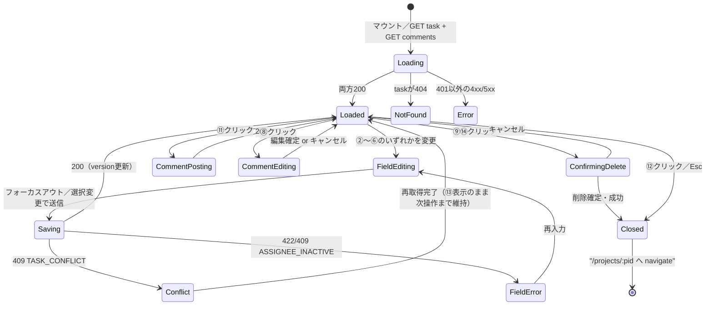
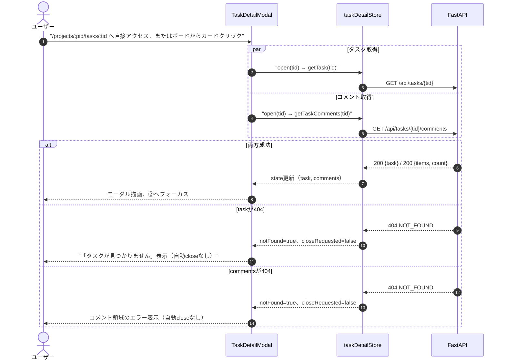
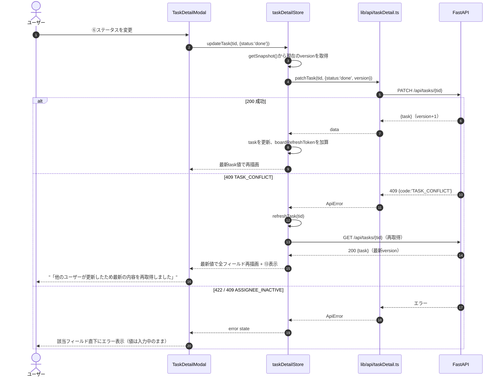
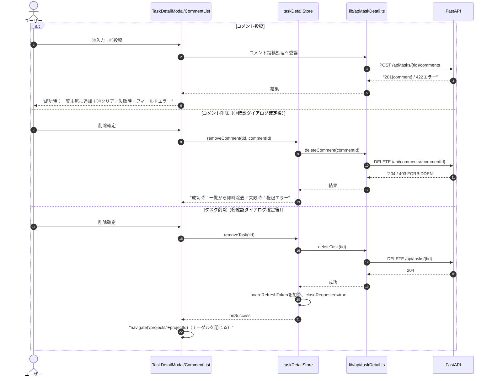
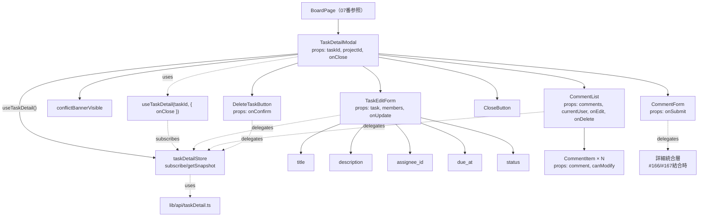
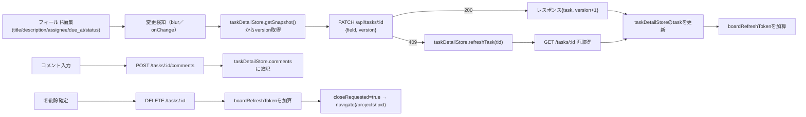

# タスク詳細/編集モーダル詳細設計（/projects/:projectId/tasks/:taskId）

## 0. 関連ドキュメント

| ドキュメント | 内容 |
|--------------|------|
| [../../basic_design/05_frontend.md](../../basic_design/05_frontend.md) | §2 ルーティング、§5.2 楽観的更新、§7.5 カンバンボード仕様（本モーダルの記述） |
| [../../basic_design/04_api.md](../../basic_design/04_api.md) | §2.4 タスク・コメントAPI、§3.2 `PATCH /tasks/{id}`、§4.2 `TASK_CONFLICT` |
| [../api/tasks/03_get_task.md](../api/tasks/03_get_task.md) | `GET /api/tasks/{task_id}` 詳細 |
| [../api/tasks/04_patch_task.md](../api/tasks/04_patch_task.md) | `PATCH /api/tasks/{task_id}` 詳細（version制御） |
| [../api/tasks/05_delete_task.md](../api/tasks/05_delete_task.md) | `DELETE /api/tasks/{task_id}` 詳細 |
| [../api/tasks/06_get_task_comments.md](../api/tasks/06_get_task_comments.md) | コメント一覧取得 |
| [../api/tasks/07_post_task_comments.md](../api/tasks/07_post_task_comments.md) | コメント投稿 |
| [../api/tasks/08_patch_comment.md](../api/tasks/08_patch_comment.md) | コメント編集（403/404の切り分け） |
| [../api/tasks/09_delete_comment.md](../api/tasks/09_delete_comment.md) | コメント削除 |
| [../api/projects/06_get_project_members.md](../api/projects/06_get_project_members.md) | 担当者選択に使うメンバー一覧 |
| [./07_project_board.md](./07_project_board.md) | 本モーダルを開くカンバンボード画面（URL同期の起点） |

### 0.1 状態管理方針（Issue #246）

タスク詳細モーダルのサーバー状態は、TanStack Queryではなく`taskDetailStore`（singleton）を正とする。#167で実装済みの`subscribe`/`getSnapshot`、リクエスト世代管理、`boardRefreshToken`を維持し、`useTaskDetail`から`useSyncExternalStore`で購読する。

この方針は、#165（ボードからモーダルを開く責務）・#166（編集・コメントUI）・#167（取得・更新state）の境界と既存テストを保ったまま、タスク詳細だけの大規模なQuery移行を避けるために決定した。TanStack Queryは通知など他機能で利用するが、タスク詳細の状態管理へは適用しない。`frontend/package.json`の依存有無だけを理由に、既存実装を別方式へ移行しない。

責務の配置は次のとおりとし、同じ責務のファイルを`features/board`と`features/task-detail`の双方に作成しない。

| 責務 | 正式な配置 | 方針 |
|------|------------|------|
| ボードとのURL同期、モーダルの表示枠 | `frontend/src/features/board/` | ボード画面の責務。タスク詳細の取得・更新ロジックは持たない |
| 編集・コメントUI、詳細state hook | `frontend/src/features/task-detail/` | タスク詳細固有の表示責務。API直接呼び出しやボード再取得通知は持たない |
| 詳細API client | `frontend/src/lib/api/taskDetail.ts` | タスク詳細APIの入出力と認証付き通信を一元化する |
| 詳細state | `frontend/src/stores/taskDetailStore.ts` | singleton state、非同期処理、`boardRefreshToken`を一元化する |

## 1. 概要

| 項目 | 内容 |
|------|------|
| 画面名 / パス | タスク詳細/編集モーダル / `/projects/:projectId/tasks/:taskId`（[07_project_board.md](./07_project_board.md) 上にオーバーレイ表示） |
| レイアウト | AppLayout上のモーダル（独自レイアウトは持たない） |
| ガード | 認証必須（ボード画面と共通）。タスクが非所属プロジェクトまたは不存在の場合はAPIが404を返しモーダル内にエラー表示 |
| 対応要件 | 要件書§2-5 |
| 主なユースケース | タスクの内容確認・編集（タイトル・説明・担当者・期限・ステータス）、コメントの閲覧・投稿・編集・削除、タスク削除 |
| 実装ファイル | ボード統合: `frontend/src/features/board/BoardPage.tsx`、`frontend/src/features/board/components/TaskDetailModal.tsx`、`frontend/src/features/board/hooks/useBoard.ts`。詳細UI: `frontend/src/features/task-detail/components/TaskEditForm.tsx`、`frontend/src/features/task-detail/components/CommentList.tsx`、`frontend/src/features/task-detail/components/CommentForm.tsx`。状態/API: `frontend/src/features/task-detail/hooks/useTaskDetail.ts`、`frontend/src/stores/taskDetailStore.ts`、`frontend/src/lib/api/taskDetail.ts` |

## 2. 画面レイアウト

```
┌──────────────────────────────────────────────────────────┐
│ ①タスク詳細                                    [⑫ ×閉じる]│
├──────────────────────────────────────────────────────────┤
│ ②タイトル [インライン編集可]                                │
│ ③説明                                                      │
│  [複数行テキストエリア、フォーカスアウトで保存]              │
│                                                            │
│ ④担当者: [selectドロップダウン▼]  ⑤期限: [date input]       │
│ ⑥ステータス: [todo/進行中/完了 セレクト]                    │
│                                                            │
│ [⑬ 409競合バナー（条件表示）]                               │
│                                                            │
│ ────────────── コメント ──────────────                     │
│ ⑦コメント一覧（created_at昇順）                             │
│  ┌────────────────────────────────────────┐              │
│  │ 投稿者名  日時        [⑧編集][⑨削除]     │              │
│  │ 本文...                                  │              │
│  └────────────────────────────────────────┘              │
│  …N件…                                                    │
│                                                            │
│ ⑩コメント入力欄（複数行）                                   │
│ [⑪         投稿         ]（ボタン）                         │
│                                                            │
│ [⑭         タスクを削除         ]（危険操作ボタン）          │
└──────────────────────────────────────────────────────────┘
```

- モーダルは画面中央に固定表示し、背景はオーバーレイでスクロールロックする。フォーカスは開いた瞬間に②へ移動しモーダル外へは出られない（フォーカストラップ。§13参照）
- レスポンシブ：幅600px未満ではモーダル幅を`100% - 24px`とし、④⑤を横並びから縦積みへ変更する
- ⑧⑨はコメント投稿者本人または`role=admin`の場合のみ表示する（§3参照）

## 3. UI要素仕様

| No | 要素 | 種別 | 初期値 | 入力制約 | 活性条件 | イベント／遷移 |
|----|------|------|--------|----------|----------|----------------|
| ① | 見出し | 静的テキスト | "タスク詳細" | - | 常時 | - |
| ② | タイトル | インライン編集text | `task.title` | 1〜150文字必須 | 常時編集可 | フォーカスアウトで変更検知→`PATCH`（§9.1） |
| ③ | 説明 | インライン編集textarea | `task.description` | 0〜2000文字（issue #40で確定） | 常時編集可 | フォーカスアウトで変更検知→`PATCH` |
| ④ | 担当者 | select | `task.assignee?.id ?? ''`（空文字＝未割当） | プロジェクトメンバーから選択、`is_active=false`のメンバーは選択肢に表示するが選択不可（グレーアウト） | 常時活性 | 選択変更で即時`PATCH` |
| ⑤ | 期限 | datetime-local input | `task.due_at`を`APP_TIMEZONE`へ変換 | 任意 | 常時活性 | 変更で即時`PATCH`。送信時はUTCへ正規化 |
| ⑥ | ステータス | select | `task.status` | `todo`/`in_progress`/`done` | 常時活性 | 変更で即時`PATCH`（ボード側の列移動と同一API） |
| ⑦ | コメント一覧 | list | `useTaskDetail().comments` | - | 常時 | スクロール表示（ページングなし） |
| ⑧ | コメント編集ボタン | icon button | - | - | `comment.author.id === currentUser.id \|\| currentUser.role === 'admin'` | クリックで該当コメントをインライン編集モードへ |
| ⑨ | コメント削除ボタン | icon button | - | - | ⑧と同一条件 | クリックで確認ダイアログ→確定で`DELETE` |
| ⑩ | コメント入力欄 | textarea | `""` | 1〜2000文字必須（trim後判定） | 常時活性 | onChangeでstate更新 |
| ⑪ | 投稿ボタン | submit button | 非活性（空文字時） | - | `body`が1〜2000文字 かつ `!isSubmitting` | クリックで`POST`、成功後にクリアしフォーカスを⑩へ戻す |
| ⑫ | 閉じるボタン | icon button | - | - | 常時活性 | クリックまたはEscで`/projects/:pid`へ`navigate`（モーダルを閉じる） |
| ⑬ | 409競合バナー | Alert(warning) | 非表示 | - | いずれかのフィールド更新が`409 TASK_CONFLICT`を受けた場合のみ | 「他のユーザーが更新したため最新の内容を再取得しました」＋再取得後の値で全フィールドを再描画 |
| ⑭ | タスク削除ボタン | 危険操作button | - | - | 常時活性（プロジェクトメンバーであれば誰でも削除可。[05_delete_task.md](../api/tasks/05_delete_task.md) §1・§13） | クリックで確認ダイアログ→確定で`DELETE /tasks/{id}`→成功後モーダルを閉じてボードへ戻る |

## 4. 使用API

| No | 呼び出しタイミング | メソッド／パス | 送信内容 | 成功時処理 | 失敗時処理 | 呼び出し元 |
|----|--------------------|-----------------|----------|------------|------------|--------------------------|
| 1 | モーダル表示時（マウント／URLの`taskId`変化時） | GET `/tasks/{taskId}` | パスパラメータのみ | `task`（`version`含む）をstateへ反映 | 404は`notFound=true`のみ。`closeRequested`は立てず、モーダル内でエラー表示 | `taskDetailStore.open` |
| 2 | 表示時（1と並行） | GET `/tasks/{taskId}/comments` | パスパラメータのみ | ⑦へ`comments`を反映 | 404はtask取得時と同じく`notFound=true`のみ。その他は`commentsError`へ保持 | `taskDetailStore.open` |
| 3 | ②③④⑤⑥のいずれか変更確定時 | PATCH `/tasks/{taskId}` | `{version, <変更フィールドのみ>}`（1回のリクエストにつき1フィールド） | レスポンスをstateへ反映し`version`を最新化。成功時に`boardRefreshToken`を加算 | `409 TASK_CONFLICT`は再取得して⑬を表示。`409 ASSIGNEE_INACTIVE`／`422`はerrorへ保持 | `taskDetailStore.updateTask` |
| 4 | ⑪クリック | POST `/tasks/{taskId}/comments` | `{body}` | 成功したコメントを一覧へ追加し、⑩をクリア | 422は入力エラー、404は`notFound=true`のみ | `CommentForm`から詳細統合層へ委譲（#166/#167結合時） |
| 5 | ⑧⑨編集/削除確定 | PATCH／DELETE `/comments/{commentId}` | `{body}` または パスパラメータのみ | `comments`の該当要素を更新／除去し、削除時は`comment_count`を減算 | 403はerrorへ保持、404はコメント再取得。自動closeはしない | `taskDetailStore.updateComment` / `removeComment` |
| 6 | ⑭削除確定 | DELETE `/tasks/{taskId}` | パスパラメータのみ | `boardRefreshToken`を加算し`closeRequested=true` | 404は`notFound=true`のみ。その他はerrorへ保持 | `taskDetailStore.removeTask` |
| 7 | 表示時（④の選択肢構築） | プロジェクトメンバーAPI | - | #165/#166の統合層がメンバー一覧を④へ渡す | 詳細state/API clientでは取得しない | `TaskEditForm`のprops |

## 5. 状態管理

| 区分 | 名称 | 型 | 初期値 | 更新契機 | 永続化 |
|------|------|----|--------|----------|--------|
| URL | `projectId`, `taskId` | `string`（route param） | route定義由来 | React Routerのナビゲーション | URL自体が状態（リロード・共有可能） |
| singleton store | `taskDetailStore` | `TaskDetailState`（`task`、`comments`、各loading/error、`notFound`、`closeRequested`、`boardRefreshToken`） | `INITIAL_STATE` | `open`でtask/commentsを並行取得、更新系actionでstateを変更。`subscribe`/`getSnapshot`で購読 | しない |
| ローカルstate | `editingField` | `'title' \| 'description' \| null` | `null` | ②③のフォーカスイン／アウト | なし |
| ローカルstate | `commentDraft` | `string` | `""` | ⑩入力・投稿成功 | なし |
| ローカルstate | `editingCommentId` | `string \| null` | `null` | ⑧クリック・編集確定／キャンセル | なし |
| singleton store | `conflictBannerVisible` | `boolean` | `false` | 409受信・再取得完了 | しない |
| コンポーネントstate | `commentDraft`、`editingCommentId`、`pendingDeleteTarget` | UI固有の値 | 空値／`null` | 入力、編集、確認ダイアログ | なし |

タスクの`version`は`taskDetailStore.getSnapshot().task.version`を常に正とし、`updateTask`がPATCH送信直前に読み取る。`boardRefreshToken`はキャッシュ無効化キーではなく、ボード側が購読して再取得するための通知カウンタである。

## 6. 画面状態遷移図



## 7. 処理シーケンス

### 7.1 モーダル表示（URLからの直接アクセス／リロード含む）



### 7.2 フィールド編集（楽観更新＋409時の再取得）



### 7.3 コメント投稿・削除／タスク削除（共通パターン）



## 8. コンポーネント構成・相関図



## 9. 関数・カスタムフック詳細

### 9.1 `features/task-detail/hooks/useTaskDetail.ts :: useTaskDetail`

| 項目 | 内容 |
|------|------|
| シグネチャ | `function useTaskDetail(taskId: string \| undefined, options?: { onClose?: () => void }): TaskDetailState & actions` |
| 引数 | `taskId`（route param）、`options.onClose`（`closeRequested`消費後の画面遷移） |
| 戻り値 | `taskDetailStore`のstateと`updateTask`、`updateComment`、`removeComment`、`removeTask`、`refresh` |
| 処理内容 | `useSyncExternalStore(taskDetailStore.subscribe, taskDetailStore.getSnapshot)`で購読し、`taskId`変更時に`taskDetailStore.open`を呼ぶ。`closeRequested`は1回だけ`onClose`へ通知してacknowledgeする |
| 副作用 | task/comments取得、state変更、close callbackの呼び出し |

### 9.2 `stores/taskDetailStore.ts :: TaskDetailStore`

| 項目 | 内容 |
|------|------|
| 公開API | `getSnapshot`、`subscribe`、`reset`、`open`、`updateTask`、`updateComment`、`removeComment`、`removeTask`、`requestClose`、`acknowledgeClose` |
| state | `TaskDetailState`。task/comments、loading/error、`notFound`、`conflictBannerVisible`、`closeRequested`、`boardRefreshToken`を保持する |
| 処理内容 | `open`はtask/commentsを`Promise.allSettled`で並行取得する。各非同期処理はrequest世代と`taskId`を確認し、古い結果をstateへ反映しない。`updateTask`はstateのversionを付与し、成功時にtaskと`boardRefreshToken`を更新する |
| 404契約 | task 404とcomments 404はどちらも`notFound=true`、`closeRequested=false`とする。自動navigateはせず、画面層が表示を決定する |
| 副作用 | `lib/api/taskDetail.ts`を介したAPI通信、購読者への通知 |

### 9.3 `lib/api/taskDetail.ts` API client

| 項目 | 内容 |
|------|------|
| 入出力 | `getTask`、`getTaskComments`、`patchTask`、`patchComment`、`deleteComment`、`deleteTask`。型は`TaskDetail`、`TaskComment`、`TaskCommentsResponse`、`TaskUpdatePayload`で定義する |
| 認証 | 共通`authAdapter`で認証ヘッダーを付与し、session/jwtの方式差をstoreへ漏らさない |
| エラー | HTTP statusとAPI `code`を`TaskDetailApiError`へ変換する。404判定はstoreが`status === 404`または`code === 'NOT_FOUND'`で行う |

### 9.4 `features/task-detail/components/*` と `features/board/components/TaskDetailModal.tsx`

| ファイル | 責務 |
|----------|------|
| `features/board/components/TaskDetailModal.tsx` | モーダルの表示枠、Esc、Tab循環、スクロールロック、前回フォーカス復帰。詳細APIやsingleton stateを直接実装しない |
| `features/task-detail/components/TaskEditForm.tsx` | title/description/assignee/due_at/statusの入力と境界値検証。変更は`onUpdate`へ委譲する |
| `features/task-detail/components/CommentList.tsx` | コメント表示、created_at昇順、本人/adminの編集・削除操作。通信はprops callbackへ委譲する |
| `features/task-detail/components/CommentForm.tsx` | コメント本文の入力・検証・投稿成功時のクリア。通信はprops callbackへ委譲する |

## 10. バリデーション

| フィールド | 実装箇所 | ルール | エラーメッセージ | バックエンド対応 |
|-----------|-------------|--------|-------------------|-------------------|
| ②title | `TaskEditForm.tsx` | 1〜150文字。blur時に変更があれば更新 callbackを呼ぶ | 「タイトルは1〜150文字で入力してください」 | pydantic `TaskUpdateRequest.title`（[04_patch_task.md](../api/tasks/04_patch_task.md) §10） |
| ③description | `TaskEditForm.tsx` | 0〜2000文字、null可 | 「説明は2000文字以内で入力してください」 | issue #40で0〜2000文字に確定（[04_api.md §3.2](../../basic_design/04_api.md#32-プロジェクトタスク)） |
| ④assignee_id | `TaskEditForm.tsx` | UUIDまたはnull。無効メンバーは選択不可 | 「担当者の選択が不正です」 | メンバー・`is_active`検証はサーバー側（`409 ASSIGNEE_INACTIVE`） |
| ⑤due_at | `TaskEditForm.tsx` | datetime-localまたはnull | 「期限日時の形式が正しくありません」 | `APP_TIMEZONE`へ変換後、ISO 8601 UTCを送信 |
| ⑥status | `TaskEditForm.tsx` | `todo`/`in_progress`/`done` | - | - |
| ⑩コメント本文 | `CommentForm.tsx` / `CommentList.tsx` | trim後1〜`VITE_TASK_COMMENT_BODY_MAX_LENGTH`文字 | 「コメントは1〜2000文字で入力してください」 | pydantic `CommentCreateRequest.body`（`TASK_COMMENT_BODY_MAX_LENGTH`。[07_post_task_comments.md](../api/tasks/07_post_task_comments.md) §10）と環境変数で値を共有する（issue #40で確定） |

## 11. エラーハンドリング

| APIエラーコード / HTTP | 画面表示 | 遷移 | 再試行導線 |
|--------------------------|----------|------|------------|
| 404 `NOT_FOUND`（task取得時） | `notFound=true`。モーダル内「タスクが見つかりません」＋閉じる導線 | 自動遷移なし（ユーザー操作で`/projects/:pid`へ） | なし |
| 404 `NOT_FOUND`（comments取得時） | `notFound=true`。コメント領域のエラー表示 | 自動遷移なし | 再取得操作 |
| 409 `TASK_CONFLICT`（フィールド更新時） | ⑬バナー表示＋全フィールドを最新値で再描画 | なし（モーダルは開いたまま） | 再取得後に同じ操作をやり直す |
| 409 `ASSIGNEE_INACTIVE` | ④直下にエラー「指定した担当者は無効化されています」 | なし | 担当者を選び直す |
| 422 `VALIDATION_ERROR`（フィールド更新） | 該当フィールド直下にエラー | なし | 修正して再度フォーカスアウト |
| 422 `VALIDATION_ERROR`（コメント投稿） | ⑩直下にエラー | なし | 修正して再送信 |
| 403 `FORBIDDEN`（コメント編集/削除） | トースト「この操作を行う権限がありません」 | なし | UI上⑧⑨は本来表示されないため、他端末からの同時操作等の異常系のみ想定 |
| 404 `NOT_FOUND`（コメント編集/削除） | errorを保持し、コメント一覧を再取得 | なし | 再取得後の一覧で再操作 |
| 204（タスク削除成功） | なし（モーダルを閉じてボードへ） | `/projects/:pid` | - |
| 401以外の5xx | 共通トースト「エラーが発生しました。しばらくしてから再度お試しください」 | なし | 再試行 |

## 12. データ遷移図



## 13. アクセシビリティ・表示設定

| 項目 | 内容 |
|------|------|
| 文字サイズ | `--font-scale`に追従（`rem`指定） |
| キーボード操作 | Escでモーダルを閉じる（⑫と同一挙動）。Tabはモーダル内要素のみを循環（`TaskDetailModal.tsx`の表示枠責務） |
| `aria-*` | モーダルルートに`role="dialog" aria-modal="true" aria-labelledby="task-detail-title"`。⑬に`role="alert"`。⑦の各コメントに`role="article"` |
| フォーカス管理 | 開いた瞬間に②へフォーカス。閉じた瞬間に直前クリックしたボード上の`TaskCard`へフォーカスを戻す（[07_project_board.md §13](./07_project_board.md#13-アクセシビリティ表示設定)と対になる挙動） |

## 14. テスト設計

| No | 区分 | ケース | 前提（MSWのモック応答等） | 期待結果 | テスト名案 |
|----|------|--------|----------------------------|----------|-------------|
| 1 | 単体 | title 151文字／コメント本文2001文字 | - | いずれもバリデーションエラー | `TaskEditForm/CommentForm rejects over-length input` |
| 2 | 単体 | 変更前と同じ値でblurした場合 | `value === original` | 更新callbackが呼ばれない | `TaskEditForm skips update when value unchanged` |
| 3 | 単体 | task/comments取得時の404 | taskまたはcommentsのGET → 404 | `notFound=true`、`closeRequested=false` | `taskDetailStore keeps 404 as notFound without close request` |
| 4 | 単体 | フィールド更新成功 | `PATCH /tasks/:id` → 200 | 新しい値で再描画、`boardRefreshToken`加算 | `taskDetailStore updates task and refresh token` |
| 5 | 単体 | 409競合 | `PATCH /tasks/:id` → 409、直後の`GET /tasks/:id`は最新データ | ⑬表示、全フィールドが最新値に更新される | `taskDetailStore refetches after task conflict` |
| 6 | コンポーネント | コメント投稿成功 | `POST /tasks/:id/comments` → 201 | 一覧末尾に追加、⑩がクリアされる | `CommentForm appends new comment on success` |
| 7 | コンポーネント | 編集/削除ボタンの表示制御 | 投稿者以外`role='member'` と `role='admin'` の2パターン | 前者は⑧⑨非表示、後者は表示 | `CommentList shows edit/delete only for author or admin` |
| 8 | コンポーネント | タスク削除の確認とキャンセル／成功 | ⑭クリック→キャンセル、または確定して`DELETE /tasks/:id` → 204 | キャンセル時はAPI未呼び出し、成功時は`navigate('/projects/:pid')` | `taskDetailStore handles delete and close request` |
| 9 | 結合 | フォーカストラップ・閉じた後のフォーカス復帰 | モーダル表示中にTabを繰り返す／⑫で閉じる | フォーカスがモーダル外へ出ない／直前のカードへ復帰する | `TaskDetailModal traps and restores focus` |
| 10 | 結合 | URL直接アクセス（リロード相当） | `/projects/:pid/tasks/:tid`へ直接遷移、`GET /tasks/:id`→200 | モーダルが開いた状態で初期表示される | `TaskDetailModal opens directly from URL on mount` |
| 11 | 結合 | 非所属／不存在タスクへのアクセス | `GET /tasks/:id` → 404 | 「タスクが見つかりません」表示、自動closeなし | `TaskDetailModal shows not-found state without auto close` |

## 15. 不明点・要検討事項

| 区分 | 内容 | 影響 |
|------|------|------|
| 確定 | タスク`description`の文字数上限はissue #40で0〜2000文字に確定（[04_api.md §3.2](../../basic_design/04_api.md#32-プロジェクトタスク)、[04_patch_task.md §5](../api/tasks/04_patch_task.md)） | - |
| 確定 | `TASK_COMMENT_BODY_MAX_LENGTH`（既定2000）はissue #40で`VITE_TASK_COMMENT_BODY_MAX_LENGTH`環境変数として共有することに確定（[05_frontend.md §6.2](../../basic_design/05_frontend.md#62-環境変数vite)） | - |
| 要検討 | フィールド更新を「1回のPATCHにつき1フィールド」とする設計は本書独自の具体化であり、複数フィールドをまとめて1回のPATCHで送信する設計（バックエンドの部分更新自体は複数フィールド対応済み）でも基本設計と矛盾しない。UI応答性とversion競合の起こりやすさのトレードオフのため、実装時に見直す余地がある | フィールドごとのAPI呼び出し回数・体感速度に影響 |
| 要検討 | コメント投稿のAPI client/store接続は#166/#167の結合時に確定する。現行#167実装は取得・編集・削除を対象とし、`CommentForm`のcallback接続は本issueで新規実装しない | コメント投稿の統合タイミングに影響 |
| なし | 上記以外 | - |
