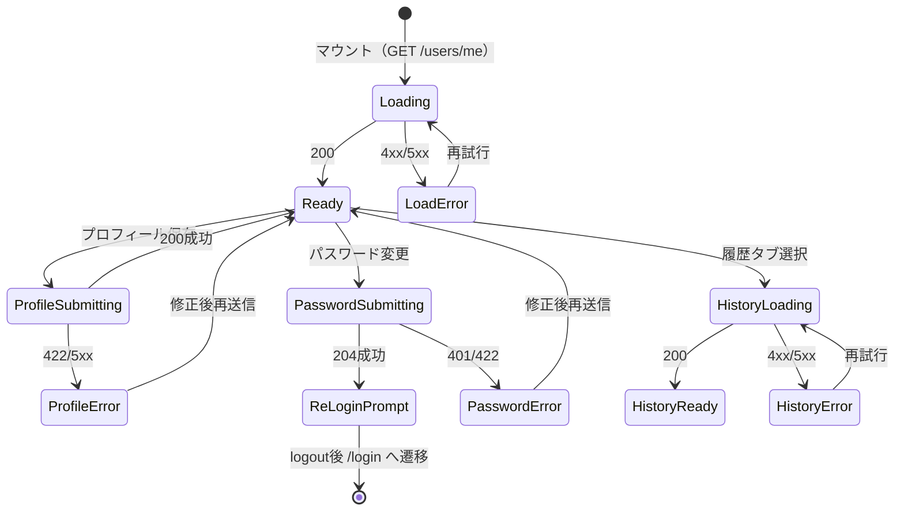
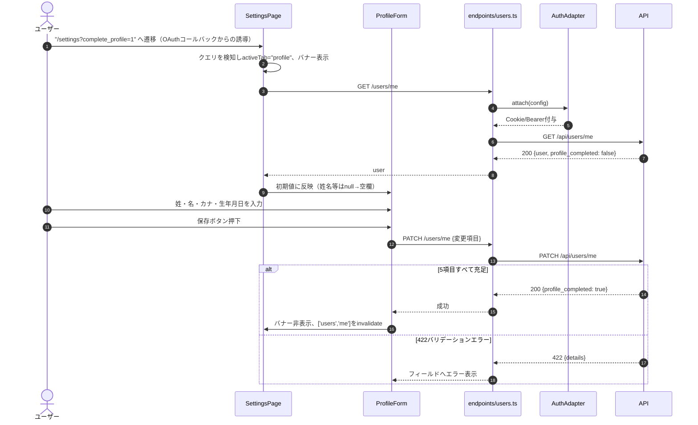
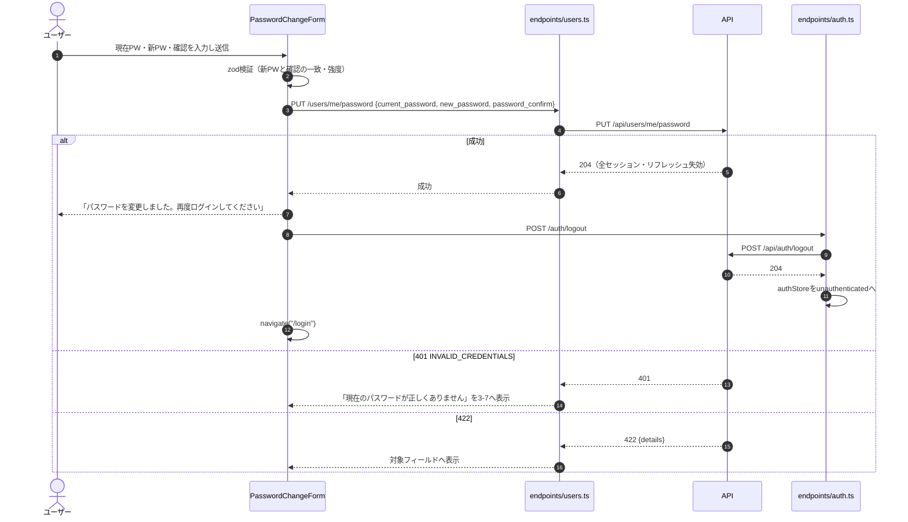
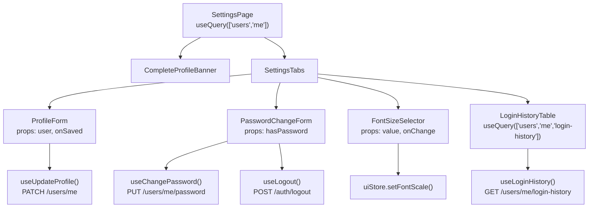
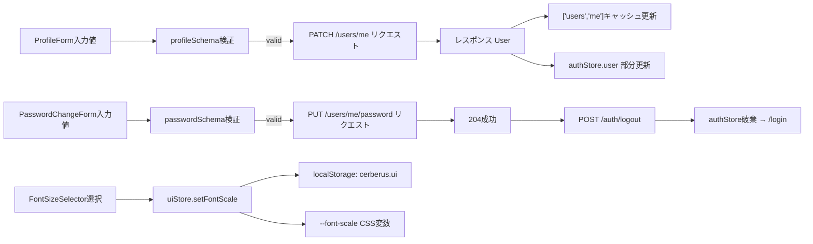

# アカウント設定詳細設計（`/settings`）

## 0. 関連ドキュメント

| ドキュメント | 内容 |
|--------------|------|
| [../../basic_design/05_frontend.md](../../basic_design/05_frontend.md) | §2 画面一覧・§4 コンポーネント構成・§7.6 アカウント設定・§8 アクセシビリティ設定 |
| [../../basic_design/04_api.md](../../basic_design/04_api.md) | §2.2 ユーザーAPI・§3.2（`PATCH /users/me` / `PUT /users/me/password`） |
| [../api/users/01_get_users_me.md](../api/users/01_get_users_me.md) | GET /api/users/me |
| [../api/users/02_patch_users_me.md](../api/users/02_patch_users_me.md) | PATCH /api/users/me |
| [../api/users/03_put_users_me_password.md](../api/users/03_put_users_me_password.md) | PUT /api/users/me/password |
| [../api/users/04_get_users_me_login_history.md](../api/users/04_get_users_me_login_history.md) | GET /api/users/me/login-history |

## 1. 概要

| 項目 | 内容 |
|------|------|
| 画面名 / パス | アカウント設定 `/settings` |
| レイアウト | AppLayout |
| ガード | 認証必須（`RequireAuth`） |
| 対応要件 | 要件書§2-6 |
| 主なユースケース | プロフィール編集（OAuth新規ユーザーの未完了プロフィール補完を含む）、パスワード変更、文字サイズ変更、ログイン履歴閲覧 |
| 実装ファイル | `src/features/settings/SettingsPage.tsx`、`ProfileForm.tsx`、`PasswordChangeForm.tsx`、`FontSizeSelector.tsx`、`LoginHistoryTable.tsx` |

`?complete_profile=1` クエリ付きで遷移してきた場合（OAuthコールバック後、`profile_completed=false`）は、プロフィール編集タブを初期選択し、案内バナーを表示する。

## 2. 画面レイアウト

```
┌──────────────────────────────────────────────────────────┐
│ [1]バナー："プロフィールを入力してください"（complete_profile時のみ）│
├──────────────────────────────────────────────────────────┤
│ [2]タブ: プロフィール | パスワード | 表示設定 | ログイン履歴          │
├──────────────────────────────────────────────────────────┤
│ [3] タブ内容                                                │
│  ┌ プロフィールタブ ─────────────────────┐                  │
│  │ [3-1]姓 [3-2]名                        │                  │
│  │ [3-3]姓カナ [3-4]名カナ                │                  │
│  │ [3-5]生年月日（date入力）                 │                  │
│  │ [3-6]保存ボタン                        │                  │
│  └─────────────────────────────────────┘                  │
│  ┌ パスワードタブ ───────────────────────┐                  │
│  │ [3-7]現在のパスワード（has_password時のみ表示）│           │
│  │ [3-8]新パスワード [3-9]新パスワード確認│                  │
│  │ [3-10]変更ボタン                       │                  │
│  └─────────────────────────────────────┘                  │
│  ┌ 表示設定タブ ─────────────────────────┐                  │
│  │ [3-11]文字サイズ: 小/標準/大/特大（ラジオ）│                │
│  └─────────────────────────────────────┘                  │
│  ┌ ログイン履歴タブ ─────────────────────┐                  │
│  │ [3-12]履歴テーブル（日時/方式/IP/成否）│                  │
│  └─────────────────────────────────────┘                  │
└──────────────────────────────────────────────────────────┘
```

レスポンシブ時：タブはスクロール可能な横並びを維持し、幅が狭い画面では `FontSizeSelector` のラジオを縦積みに、`LoginHistoryTable` を横スクロールコンテナ（`overflow-x: auto`）に切り替える。

## 3. UI要素仕様

| No | 要素 | 種別 | 初期値 | 入力制約 | 活性条件 | イベント／遷移 |
|----|------|------|--------|----------|----------|----------------|
| 1 | 案内バナー | 表示のみ | 非表示 | `?complete_profile=1` かつ `profile_completed=false` で表示 | 常時 | なし（保存成功で非表示） |
| 2 | タブ | タブ切替 | `complete_profile=1` なら「プロフィール」、それ以外は「プロフィール」 | - | 常時活性 | クリックで `activeTab` state 更新 |
| 3-1〜3-2 | 姓・名入力 | text | `GET /users/me` の値（`null`なら空） | 各1〜30文字必須 | 常時活性 | 入力毎に RHF state 更新 |
| 3-3〜3-4 | 姓カナ・名カナ入力 | text | 同上 | 各1〜30文字、ひらがな/カタカナ/数字のみ | 常時活性 | 同上 |
| 3-5 | 生年月日 | `input type="date"` | 同上（`null`なら空） | 未来日不可 | 常時活性 | 入力毎にRHF state更新 |
| 3-6 | 保存ボタン | button | disabled（未変更時） | フォームdirty かつ valid | dirty かつ valid | `PATCH /users/me` 送信 |
| 3-7 | 現在のパスワード入力 | password | 空 | 必須（`has_password=true`時のみ表示） | `has_password=true`のとき表示・必須 | 目のアイコンで表示切替 |
| 3-8 | 新パスワード入力 | password | 空 | 8文字以上・2種類以上の文字種 | 常時活性 | 強度インジケータ更新 |
| 3-9 | 新パスワード確認 | password | 空 | `3-8`と一致 | 常時活性 | - |
| 3-10 | 変更ボタン | button | disabled | valid かつ submitting でない | valid | `PUT /users/me/password` 送信 |
| 3-11 | 文字サイズラジオ | radio×4 | `uiStore.fontScale` に対応する項目 | - | 常時活性 | 選択即時に `uiStore.setFontScale()` |
| 3-12 | ログイン履歴テーブル | table | - | - | タブ選択時に取得 | 行クリックなし（表示のみ） |

## 4. 使用API

| No | 呼び出しタイミング | メソッド／パス | 送信内容 | 成功時処理 | 失敗時処理 | queryKey / mutationKey |
|----|--------------------|-----------------|----------|------------|------------|--------------------------|
| 1 | マウント時 | GET `/users/me` | - | フォーム初期値に反映、`profile_completed`確認 | トースト表示 | `['users', 'me']` |
| 2 | プロフィール保存 | PATCH `/users/me` | 変更フィールドのみ | `['users','me']`をinvalidate、バナー非表示、authStoreの`user`更新 | 422はフィールドへ反映、それ以外はトースト | `mutationKey: ['users','me','update']` |
| 3 | パスワード変更 | PUT `/users/me/password` | `current_password`（該当時）, `new_password`, `password_confirm` | 成功メッセージ表示 → 「再ログインしてください」誘導 → `POST /auth/logout` 実行 → `/login`へ遷移 | 401（`INVALID_CREDENTIALS`）は3-7へエラー表示、422はフィールド反映 | `mutationKey: ['users','me','password']` |
| 4 | ログイン履歴タブ選択時 | GET `/users/me/login-history` | - | テーブル描画 | トースト表示、再試行ボタン | `queryKey: ['users','me','login-history']` |
| 5 | パスワード変更成功後 | POST `/auth/logout` | - | authStoreクリア、Cookie/トークン破棄はbackend側 | 失敗してもクライアント側は未認証扱いにして遷移 | `mutationKey: ['auth','logout']` |

## 5. 状態管理

| 区分 | 名称 | 型 | 初期値 | 更新契機 | 永続化 |
|------|------|----|--------|----------|--------|
| ローカルstate | `activeTab` | `"profile" \| "password" \| "display" \| "history"` | `complete_profile=1`なら`"profile"` | タブクリック | しない |
| ローカルstate（RHF） | `profileForm` | `ProfileFormValues` | `GET /users/me`のレスポンス | 入力・保存成功 | しない |
| ローカルstate（RHF） | `passwordForm` | `PasswordFormValues` | 空文字群 | 入力・送信成功時リセット | しない |
| Zustand | `authStore.user` | `User` | 起動時の`/auth/me` | プロフィール保存成功時に部分更新 | しない |
| Zustand + persist | `uiStore.fontScale` | `number` | localStorage復元値（無ければ`1.0`） | ラジオ選択 | localStorage（`cerberus.ui`） |
| TanStack Query | `['users','me']` | `User` | マウント時 | invalidate（プロフィール保存後） | しない |
| TanStack Query | `['users','me','login-history']` | `LoginHistoryItem[]` | 履歴タブ初回選択時 | 明示的refetchのみ | しない |

## 6. 画面状態遷移図



## 7. 処理シーケンス

### 7.1 プロフィール補完（OAuth新規ユーザー）



### 7.2 パスワード変更（has_password=true の通常ユーザー）



`has_password=false`（Google連携のみ）のユーザーは `3-7` を描画せず、`current_password` を送信しない。バックエンドはこの場合の省略を許容する（[基本設計 §3.2](../../basic_design/04_api.md#32-プロジェクトタスク)）。

## 8. コンポーネント構成・相関図



## 9. 関数・カスタムフック詳細

### 9.1 `hooks/useUpdateProfile.ts :: useUpdateProfile`

| 項目 | 内容 |
|------|------|
| シグネチャ | `function useUpdateProfile(): UseMutationResult<User, ApiError, ProfilePatchInput>` |
| 引数 | なし（フック自体は引数なし。`mutate(input)`で入力） |
| 戻り値 | TanStack Queryの`UseMutationResult` |
| 処理内容 | 1. `PATCH /users/me`を呼ぶ<br/>2. 成功時 `queryClient.invalidateQueries(['users','me'])`<br/>3. `authStore.updateUser(partial)`で表示名等を即時反映 |
| 副作用 | API呼び出し、TanStack Queryキャッシュ更新、authStore更新 |

### 9.2 `hooks/useChangePassword.ts :: useChangePassword`

| 項目 | 内容 |
|------|------|
| シグネチャ | `function useChangePassword(): UseMutationResult<void, ApiError, PasswordChangeInput>` |
| 引数 | なし |
| 戻り値 | `UseMutationResult` |
| 処理内容 | 1. `PUT /users/me/password`を呼ぶ<br/>2. 成功時、呼び出し元（`PasswordChangeForm`）が`useLogout()`を連鎖実行する（本フック自体はlogoutを呼ばない） |
| 副作用 | API呼び出しのみ |

### 9.3 `features/settings/PasswordChangeForm.tsx :: PasswordChangeForm`

| 項目 | 内容 |
|------|------|
| シグネチャ | `function PasswordChangeForm(props: { hasPassword: boolean }): JSX.Element` |
| 引数 | `hasPassword`：`GET /users/me`の`has_password` |
| 戻り値 | JSX |
| 処理内容 | 1. `hasPassword`に応じ`current_password`欄の描画・zodスキーマ分岐を切替<br/>2. 送信成功時、成功メッセージを表示後 `useLogout().mutate()` を呼びログイン画面へ遷移 |
| 副作用 | `useChangePassword`・`useLogout`の呼び出し、`navigate` |

### 9.4 `stores/uiStore.ts :: setFontScale`

| 項目 | 内容 |
|------|------|
| シグネチャ | `setFontScale(scale: 0.875 \| 1 \| 1.125 \| 1.25): void` |
| 引数 | `scale`：4段階の倍率 |
| 戻り値 | なし |
| 処理内容 | 1. store状態を更新<br/>2. `document.documentElement.style.setProperty('--font-scale', String(scale))`<br/>3. persistミドルウェアが自動でlocalStorage（`cerberus.ui`）へ保存 |
| 副作用 | DOM操作（CSS変数更新）、localStorage書き込み |

## 10. バリデーション

| スキーマ | フィールド | 規則 | エラーメッセージ | バックエンド対応 |
|----------|-----------|------|-------------------|-------------------|
| `profileSchema` | `last_name` / `first_name` | 1〜30文字必須 | 「30文字以内で入力してください」 | `users.last_name`/`first_name` CHECK不使用・アプリ層検証 |
| `profileSchema` | `last_name_kana` / `first_name_kana` | 1〜30文字、`^[ぁ-んァ-ヶー0-9]+$` | 「ひらがな・カタカナ・数字のみで入力してください」 | `users`のCHECK制約と同等 |
| `profileSchema` | `birth_date` | 未来日不可 | 「未来の日付は指定できません」 | pydanticの未来日チェックと同等 |
| `passwordSchema` | `current_password` | `hasPassword=true`時必須 | 「現在のパスワードを入力してください」 | `PUT /users/me/password`の必須判定 |
| `passwordSchema` | `new_password` | 8文字以上、大文字/小文字/数字/記号のうち2種類以上 | 「8文字以上で、2種類以上の文字種を含めてください」 | 会員登録と同一規則（[基本設計§3.1](../../basic_design/04_api.md#31-認証)） |
| `passwordSchema` | `password_confirm` | `new_password`と一致 | 「新しいパスワードが一致しません」 | サーバー側422で個別検証 |

`profile_completed` の算出はフロントでは行わず、サーバーレスポンスの値をそのまま参照する。

## 11. エラーハンドリング

| APIエラーコード / HTTP | 画面表示 | 遷移 | 再試行導線 |
|--------------------------|----------|------|-------------|
| 422 `VALIDATION_ERROR` | 対象フィールド下にエラーメッセージ | なし | 修正後に再送信 |
| 401 `INVALID_CREDENTIALS`（パスワード変更） | `has_password=true`は3-7に「現在のパスワードが正しくありません」、`false`はフォーム上部に再ログインを促すエラー | なし | 入力を確認して再送信 |
| 401 `UNAUTHENTICATED`（全体） | interceptorが処理（[05_frontend §6.1](../../basic_design/05_frontend.md#61-interceptor-の流れ)） | `/login`へ | - |
| 404（履歴取得失敗など） | トースト「情報を取得できませんでした」 | なし | 「再試行」ボタン |
| 5xx | トースト「エラーが発生しました。時間をおいて再度お試しください」 | なし | 「再試行」ボタン |

## 12. データ遷移図



## 13. アクセシビリティ・表示設定

| 項目 | 内容 |
|------|------|
| 文字サイズ | `--font-scale`（`0.875`/`1`/`1.125`/`1.25`）を全コンポーネントの`rem`基準に反映（[05_frontend §8](../../basic_design/05_frontend.md#8-アクセシビリティ設定文字サイズ)） |
| キーボード操作 | タブは矢印キーで移動、Enterで選択（`role="tablist"` / `role="tab"`） |
| aria属性 | フォームエラーは`aria-invalid="true"`＋`aria-describedby`でエラー文言と紐付け。バナーは`role="status"` |
| フォーカス管理 | クリックまたは矢印キーで選択したタブボタンへフォーカスを置く（ARIA Tabsの標準挙動）。パネル見出しへは移動しない。保存成功トーストはフォーカスを奪わない |
| ラベル | パスワード表示切替ボタンに`aria-label="パスワードを表示/非表示"`を付与 |

## 14. テスト設計

| No | 区分 | ケース | 前提（MSWのモック応答等） | 期待結果 | テスト名案 |
|----|------|--------|----------------------------|----------|-------------|
| 1 | 単体（zod） | パスワード強度不足 | - | `new_password`にエラー | `passwordSchema rejects weak password` |
| 2 | 単体（zod） | フリガナに漢字混入 | - | `last_name_kana`にエラー | `profileSchema rejects non-kana` |
| 3 | 単体（uiStore） | `setFontScale(1.25)`実行 | - | `--font-scale`更新・localStorage保存 | `uiStore persists font scale` |
| 4 | コンポーネント | `has_password=false`でPasswordChangeForm描画 | `GET /users/me`で`has_password:false` | 現在PW欄が非表示 | `PasswordChangeForm hides current password field for oauth-only user` |
| 5 | コンポーネント | プロフィール保存成功 | `PATCH /users/me`が200 | バナー非表示・成功トースト | `ProfileForm shows success and clears banner` |
| 6 | コンポーネント | パスワード変更成功 | `PUT .../password`が204、`POST /auth/logout`が204 | `/login`へ遷移 | `PasswordChangeForm redirects to login after success` |
| 7 | コンポーネント | ログイン履歴取得失敗 | `GET .../login-history`が500 | エラー表示＋再試行ボタン | `LoginHistoryTable shows retry on error` |
| 8 | 結合 | `?complete_profile=1`付き遷移 | `GET /users/me`で`profile_completed:false` | プロフィールタブ初期選択・バナー表示 | `SettingsPage opens profile tab with banner when complete_profile=1` |
| 9 | コンポーネント | `has_password=false`で401 `INVALID_CREDENTIALS` | パスワード変更APIが401 | フォーム上部に再ログインを促すエラー | `PasswordChangeForm shows form error for oauth-only invalid credentials` |
| 網羅できない範囲 | - | 実際のブラウザでの日本語IME入力挙動 | - | - | RTLのイベントシミュレートで代替し、実操作は手動確認とする |

## 15. 不明点・要検討事項

| 区分 | 内容 | 影響 |
|------|------|------|
| 要検討 | `GET /users/me/login-history` のレスポンス項目（IPアドレス・User-Agentを画面にそのまま表示するか、マスキングするか）が基本設計に明記されていない。`login_history`テーブルには`ip_address`/`user_agent`が存在するため、本設計では表示する前提としたが、個人情報保護の観点で表示要否の最終確認が必要 | ログイン履歴タブの列構成 |
| 要検討 | パスワード変更成功後の自動ログアウト〜`/login`遷移の際、複数タブを開いている場合の他タブへの反映方法（`storage`イベント等でのブロードキャスト）は基本設計に記載がなく、本設計では対象タブのみの遷移とした | マルチタブ利用時のUX |
