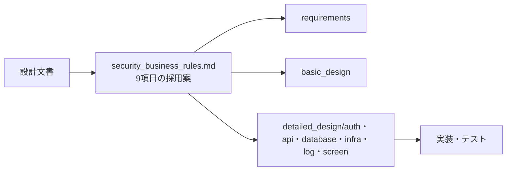

# セキュリティ・業務ルール確定事項

本書は Issue #8 で確定した9項目の正規方針である。要件・基本設計・詳細設計は本書と矛盾しないように記載し、下表の採用案を実装仕様として扱う。

## 1. 決定一覧

| No | 論点 | 採用方針 | 主要な値・応答 |
|----|------|----------|----------------|
| 1 | ログイン以外のRate Limit | 副作用のある公開API、OAuth経路、通知APIを制限する。GETの一般APIは対象外 | 超過時 `429 TOO_MANY_ATTEMPTS`、`Retry-After` を付与。Redis障害時は `503 SERVICE_UNAVAILABLE` |
| 2 | パスワード再設定トークン | ユーザー単位で最新1本だけを有効にする | `pwreset_current:{user_id}`、TTL `PASSWORD_RESET_TTL_SECONDS`（既定1800秒） |
| 3 | Redis失敗時のDB更新補償 | Redis失効を先に完了してからDB更新をコミットする。Redis失敗時はDBを更新しない | 部分失効も `503 SERVICE_UNAVAILABLE` と監査ERROR。再実行は冪等 |
| 4 | `X-Forwarded-For` | `TRUSTED_PROXY_CIDRS` に登録された直近Proxyからの値だけを信頼する | 未登録Proxyのヘッダは無視し、接続元IPを監査IP・制限キーに使用 |
| 5 | `login_history` INSERT失敗 | ログインを拒否する。発行済みのRedis状態は補償削除する | `503 SERVICE_UNAVAILABLE`。成功ログインを監査記録なしで返さない |
| 6 | 初期管理者環境変数 | 必須。未設定・空文字ならbackendを起動しない | `INITIAL_ADMIN_EMAIL`、`INITIAL_ADMIN_USERNAME`、`INITIAL_ADMIN_PASSWORD` のいずれか不足でfail-close |
| 7 | `display_name` フォールバック | 姓名が両方そろった場合のみ「姓 名」、それ以外は `username` | APIレスポンスは常に非NULL文字列 |
| 8 | コメント更新競合 | 既存スキーマを維持し、Last Write Winsを採用する | `task_comments` に `version` は追加しない。後から成功した更新が有効 |
| 9 | JWT強制ログアウトの遅延 | force-logout単体では既発行Access Tokenの即時失効を行わない | 最大 `ACCESS_TOKEN_TTL_SECONDS`（既定900秒）。即時遮断は無効化APIを使用 |

## 2. 各項目の判断

### 2.1 ログイン以外のRate Limit

#### 採用案

次のAPI群をRate Limit対象とする。今回の対象外である一般API（コメント投稿を含む）は既存の認証・認可・入力検証で保護し、追加のRate Limitは設けない。キーは、未認証APIでは確定済みクライアントIP、認証済み通知APIでは `user_id` と確定済みクライアントIPを組み合わせたハッシュとする。メールアドレスやトークンの平文はRedisキーに保存しない。

| API群 | 上限 | 時間窓 | 追加制御 |
|--------|------|--------|----------|
| `POST /auth/register` | 5回 | 900秒 | IP単位 |
| `POST /auth/verify-email` | 10回 | 900秒 | IP単位。トークンはワンタイム |
| `POST /auth/verify-email/resend` | 5回 | 900秒 | IP単位に加え、ユーザー単位の送信間隔60秒 |
| `POST /auth/password/forgot` | 5回 | 900秒 | IP単位。応答は常に202 |
| `POST /auth/password/reset` | 10回 | 900秒 | IP単位。トークンは最新1本のみ |
| OAuth開始・callback・exchange | 各10回 | 900秒 | API群ごとのIP単位 |
| 通知のGET（一覧・未読件数） | 120回 | 60秒 | `user_id` + IP単位 |
| 通知のPATCH/POST | 60回 | 60秒 | `user_id` + IP単位 |

超過時は全対象で `429 TOO_MANY_ATTEMPTS` とし、残り秒数を `Retry-After` ヘッダに設定する。メール存在有無、OAuth state、リセットトークンの有効性は429応答から推測できないようにする。Rate LimitのRedis操作に失敗した場合は許可せず `503 SERVICE_UNAVAILABLE` とする。

#### 代替案と判断理由

全APIを一律に制限する案は、通知ポーリングや通常の一覧取得を遅くしUXを損なうため不採用とした。WAF等の外部制限だけに任せる案は、学習環境の構成に外部WAFがなくAPI単位の監査もできないため不採用とした。

#### 脅威・UX・運用影響

メール爆撃、登録自動化、OAuth callbackへの試行、通知APIの過剰利用を抑える。一方、共有NATでは同一IPの利用者が巻き込まれるため、画面は `Retry-After` の秒数を案内する。運用者は `event=rate_limit_rejected` とAPI履歴の `request_id` を突合し、必要な場合だけ環境変数を変更する。

#### テスト観点

各API群で上限回数までは成功し、上限超過で429・`Retry-After` が返ること、時間窓終了後に再実行できること、未認証APIでユーザー列挙が起きないこと、Redis停止時に503で許可されないことを検証する。

### 2.2 パスワード再設定トークン

#### 採用案

`password/forgot` の発行時に、ユーザー単位の `pwreset_current:{user_id}` を原子的に置き換える。旧 `pwreset:{token_hash}` を削除してから新キーとcurrentキーを設定し、`password/reset` はcurrentキーと一致するトークンだけを原子的に消費する。TTLは `PASSWORD_RESET_TTL_SECONDS=1800` とする。

#### 代替案と判断理由

複数トークンを並行有効にする案は、古いメールが転送・漏えいした場合の有効期間を不要に残すため不採用とした。メール再送と同じく、最新メールを正とするほうが利用者にも説明しやすい。

#### 脅威・UX・運用影響

古いメールリンクの再利用を防ぐ。利用者が複数回要求した場合は最後のメールだけが有効になるため、受信遅延した古いメールでは再設定できない。Redis障害やキー消失時は再度forgotを要求する。

#### テスト観点

連続発行で旧トークンが400、最新トークンだけが成功すること、同一トークンの並行消費で成功が1回だけであること、TTL満了・Redis障害・再設定成功後の全セッション失効を検証する。

### 2.3 Redis失敗時のDB更新補償

#### 採用案

パスワード変更・パスワード再設定・管理者による無効化では、全セッション／refreshのRedis失効を先に実行し、成功確認後にPostgreSQL更新をコミットする。Redis処理が一部だけ成功して失敗した場合もDB更新を行わず、同じ失効処理を再実行する。Redis失効は削除操作のため再実行可能である。

既存設計で想定していたRedis `auth_version` の単独更新を正とする方式は採用しない。Redisは揮発ストアであり、DB更新と原子的にコミットできないため、認証状態の正はPostgreSQLとする。Redis障害時にDBだけを更新するfail-openは行わない。

#### 代替案と判断理由

DB更新後にRedisを失効させ、失敗時に補償ジョブで追いつく案は、補償完了まで旧セッションが残るため不採用とした。二相コミットやRedis永続化は学習用構成の範囲を超えるため採用しない。

#### 脅威・UX・運用影響

失敗時は対象ユーザーが一時的に再ログインを要求される可能性があるが、旧認証状態を残すより安全である。運用者はERRORログの `user_id` と `request_id` を確認し、Redis復旧後に同じ管理操作または運用コマンドを再実行する。DB更新が未実施であることを確認してから再試行する。

#### テスト観点

Redis接続断・途中失敗を注入し、DB更新が実行されないこと、既存キーの一部削除後も再実行で全キーが消えること、DB更新失敗時は失効済み状態が維持されること、503と監査ERRORが記録されることを検証する。

### 2.4 Proxy境界と監査IP

#### 採用案

`TRUSTED_PROXY_CIDRS` にCIDRをカンマ区切りで設定する。接続元IPが登録範囲内の場合だけ `X-Forwarded-For` を右から左へ検証し、信頼範囲外で最初に現れる値をクライアントIPとする。直近Proxyが未登録、値が不正、ヘッダがない場合は `request.client.host` を採用する。

解決したIPを `login_history.ip_address`、`api_history.ip_address`、Rate Limitキーに共通利用する。監査ログには `client_ip`、`proxy_peer_ip`、`ip_source`（`direct` / `trusted_xff`）を記録し、未信頼のXFF値を監査IPとして保存しない。

#### 代替案と判断理由

すべてのXFFを信頼する案は、直接接続者がヘッダを偽装して制限を回避できるため不採用とした。常に接続元IPだけを使う案は、信頼済みリバースProxy配下で利用者を区別できず監査性が下がるため不採用とした。

#### 脅威・UX・運用影響

偽装IPによるRate Limit回避を防ぐ。Proxy構成変更時はCIDRの更新が必要で、誤設定時は接続元IPにフォールバックする。IPは監査情報として90日保持するため、アクセス権限を管理者に限定する。

#### テスト観点

信頼Proxy・未信頼接続元・複数段Proxy・不正XFF・XFFなしをそれぞれ検証し、login/api履歴とRate Limitキーが同じ解決IPを使うことを確認する。

### 2.5 `login_history` INSERT失敗

#### 採用案

成功・失敗を問わず、`login_history`へのINSERTが完了しなければログインを成立させない。認証成功後にRedisで作成したsession/refreshは補償削除し、クライアントへは `503 SERVICE_UNAVAILABLE` を返す。失敗ログ自体は構造化標準出力へ `event=login_history_write_failed` として出す。

#### 代替案と判断理由

監査記録を捨ててログイン成功を優先する案は、認証成功の追跡不能と監査要件違反を招くため不採用とした。非同期キューへ送る案は、今回の構成に永続キューがなく記録保証をできないため不採用とした。

#### 脅威・UX・運用影響

監査ログ欠落と、DB障害中の認証継続を防ぐ。DB復旧までログインできないため、運用者は先にDB接続と`login_history` INSERT権限を復旧する。補償削除にも失敗した場合、クライアントへ資格情報を返していないことを確認し、Redis復旧後に対象ユーザーのキーを全失効する。

#### テスト観点

成功ログイン・失敗ログインそれぞれでINSERT失敗を注入し、503、Redis状態の補償、資格情報の非返却、`login_history_write_failed`ログを検証する。

### 2.6 初期管理者環境変数

#### 採用案

`INITIAL_ADMIN_EMAIL`、`INITIAL_ADMIN_USERNAME`、`INITIAL_ADMIN_PASSWORD` は全て必須とし、未設定または空文字ならAlembic／backendの起動を失敗させる。seedをスキップして起動すること、固定値や自動生成値で代替することは行わない。CIは専用Secretを注入する。

#### 代替案と判断理由

不足時にseedだけスキップして起動する案は、管理者不在または初期資格情報不明の状態を作るため不採用とした。開発時だけ固定adminを用意する案も、資格情報の漏えいを招くため不採用とした。

#### 脅威・UX・運用影響

設定ミスでサービスは利用不能になるが、未保護の初期管理者を作らない安全側動作である。起動失敗時は環境変数名だけをログで確認し、値は出力しない。Secretを設定してbackendを再起動する。

#### テスト観点

3変数それぞれの未設定・空文字・全設定を検証し、未設定時にHTTP受付前で起動失敗し、Secret値がログに出ないことを確認する。

### 2.7 `display_name` フォールバック

#### 採用案

`last_name` と `first_name` がともに空でない場合だけ、半角スペースで連結した値を返す。それ以外（片方のみ、両方未設定、空白のみ）は `username` を返す。OAuth新規ユーザーの姓名未設定でもAPIの型は非NULLを維持する。

#### 代替案と判断理由

片方だけを表示する案は画面ごとに表示規則が変わりやすく、空欄を返す案は操作主体の識別性を下げるため不採用とした。

#### 脅威・UX・運用影響

管理画面・プロジェクト・コメントで同じ識別子を表示できる。OAuth直後はusername表示になることを利用者へ説明し、プロフィール補完後に姓名表示へ変わる。個人情報を新たに保存する変更はない。

#### テスト観点

姓名両方、姓のみ、名のみ、両方未設定、空白値を入力した場合の各APIレスポンスが規則どおりであることを検証する。

### 2.8 コメント更新の競合

#### 採用案

コメントはLast Write Winsとする。`task_comments` に `version` 列を追加せず、更新時の競合エラーも返さない。同時更新ではPostgreSQLで後からコミットされた本文と`updated_at`を最終値とする。

#### 代替案と判断理由

楽観ロックを追加して409 `COMMENT_CONFLICT`を返す案は変更消失を防げるが、短いコメント編集に再取得・再入力を求めUXを重くし、今回の既存DB設計との差分も大きいため不採用とした。

#### 脅威・UX・運用影響

同時編集では先の入力が無言で上書きされる。UIは競合バナーを表示せず、保存成功を表示する。重要な履歴管理や復元は提供しないため、将来必要になった場合は別Issueで履歴要件と併せて再設計する。

#### テスト観点

同一コメントを2リクエストで更新し、両方が200、最終本文が後コミット値、`version`列や409が存在しないことを検証する。認可・XSS対策・DB障害時503も既存テストで確認する。

### 2.9 JWT強制ログアウト後のAccess Token

#### 採用案

`POST /admin/users/{user_id}/force-logout` はRedisのsessionとrefreshだけを全失効し、既発行Access Tokenはdenylistを用いず、最大 `ACCESS_TOKEN_TTL_SECONDS`（既定900秒）まで有効とする。この遅延を仕様上許容し、監査ログに `access_token_revocation_delay_seconds=900` を記録する。アカウントを直ちに遮断する場合は `PATCH /admin/users/{user_id}/status` で無効化する。

#### 代替案と判断理由

JWTのjti denylistをRedisへ保持する案は即時失効できるが、揮発データの追加管理と全リクエストのRedis参照が必要になり、JWTの比較対象としての構成を変えるため不採用とした。

#### 脅威・UX・運用影響

強制ログアウト直後から最大15分、盗難済みAccess TokenでAPIが呼ばれる脅威が残る。管理者画面には「アカウント無効化なら即時遮断、強制ログアウトは最大15分」と明示する。緊急時は無効化APIを使い、原因調査後に必要なら再有効化する。

#### テスト観点

force-logout直後のAccess TokenがTTL内は利用でき、TTL超過後は401になること、refreshは即時失効すること、status無効化ではAccess Tokenも`USER_INACTIVE`で直ちに拒否されることをモード別に検証する。

## 3. 失敗時の共通原則と未決定事項の扱い

認証・Rate Limit・失効・監査記録の判定に必要なDBまたはRedisが利用できない場合は、許可・成功・空データへの置換をせず `503 SERVICE_UNAVAILABLE` とする。RedisやDBの部分処理は監査ERRORへ出し、削除処理は同じ入力で再実行できるようにする。

本書の9項目は採用案を確定済みであり、下位文書に残る「不明」「要検討」はこの9項目の実装判断を示すものではない。下位文書に同じ論点の旧記述がある場合は本書の採用案へ更新し、未決定のまま実装着手しない。

