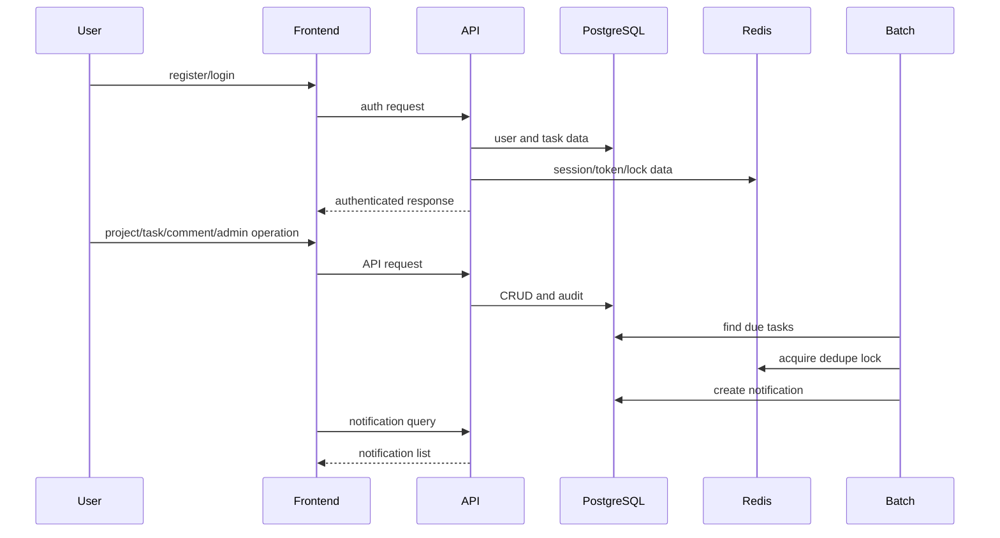

# Issue #46 完了検証

## 判定

2026-09-16時点で、Issue #46のDefinition of Doneを確認した。

| 要件 | 判定 | 根拠 |
| --- | --- | --- |
| 全roadmapが完了 | ✅ | #47、#53、#71、#75、#94、#145、#180、#189を本PRで完了扱いとする。各roadmapのphaseは全てCLOSED。 |
| API・batch・frontend・DB・infraのCI成功 | ✅ | developのCI run [35061587009](https://github.com/oikawa-d/task_management/actions/runs/35061587009)で、detect、docs-check、workflow-lint、hook-test、backend lint/test(session・jwt)、frontend lint/test、batch test、batch container integration、docker buildが全て成功。 |
| 全体シナリオテスト成功 | ✅ | 下記のAPI結合、認証方式別、OAuth、管理、通知、障害系テストをCIで実行し成功。運用手順はIssue #482の実機確認記録で成功。 |

## シナリオ対応表

| シナリオ | 検証箇所 |
| --- | --- |
| session認証で登録・メール認証・login・logout | `api/tests/integration/test_auth_endpoints_integration.py`、`api/tests/integration_token_mail/test_auth_token_mail_flow.py` |
| JWTで同等の認証操作 | `api/tests/integration/test_auth_endpoints_integration.py`、CI `backend-test` の `auth_mode: [session, jwt]` |
| Google OAuth2の開始・callback・exchange | `api/tests/test_oauth_integration_flow.py` |
| project・task・comment操作 | `api/tests/integration_tasks/`、`api/tests/integration_comments/`、`api/tests/api/routers/test_projects_router.py` |
| adminのユーザー・project管理 | `api/tests/api/routers/test_admin_router.py`、`frontend/src/features/admin/` |
| 期限通知の作成と重複防止 | `batch/tests/test_due_notification_job.py`、`batch/tests/test_repository_due_notification.py`、`frontend/src/features/notifications/` |
| Redis/DB障害時の規定errorと不整合防止 | `api/tests/integration/test_users_health_endpoints_integration.py`、`api/tests/integration/test_auth_endpoints_integration.py`、`api/tests/integration_tasks/` |
| Compose上のbatchからDB/Redisへの疎通 | `batch/tests/integration/test_container_connectivity.py`、CI `batch-container-integration` |
| バックアップ・リストア・保持期間パージ | Issue #482の実機確認記録 |

## 実行境界

- 外部Google認可画面、実メール配送、ブラウザ実機表示は、設計上の外部境界でありCIの自動テスト対象外。
- CD workflowは開発・学習用途では採用せず、PR CIとローカルDocker Composeを運用の正とした。変更はPR #494で反映済みであり、image push・self-hosted runner反映を現行DoDには含めない。
- `.env`の値は検証記録へ転記していない。

## シナリオの流れ

